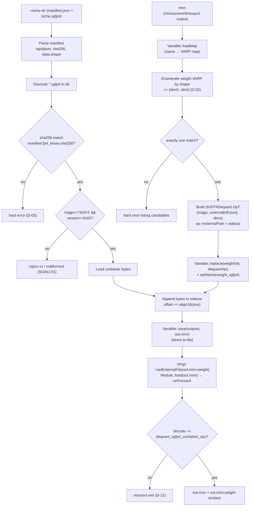

# Phase 5: Injection Core — Artifact Construction & Graph Splicing - Research

**Researched:** 2026-08-26
**Domain:** C++ graph surgery on MNN Express VARP graphs + external-sidecar op injection (SGFP4 v2 FP4 dequant)
**Confidence:** HIGH

<user_constraints>
## User Constraints (from CONTEXT.md)

### Locked Decisions

#### Container→Tensor Pairing
- **D-01:** Pairing is manifest-driven. The tool consumes exporter output directories (each containing `manifest.json` + `<niche>.sgfp4`); it reads `fp4_binary.path` and `fp4_binary.stats.shape` from the manifest itself — no container path or tensor name duplicated on the CLI.
- **D-02:** Target-tensor selection by exact shape match: find `.mnn` weight tensors whose shape exactly equals `{dimO=shape[0], dimI=shape[1]}`. Exactly one match → inject. Zero or multiple matches → hard error listing candidate tensor names/shapes.
- **D-03:** Integrity check at inject time: compute sha256 of the container file and compare against manifest `fp4_binary.sha256`; mismatch → hard error.
- **D-04:** Exact match only — non-64-multiple / padded shapes are rejected. The tiling/padding convention gap is a known v3.0 Phase 10 item; do not invent padding rules in this tool.
- **D-05:** `SGFP4DequantParam.dims` comes from the manifest's `fp4_binary.stats.shape`; the tool cross-checks it against the matched `.mnn` tensor shape and errors on disagreement.

#### Graph Surgery Mechanism
- **D-06:** Express VARP-level surgery: load the `.mnn` as a VARP graph, construct the `SGFP4Dequant` op from a hand-built `OpT` (as `test/op/SGFP4DequantTest.cpp` and `test/op/SGFP4VulkanDequantTest.cpp` already demonstrate), then rewire each consumer from the original constant weight to the dequant node. No manual FlatBuffers `NetT` oplists index bookkeeping. (NOTE: the named primitive `Variable::replaceInput` does not exist in the MNN codebase — the actual API is `Variable::replace(VARP dst, VARP src)`; see Pitfall 1.)
- **D-07:** The original constant weight tensor is detached and dead-dropped: leave it in the loaded VARP graph untouched; after consumer rewiring it becomes dead code and `Variable::save` drops unreachable constants naturally. No forced removal code.
- **D-08:** Injected node keeps the original weight tensor's name with an `_sgfp4` suffix (e.g. `weight` → `weight_sgfp4`).

#### Tool Form & CLI
- **D-09:** The tool is a new C++ binary under `tools/fp4/` (e.g. `tools/fp4/sgfp4_inject.cpp`) with its own CMakeLists gated behind a CMake option, linked against core MNN Express. Manifest JSON parsing uses the vendored `3rd_party/rapidjson`.
- **D-10:** CLI surface: `sgfp4_inject --model input.mnn --niche-dir <dir> [--niche-dir <dir>...] --output out.mnn`.
- **D-11:** The sidecar is emitted alongside the output model as `<output>.weight` (e.g. `out.mnn` → `out.mnn.weight`).

#### Verification Depth
- **D-12:** In-tool post-serialization verification is unconditional: after `Variable::save`, the tool reloads the artifact via Express `Module::load` (calling `rtmgr->setExternalFile(sidecar)` before load), runs each `SGFP4Dequant` node, and compares outputs against a direct CPU decode of the same container bytes (via `dequant_sgfp4_container_cpu`). Mismatch → nonzero exit with diagnostic.
- **D-13:** The in-tool numeric check is a decode-oracle comparison (reloaded-artifact decode vs. fresh decode of the same container — deterministically identical). FP32-tolerance comparison against the original model stays in the Phase 5 test suite and Phase 6 end-to-end.

### the agent's Discretion
- Internal structure of the binary (single TU vs. helper headers under `tools/fp4/`), CMake option naming, exact error-message wording, logging verbosity.
- Weight-tensor enumeration order and candidate-listing format in ambiguity errors.
- Whether the sha256 implementation uses a small vendored/public-domain header or platform API (no OpenSSL dependency introduced).

### Deferred Ideas (OUT OF SCOPE)
- Non-64-multiple weight shapes / tiling-padding conventions — belongs to v3.0 Phase 10.
- Transposed shape matching (dimO×dimI vs dimI×dimO tolerance) — rejected for now.
- `--no-verify` style skip flag for bulk injection runs — only when a bulk use case actually appears (Phase 7 or later).
- Structured (non-uniform / LAYOUT_MIXED) container coverage — Phase 7 (SGINJ-08).
</user_constraints>

## Summary

Phase 5 builds the first producer of a real, loadable `.mnn` that uses `OpType_SGFP4Dequant` on real weights. The entire **consume** side already exists and is merged: `CPUSGFP4Dequant` Execution (`source/backend/cpu/CPUSGFP4Dequant.cpp`) reads the sidecar bytes from `op->externalPath()` + `SGFP4DequantParam::{magic, external, dims}`; `ShapeSGFP4Dequant` (`source/shape/ShapeSGFP4Dequant.cpp`) derives output shape from `dims`; `dequant_sgfp4_container_cpu` in `include/MNN/SGFP4DequantUtils.hpp` is the deterministic decode oracle; and the two op-level tests (`test/op/SGFP4DequantTest.cpp`, `test/op/SGFP4VulkanDequantTest.cpp`) already demonstrate the exact `OpT` construction + `op->externalPath` + `Module::load` round-trip. Phase 5's new work is therefore entirely in the **produce** direction: load a converted `.mnn` as an Express VARP graph, build a dequant node per target weight, rewire consumers, merge container bytes into one sidecar, and serialize via `Variable::save(vars, fileName)`.

**Primary recommendation:** Implement the tool as a thin C++ binary under `tools/fp4/sgfp4_inject.cpp` that (1) loads the model via `Variable::loadMap`, (2) builds each `SGFP4Dequant` node by near-copying the verified `OpT`-construction block from `SGFP4DequantTest.cpp`, (3) rewires each consumer with `Variable::replace(weightVar, dequantVar)` — **not** a non-existent `replaceInput` — (4) concatenates container bytes into a single sidecar with non-overlapping `{offset,size}` ranges, and (5) saves via the direct-to-file `Variable::save(outputs, fileName)` overload, then unconditionally reloads through `Module::load` to prove the artifact decodes within oracle tolerance. Every claimed building block below was verified against in-repo source, not training knowledge.

**Confidence: HIGH** — the consume path, op-construction recipe, serialization overload, and the `externalPath` gotcha are all byte-verified in the repository; the only genuinely novel code is the consumer-rewiring loop and the manifest path resolution, both flagged explicitly below.

## Architectural Responsibility Map

| Capability | Primary Tier | Secondary Tier | Rationale |
|------------|-------------|----------------|-----------|
| Load converted `.mnn` as a mutable graph | Express `Variable::loadMap` | — | Produces a `map<name,VARP>` over the whole NetT without manual FlatBuffers oplist parsing |
| Find target weight tensors by shape | Tool (shape enumeration over VARP `getInfo()->dim`) | — | D-02 exact-shape match against manifest `stats.shape` |
| Build `SGFP4Dequant` node | Tool (hand-built `OpT` + `Expr::create`) | — | Op is a 0-input Const-like source; no backend code changes |
| Rewire consumers | Express `Variable::replace` | — | Mutates the const Expr in place; back-reference (`mTo`) maintenance is automatic |
| Sidecar byte-range assignment | Tool (sequential offset cursor) | — | Single merged file, 16-byte alignment per container (D-11, SGINJ-03) |
| Serialize spliced graph | Express `Variable::save(vars, fileName)` | — | Direct-to-file overload (SGINJ-04); `getExecuteOrder` drops dead constants (D-07) |
| Decode at reload (oracle) | `CPUSGFP4Dequant` + `dequant_sgfp4_container_cpu` | — | Ground-truth consumer from Phase 4 (v1.0) |
| Manifest JSON parsing | Tool + vendored `3rd_party/rapidjson` | — | D-01/D-03/D-05 |
| SHA-256 integrity | Tool (vendored/public-domain header or platform API) | — | D-03; no OpenSSL (locked) |

<phase_requirements>
## Phase Requirements

| ID | Description | Research Support |
|----|-------------|------------------|
| SGINJ-01 | Accept normally-converted `.mnn` + v2 containers; reject legacy v1 via version check | Version gate = container bytes `magic == 'SGF4' && version == 0x02` (`kSGFP4Magic`/`kSGFP4Version`, `SGFP4DequantUtils.hpp`); v1 fixed-payload containers have **no** `SGF4` magic header (`fp4_exporter.py` v1 layout = `headers[B]|offsets[B]|codes_blob`), so a magic+version probe rejects them. Do **not** trust manifest `fp4_binary.format` (see Pitfall 2). |
| SGINJ-02 | Build `Op` with `type=OpType_SGFP4Dequant`, `main.type=OpParameter_SGFP4DequantParam`, `SGFP4DequantParamT{magic=kSGFP4Magic, external={offset,size}, dims={dimO,dimI}}`, `op->externalPath` set literally | Exact `OpT` recipe verified in `test/op/SGFP4DequantTest.cpp::runSgfp4Module` (lines ~400-415) and `SGFP4VulkanDequantTest.cpp`; struct fields verified in `schema/current/CaffeOp_generated.h:1440` (`uint32_t magic`, `std::vector<int64_t> external`, `std::vector<int32_t> dims`). `externalPath` gotcha confirmed in `OpCommonUtils.cpp::createExecutionWithExternal` (only Convolution2D/Scale/LayerNorm are rewritten). |
| SGINJ-03 | Single merged sidecar, non-overlapping `{offset,size}`; consumers read the new node's output | Sequential offset cursor with per-container `sgfp4_align16` rounding; rewiring via `Variable::replace`. `CPUSGFP4Dequant::onResize` reads `op->externalPath()` + `external()[0..1]` as `{offset,size}` (verified). |
| SGINJ-04 | Serialize via `Variable::save(vars, fileName)` direct-to-file; reload via `Module::load` with `rtmgr->setExternalFile()` before load; decode within oracle tolerance | `Variable::save(const std::vector<VARP>&, const char*)` verified at `include/MNN/expr/Expr.hpp:157` / `express/Expr.cpp:1327`. `Module::load({},{}, buffer, size, rtmgr)` + `rtmgr->setExternalFile()` verified in both test files and `Executor.hpp:118`. Oracle = `dequant_sgfp4_container_cpu`. |

*Requirement IDs supplied by orchestrator: SGINJ-01, SGINJ-02, SGINJ-03, SGINJ-04.*
</phase_requirements>

## Standard Stack

This phase adds no external registry packages. All dependencies are in-repo (vendored) or platform APIs.

### Core
| Library | Version | Purpose | Why Standard |
|---------|---------|---------|--------------|
| MNN Express (`Variable`/`Expr`/`Module`/`Executor::RuntimeManager`) | in-repo (`express/`, `include/MNN/expr/`) | Graph load (`loadMap`), op construction (`Expr::create`), consumer rewiring (`Variable::replace`), serialization (`Variable::save`), reload (`Module::load`) | The only supported graph-surgery API; quantization tool (`tools/quantization/calibration.cpp`) already uses `loadMap`→`getInputAndOutput`→`save` |
| MNN generated FlatBuffers types (`MNN_generated.h`, `CaffeOp_generated.h`) | generated from `schema/default/*.fbs` | `OpT`, `SGFP4DequantParamT`, `OpType_SGFP4Dequant` (=605), `OpParameter_SGFP4DequantParam` (=102) | Native-table op descriptor used by the existing tests |
| `MNN/SGFP4DequantUtils.hpp` | in-repo (`include/MNN/`) | `kSGFP4Magic`, `kSGFP4Version`, `sgfp4_align16`, `dequant_sgfp4_container_cpu` (oracle), version probe | Byte-verified against gnus-poc exporter; single source of format truth |
| rapidjson | vendored `3rd_party/rapidjson` | `manifest.json` parsing | D-09 locked; already in-tree, no install |

### Supporting
| Library | Version | Purpose | When to Use |
|---------|---------|---------|-------------|
| SHA-256 (vendored public-domain single-header, **or** Windows `BCryptHash` API) | n/a | D-03 container integrity check | Vendored header is the portable default; `BCrypt` avoids adding any file when building Windows-only. Do **not** add OpenSSL (locked). |
| `half.hpp` (vendored `3rd_party/half`) | in-repo | FP16 leaf-header decode | Not needed by the tool itself — only inside `dequant_sgfp4_container_cpu` |

### Alternatives Considered
| Instead of | Could Use | Tradeoff |
|------------|-----------|----------|
| Express `Variable::replace` surgery | Manual `NetT` oplists + `inputIndexes` mutation | Full control but error-prone index bookkeeping; rejected by D-06 |
| `fp4_binary.path` as literal container path | `<niche>.sgfp4` file discovery in the niche dir | Manifest path is gnus-poc-root-relative (backslash-separated) — see Pitfall 3 |
| MSVC build | MinGW gcc 13.2.0 | MSVC `cl` is not on PATH on this machine (probed) |

**Installation:** none — everything is vendored. The only new artifact is a small vendored SHA-256 header (public-domain, e.g. a ~150-line single-file implementation) placed under `tools/fp4/`.

**Version verification:** No registry lookups apply. The FlatBuffers-generated struct and the op enum were verified directly against `schema/current/CaffeOp_generated.h` (line 1440) and `schema/current/MNN_generated.h` (lines 302, 1219). The decoder constants were verified against `include/MNN/SGFP4DequantUtils.hpp` and cross-checked against the exporter's `quantize/sgfp4_format.py` (`SGFP4_MAGIC = b"SGF4"`, `SGFP4_VERSION_V2 = 0x02`).

## Package Legitimacy Audit

**No external packages are installed by this phase.** Every dependency is either vendored in-repo (`3rd_party/rapidjson`, `3rd_party/half`) or generated from the repository's own FlatBuffers schema. The only new code dependency is a vendored SHA-256 implementation, which is a self-contained source file, not a registry install.

| Package | Registry | Age | Downloads | Source Repo | slopcheck | Disposition |
|---------|----------|-----|-----------|-------------|-----------|-------------|
| (none) | — | — | — | — | n/a | n/a |

**Packages removed due to slopcheck [SLOP] verdict:** none
**Packages flagged as suspicious [SUS]:** none

*The slopcheck / registry-verification protocol is not applicable: the phase performs no `npm`/`pip`/`cargo` installs. The vendored SHA-256 header recommendation is a `[CITED]`-class in-repo pattern choice (single-source-file), not a registry package — the planner should pin the exact header choice and review it before committing.*

## Architecture Patterns

### System Architecture Diagram



### Recommended Project Structure
```
tools/fp4/
├── encode_sgfp4.py          # existing test-oracle encoder (do not touch)
├── quantize_fp4.py          # existing
├── test_quantize_fp4.py     # existing
├── sgfp4_inject.cpp         # NEW: tool main + graph surgery + sidecar merge
├── sha256.h                 # NEW: vendored public-domain SHA-256 (or use BCrypt)
└── CMakeLists.txt           # NEW: add_executable + link ${MNN_DEPS}

test/op/
├── SGFP4DequantTest.cpp     # existing op-construction reference (read-only)
├── SGFP4VulkanDequantTest.cpp
├── SGFP4DequantFixtures.h   # existing oracle fixtures
└── SGFP4InjectTest.cpp      # NEW: Phase 5 test — inject→save→reload→oracle-check
```

### Pattern 1: Load model as a VARP map and identify inputs/outputs
**What:** Convert a `.mnn` into an addressable graph of `VARP`s, then recover the output variables that must be saved.
**When to use:** Every graph-surgery entry point (mirrors `tools/quantization/calibration.cpp::_quantizeModelEMA`, lines 1320-1330).
**Example:**
```cpp
// Source: tools/quantization/calibration.cpp:1320-1325 (pattern)
auto varMap = Variable::loadMap(_originalModelFile.c_str());
if (varMap.empty()) { MNN_ERROR("Can not load model\n"); return false; }
auto inputOutputs = Variable::getInputAndOutput(varMap);
auto varOutputs   = Variable::mapToSequence(inputOutputs.second); // save THESE
```

### Pattern 2: Build the SGFP4Dequant op and set `externalPath` literally
**What:** Hand-build the `OpT` and attach it to a 0-input Expr — the exact recipe the two existing tests use.
**When to use:** For every injected weight tensor (SGINJ-02).
**Example:**
```cpp
// Source: test/op/SGFP4DequantTest.cpp (runSgfp4Module) + CaffeOp_generated.h:1440
std::shared_ptr<MNN::OpT> op(new MNN::OpT);
op->type = MNN::OpType_SGFP4Dequant;
op->main.type = MNN::OpParameter_SGFP4DequantParam;
auto* param = new MNN::SGFP4DequantParamT;      // {uint32_t magic; vector<int64_t> external; vector<int32_t> dims;}
param->magic = MNN::kSGFP4Magic;
param->external = {offset, static_cast<int64_t>(size)};
param->dims = {dimO, dimI};
op->main.value = param;
op->externalPath = sidecarPath;                 // LITERAL — see Pitfall 4 (createExecutionWithExternal gotcha)
auto dequantVar = Variable::create(Expr::create(op.get(), {})); // 0 inputs
dequantVar->setName(weightVar->name() + "_sgfp4");             // D-08
```

### Pattern 3: Rewire consumer from the original constant to the dequant node
**What:** Swap the weight VARP's expression for the dequant expression; consumers see the new op automatically via the Expr `mTo` back-references.
**When to use:** After building each dequant node (D-06/D-07).
**Example:**
```cpp
// Source: include/MNN/expr/Expr.hpp:168 (Variable::replace) + express/Expr.cpp:686-733
Variable::replace(weightVar, dequantVar);  // in-place: mutates the const Expr into the dequant op
// The original const is now unreachable from outputs -> Variable::save drops it (D-07).
// Do NOT keep dequantVar in the save set (it aliases the now-orphaned Expr).
```

### Pattern 4: Serialize to file and reload for verification
**What:** Save only the output variables (direct-to-file), then reload and run through `Module::load` with the sidecar registered.
**When to use:** SGINJ-04 / D-12.
**Example:**
```cpp
// Source: include/MNN/expr/Expr.hpp:157, express/Expr.cpp:1327; Module.hpp:76; Executor.hpp:118
Variable::save(varOutputs, outMnnPath.c_str());            // direct-to-file overload (NOT the vector<int8_t> variant)

MNN::ScheduleConfig config; config.type = MNN_FORWARD_CPU;
std::shared_ptr<Executor::RuntimeManager> rtmgr(Executor::RuntimeManager::createRuntimeManager(config));
rtmgr->setExternalFile(sidecarPath);                        // MUST precede Module::load (Pitfall 5)
std::shared_ptr<Module> m(Module::load({}, {}, outMnnPath.c_str(), rtmgr));
auto outputs = m->onForward({});
```

### Anti-Patterns to Avoid
- **Manual `NetT` oplists `inputIndexes` bookkeeping:** D-06 forbids it; `Variable::save`'s `getExecuteOrder` + `inputIndexes` mapping is generated automatically from the VARP graph.
- **Trusting manifest `fp4_binary.format` for version gating:** the field reads `"fp4_ultra_v0.2"` (a gnus-poc mislabel for an unrelated format); gate on the container's magic+version bytes only.
- **Naively resolving `fp4_binary.path`:** it is gnus-poc-root-relative and backslash-separated; discover the `.sgfp4` file in the niche dir instead (Pitfall 3).
- **Saving the orphaned `dequantVar`:** after `Variable::replace`, the constructed VARP points at a detached Expr; saving it would emit a duplicate node. Save only `varOutputs`.

## Don't Hand-Roll

| Problem | Don't Build | Use Instead | Why |
|---------|-------------|-------------|-----|
| Container decode (oracle + reload) | Custom byte parser | `dequant_sgfp4_container_cpu` (`SGFP4DequantUtils.hpp`) | Bounds-checked, byte-verified against the exporter; ASVS V5 posture already in place |
| Graph load/save/splice | FlatBuffers `NetT` mutation | Express `Variable::loadMap`/`replace`/`save` | Index bookkeeping and constant dropping handled for free |
| Manifest JSON parsing | Hand-rolled JSON | vendored rapidjson | Already in-tree, D-09 locked |
| FP16 header decode | Hand-rolled FP16 | vendored `half.hpp` | Already used inside `unpack_leaf_header` |
| SHA-256 | OpenSSL (forbidden) | vendored public-domain header or `BCryptHash` | No new system dependency; portable |

**Key insight:** Every difficult sub-problem (decode correctness, graph serialization, shape inference, op registration) is already solved in-repo — the only new logic is the *wiring* between them (manifest→container→tensor→op→sidecar→save→reload). Hand-rolling any of the solved pieces would reintroduce the exact bugs the v1.0 phases already eliminated.

## Common Pitfalls

### Pitfall 1: `Variable::replaceInput` does not exist
**What goes wrong:** D-06 names `Variable::replaceInput` as the rewiring primitive, but that symbol does not exist anywhere in the MNN Express API (the only `replaceInput` hit is `tools/converter/source/torch/torchOptimize.cpp:501`, a Torch-script IR method, unrelated to Express). A planner that emits `Variable::replaceInput(...)` will not compile.
**Why it happens:** The CONTEXT.md/DISCUSSION-LOG were written from memory of "quantization-tool precedent" without grepping the actual API.
**How to avoid:** Use `Variable::replace(VARP dst, VARP src)` (static, `Expr.hpp:168`, impl `Expr.cpp:686`). For two 1-output Exprs it performs in-place `Expr::replace`, which copies the dequant op into the const Expr and lets consumers keep their back-references.
**Warning signs:** `no member named 'replaceInput' in 'MNN::Express::Variable'`.

### Pitfall 2: `externalPath` is not auto-injected for `SGFP4Dequant`
**What goes wrong:** Setting `rtmgr->setExternalFile(sidecar)` before `Module::load` does **not** populate `op->externalPath` for this op. `OpCommonUtils::createExecutionWithExternal` only rebuilds/rewrites `externalPath` for `Convolution2D`/`Scale`/`LayerNorm` (`OpCommonUtils.cpp:665-690`); `OpParameter_SGFP4DequantParam` falls through to `backend->onCreate(inputs, outputs, op)` with no rewrite. `CPUSGFP4Dequant::onResize` reads `mOp->externalPath()` directly and returns `NOT_SUPPORT` if it is null (`CPUSGFP4Dequant.cpp:52`).
**Why it happens:** The op is a new type not in `createExecutionWithExternal`'s switch; the session-level external file is a separate mechanism the op does not consult.
**How to avoid:** Set `op->externalPath = sidecarPath` literally on the `OpT` before `Expr::create` (SGINJ-02; documented in both test files).
**Warning signs:** `CPUSGFP4Dequant::onResize → NOT_SUPPORT` at runtime despite a valid sidecar.

### Pitfall 3: Manifest `fp4_binary.path` is gnus-poc-root-relative and backslash-separated
**What goes wrong:** `ManifestBuilder.build` writes `"path": str(fp4_bin_path.relative_to(self._root))` (`manifest.py:50`), yielding `"models\\specialists_mlx\\demo\\fp4\\demo.sgfp4"` — relative to the **gnus-poc project root**, not the niche dir, and with `\` separators. Joining `--niche-dir` with this string produces a broken path on most machines.
**Why it happens:** The manifest is a *catalog* entry (root-relative), not a per-dir locator, even though `fp4_exporter.py::export_to_file` writes `manifest.json` + `<niche>.sgfp4` + `<niche>_stats.json` into the same `output_dir`.
**How to avoid:** Discover the container as the unique `*.sgfp4` file inside `--niche-dir` (error on 0 or >1); use `fp4_binary.path`'s **basename** and `fp4_binary.sha256` (D-03) for cross-validation, never for path resolution.
**Warning signs:** "file not found" when the niche dir contains the `.sgfp4` but the joined path points elsewhere.

### Pitfall 4: Saving the wrong VARP set drops or duplicates nodes
**What goes wrong:** `Variable::save` serializes only the exprs reachable from the passed VARP list (`getExecuteOrder` walks backward from outputs, `Expr.cpp:1108+`). Saving the input vars or the orphaned `dequantVar` yields either an empty artifact or duplicate dequant nodes.
**Why it happens:** Confusion between "the VARP I constructed" and "the VARP the graph now uses after replace".
**How to avoid:** Save exactly `Variable::mapToSequence(getInputAndOutput(varMap).second)` (the outputs), recomputed **after** rewiring. After `Variable::replace`, `weightVar` (not `dequantVar`) is the live node.
**Warning signs:** reloaded artifact has zero ops, or two `SGFP4Dequant` ops where one was expected.

### Pitfall 5: `rtmgr->setExternalFile` must precede `Module::load`
**What goes wrong:** Calling `setExternalFile` after `Module::load` leaves buffer-based loads unable to resolve external paths.
**Why it happens:** Documented Phase 1 pitfall (STATE.md): buffer-based `Module::load` does not auto-set `externalPath`; the runtime manager's external file must be registered before graph construction.
**How to avoid:** `rtmgr->setExternalFile(sidecarPath)` before `Module::load(...)`. For this op the literal `op->externalPath` is still the authoritative resolver (Pitfall 2), but keep the ordering correct anyway.
**Warning signs:** intermittent `NOT_SUPPORT`/null output when the load order is swapped.

### Pitfall 6: Demo container is uniform-only; do not overfit to it
**What goes wrong:** `demo.sgfp4` (132,368 bytes, 512×512) is all `UNIFORM_64` (`layout_distribution: {"0": 64}`), so a Phase 5 test that passes on it proves only the uniform path — it cannot satisfy Phase 7's quadtree criterion.
**Why it happens:** The starter artifact is uniform random noise by design (handoff caveat).
**How to avoid:** Use it as the Phase 5 test container, but document that LAYOUT_MIXED coverage is Phase 7's obligation (a structured gnus-poc artifact is required then). Do not claim quadtree coverage from this artifact.

## Code Examples

Verified patterns from official/in-repo sources:

### Build + save + reload a single SGFP4Dequant node (complete, compiles against current repo)
```cpp
// Sources: test/op/SGFP4DequantTest.cpp (op construction & reload);
//          schema/current/CaffeOp_generated.h:1440 (SGFP4DequantParamT);
//          include/MNN/expr/Expr.hpp:157 (Variable::save direct-to-file)
using namespace MNN::Express;

std::shared_ptr<MNN::OpT> op(new MNN::OpT);
op->type      = MNN::OpType_SGFP4Dequant;
op->main.type = MNN::OpParameter_SGFP4DequantParam;
auto* param   = new MNN::SGFP4DequantParamT;
param->magic    = MNN::kSGFP4Magic;
param->external = {offset, static_cast<int64_t>(size)};
param->dims     = {dimO, dimI};
op->main.value  = param;
op->externalPath = sidecarPath;                       // literal (Pitfall 2)

auto out = Variable::create(Expr::create(op.get(), {}));   // 0-input source op

MNN::ScheduleConfig cfg; cfg.type = MNN_FORWARD_CPU;
std::shared_ptr<Executor::RuntimeManager> rtmgr(Executor::RuntimeManager::createRuntimeManager(cfg));
rtmgr->setExternalFile(sidecarPath);                  // before load (Pitfall 5)

auto buffer = Variable::save({out});                  // in-memory variant — tests use this
std::shared_ptr<Module> m(Module::load({}, {}, buffer.data(), buffer.size(), rtmgr));
auto outputs = m->onForward({});
const float* decoded = outputs[0]->readMap<float>();
```

### v1-container rejection (SGINJ-01)
```cpp
// Source: include/MNN/SGFP4DequantUtils.hpp (constants) + fp4_exporter.py v1 layout comment
bool isV2Container(const uint8_t* p, size_t n) {
    if (n < MNN::kSGFP4FixedHeaderSize) return false;
    if (MNN::sgfp4_read_u32_le(p) != MNN::kSGFP4Magic) return false;  // 'SGF4'
    return p[MNN::kSGFP4VersionByteOffset] == MNN::kSGFP4Version;      // 0x02
}
// v1 fixed-payload files have NO 'SGF4' magic (layout: headers[B]|offsets[B]|codes_blob),
// so this probe rejects them without attempting to decode.
```

## State of the Art

| Old Approach | Current Approach | When Changed | Impact |
|--------------|------------------|--------------|--------|
| No producer existed — v1.0 shipped decode-only | Standalone post-hoc graph-surgery injection tool | 2026-08-26 restructure | First real, loadable `.mnn` using `OpType_SGFP4Dequant` |
| Converter-integration-first (formerly v2.0) | Injection tool first; converter = v3.0 Phases 8-12 | 2026-08-26 | Front-loads a real artifact to de-risk the converter milestone |
| `MNN_SUPPORT_TRANSFORMER_FUSE` gating on the op | Op compiled unconditionally; tests still gated on the flag | v1.0 | Op registers always (`CPUOPRegister.cpp:153`, `ShapeRegister.cpp:238`); build still needs the flag for tests |
| In-memory `Variable::save(vars)` (tests) | Direct-to-file `Variable::save(vars, fileName)` | Phase 5 (SGINJ-04) | The artifact writes straight to disk via `FileLoader::write` |

**Deprecated/outdated:**
- `Variable::replaceInput` (named in CONTEXT.md D-06): never existed — use `Variable::replace`.
- `fp4_ultra_v0.2` manifest label: a gnus-poc label for an unrelated E2M1 format; the format here is "SGFP4 v2" (terminology locked in REQUIREMENTS.md/STATE.md).

## Assumptions Log

| # | Claim | Section | Risk if Wrong |
|---|-------|---------|---------------|
| A1 | `Variable::replace(weightVar, dequantVar)` is the correct consumer-rewiring mechanism (in-place `Expr::replace`), since no `replaceInput` exists. | Architecture / Code Examples | HIGH — if in-place mutation has a name/layout side effect, the saved graph could be wrong; must be validated by the Phase 5 test in the first task (Wave 0 spike). |
| A2 | The sha256 implementation will be a vendored public-domain single header (or Windows `BCryptHash`), not OpenSSL. | Standard Stack | LOW — implementation detail; any correct SHA-256 works. |
| A3 | The tool locates the container as the unique `*.sgfp4` in the niche dir, using `fp4_binary.path` only for basename + sha256 cross-check (because the manifest path is root-relative). | Pitfall 3 | MEDIUM — if a niche dir ever contains multiple `.sgfp4` files, the unique-file assumption needs an explicit selector. |
| A4 | Weight tensors to match are 2D (`dimO × dimI`) — conv weights in NC4HW4 (4D `[O,I,1,1]`) are out of scope for Phase 5. | Summary / SGINJ mapping | MEDIUM — if the Phase 5 test model uses 4D conv weights, exact-shape match fails; the demo (512×512 MatMul) avoids this, but planner should confirm the test model's weight tensor rank. |
| A5 | `MNN_SUPPORT_TRANSFORMER_FUSE=ON` is required for the SGFP4 tests to actually execute (they are `#ifdef`-gated), even though the op itself compiles unconditionally. | State of the Art | LOW — confirmed by the `#ifdef` in both test files; build must pass the flag. |

## Open Questions (RESOLVED)

1. **Exact in-place semantics of `Variable::replace` for two 0-input, 1-output Exprs**
   - What we know: `Expr::replace(old, from)` copies `from`'s `mOp`/`mName`/`mOutputNames`/`mInside`/`mInputs` into `old` (`Expr.cpp:503-575`); consumers keep their `mTo` back-refs on `old`.
   - What's unclear: whether the const's `mStorage`/`mOutputTensors` (the loaded weight blob) is fully released or lingers in the mutated Expr.
   - Recommendation: include a Wave 0 spike task that runs the inject→save→reload loop on a minimal 2-op graph (input→MatMul(weight)→output) and asserts the saved artifact has one `SGFP4Dequant` op, zero `Const` weight ops, and correct decode. This validates A1 before full implementation.
   - RESOLVED: Plan 05-01 Task 1 is the A1 Wave-0 spike — it runs the inject→save→reload loop on a minimal input→MatMul→output graph before any tool code depends on the semantics.

2. **Test model shape / weight rank for Phase 5**
   - What we know: the demo container is 512×512 (2D). The `.mnn` used for the test is not yet pinned.
   - What's unclear: whether the test `.mnn` has a 2D MatMul weight matching `{512,512}`, or needs a synthetic minimal model.
   - Recommendation: generate (or reuse) a minimal converted `.mnn` with a single MatMul whose weight is `[512,512]`; confirm rank=2 (A4) during planning.
   - RESOLVED: Plan 05-01 uses a programmatically-constructed minimal 512×512 MatMul model (and 05-02 commits a named generator step for `minimal_512.mnn`) — weight is rank-2 `[512,512]`, avoiding the A4 4D-conv case.

3. **SHA-256 header provenance**
   - What we know: D-03 needs SHA-256; OpenSSL is locked out; no registry install.
   - What's unclear: which exact public-domain header to vendor.
   - Recommendation: pin a specific, widely-used public-domain implementation (e.g., the RFC 6234 / WjCryptLib-style single header) and review it for the license header before committing.
   - RESOLVED: Plan 05-02 Task 1 vendors `tools/fp4/sha256.hpp` (RFC 6234 / WjCryptLib-style public-domain single header) with license-header review called out in the task's acceptance criteria.

## Environment Availability

| Dependency | Required By | Available | Version | Fallback |
|------------|------------|-----------|---------|----------|
| CMake | Build the tool | ✓ | 3.29.2 | — |
| C++ compiler (MinGW g++) | Build the tool + tests | ✓ | 13.2.0 (x86_64-ucrt-posix-seh) | — |
| MSVC `cl` | (not required) | ✗ | — | MinGW g++ is the active toolchain |
| Python | Regenerate exporter artifacts (dev-only) | ✓ | 3.13.4 | — |
| rapidjson | `manifest.json` parsing | ✓ | vendored `3rd_party/rapidjson` | — |
| half.hpp | (indirect, inside decoder) | ✓ | vendored `3rd_party/half` | — |
| Demo container | Phase 5 test input | ✓ | `W:\...\gnus-poc\models\specialists_mlx\demo\fp4\demo.sgfp4` (132,368 B) | embed as fixture |
| Demo manifest | D-01/D-03/D-05 input | ✓ | `W:\...\gnus-poc\models\specialists_mlx\demo\fp4\manifest.json` | — |
| gnus-poc `fp4_exporter.py` | Reference encoder (not runtime) | ✓ | `W:\...\gnus-poc\quantize\fp4_exporter.py` | — |
| OpenSSL | (explicitly excluded) | — | — | vendored SHA-256 / BCrypt |

**Missing dependencies with no fallback:** none.

**Missing dependencies with fallback:**
- MSVC `cl` — fallback is MinGW g++ (already the working toolchain).
- OpenSSL — fallback is a vendored public-domain SHA-256 header (locked: no OpenSSL).

## Validation Architecture

### Test Framework
| Property | Value |
|----------|-------|
| Framework | MNN custom test runner (`run_test.out`), `MNNTestSuite`/`MNNTestCase` (`test/main.cpp`, `test/MNNTestSuite.*`) |
| Config file | `test/CMakeLists.txt` (glob-recurses `test/**/*.cpp`; gates `MNN_SUPPORT_TRANSFORMER_FUSE` via per-file `#ifdef`) |
| Quick run command | `./run_test.out op/sgfp4/` (runs all SGFP4 suites: `op/sgfp4/uniform_decode`, `op/sgfp4/mixed_decode`, `op/sgfp4/vulkan_uniform_parity`) |
| Full suite command | `./run_test.out` (whole suite; note: `test/op/FP4ModelTest.cpp` currently blocks a from-scratch full build — see STATE.md pending todo) |

### Phase Requirements → Test Map
| Req ID | Behavior | Test Type | Automated Command | File Exists? |
|--------|----------|-----------|-------------------|-------------|
| SGINJ-01 | v1 container rejected via version check | unit | `./run_test.out op/sgfp4/inject_v1_reject` | ❌ Wave 0 |
| SGINJ-02 | Op/param + literal `externalPath` constructed correctly | unit | `./run_test.out op/sgfp4/inject` | ❌ Wave 0 |
| SGINJ-03 | Non-overlapping sidecar `{offset,size}` + consumer reads new output | integration | `./run_test.out op/sgfp4/inject` | ❌ Wave 0 |
| SGINJ-04 | `Variable::save(file)` direct-to-file + `Module::load` reload within oracle tolerance | integration | `./run_test.out op/sgfp4/inject` | ❌ Wave 0 |

### Sampling Rate
- **Per task commit:** `./run_test.out op/sgfp4/` (fast, <30s)
- **Per wave merge:** `./run_test.out op/sgfp4/` plus a build of `sgfp4_inject` and one end-to-end CLI run against the demo niche dir
- **Phase gate:** full suite green before `/gsd-verify-work`

### Wave 0 Gaps
- [ ] `test/op/SGFP4InjectTest.cpp` — new test (registration `op/sgfp4/inject`) covering SGINJ-02/03/04 end-to-end: load a minimal `.mnn` (MatMul with `[512,512]` weight), inject the demo container, `Variable::save(file)`, reload via `Module::load` + `rtmgr->setExternalFile`, compare against `dequant_sgfp4_container_cpu`. Also a `op/sgfp4/inject_v1_reject` case for SGINJ-01.
- [ ] Minimal converted `.mnn` test model with a single 2D `[512,512]` weight — or a test fixture that constructs it programmatically via Express and saves it as the injection input.
- [ ] CMake wiring: `MNN_BUILD_SGFP4_TOOLS` option + `tools/fp4/CMakeLists.txt` include (mirror `tools/quantization/CMakeLists.txt`); confirm `MNN_SUPPORT_TRANSFORMER_FUSE=ON` and `MNN_BUILD_TEST=ON` in the build command.
- [ ] Demo container + manifest available to the test at runtime (copy to a test-data path or embed `demo.sgfp4` bytes as a fixture, mirroring `SGFP4DequantFixtures.h`).

## Security Domain

> `security_enforcement` is enabled (ASVS level 1, `security_block_on: high`). This is a local C++ CLI tool that reads two untrusted inputs (a `.mnn` model and a `.sgfp4` container + manifest); there is no network, auth, or session surface.

### Applicable ASVS Categories

| ASVS Category | Applies | Standard Control |
|---------------|---------|-----------------|
| V2 Authentication | no | n/a (offline CLI) |
| V3 Session Management | no | n/a |
| V4 Access Control | no | n/a (single-user local tool) |
| V5 Input Validation | yes | Reject on magic/version mismatch (SGINJ-01); sha256 integrity gate (D-03); bounds-checked `dequant_sgfp4_container_cpu` (already ASVS V5-hardened); exact-shape-match-or-error (D-02) |
| V6 Cryptography | yes (sha256 only, for integrity not secrecy) | Vendored public-domain SHA-256 or `BCryptHash`; never hand-roll crypto |

### Known Threat Patterns for {C++ CLI tool consuming untrusted files}

| Pattern | STRIDE | Standard Mitigation |
|---------|--------|---------------------|
| Malformed/oversized container forces large allocation | DoS | `CPUSGFP4Dequant::onResize` already bounds `external()[1]` against real file size (`queryFileSize`) before `mContainer.resize` |
| Legacy v1 container silently misdecoded | Tampering / Integrity | Magic+version probe before decode (SGINJ-01) |
| Wrong-niche / corrupt container injected | Tampering | sha256 vs manifest (`fp4_binary.sha256`) at inject time (D-03) |
| Manifest path/JSON injection leading to arbitrary file read | Spoofing | Never resolve `fp4_binary.path` literally (Pitfall 3); treat manifest fields as untrusted data, validate `stats.shape` is 2 positive ints, cross-check dims vs matched tensor (D-05) |
| Ambiguous shape match injects the wrong tensor | Logic | Exact-match-only; zero-or-multiple matches → hard error listing candidates (D-02) |

## Sources

### Primary (HIGH confidence — verified against in-repo source this session)
- `include/MNN/SGFP4DequantUtils.hpp` — `kSGFP4Magic`/`kSGFP4Version`/`sgfp4_align16`/`dequant_sgfp4_container_cpu` (decode oracle + version gate)
- `schema/current/CaffeOp_generated.h:1440` — `SGFP4DequantParamT{uint32_t magic; vector<int64_t> external; vector<int32_t> dims}`
- `schema/current/MNN_generated.h` (302, 1219) — `OpType_SGFP4Dequant=605`, `OpParameter_SGFP4DequantParam=102`
- `schema/default/CaffeOp.fbs:114-123` — SGFP4DequantParam schema (magic/external/dims only)
- `test/op/SGFP4DequantTest.cpp` + `test/op/SGFP4VulkanDequantTest.cpp` — op-construction recipe, `op->externalPath` literal, `Module::load` + `rtmgr->setExternalFile`
- `source/core/OpCommonUtils.cpp:665-740` — `createExecutionWithExternal` switch (Convolution2D/Scale/LayerNorm only) → externalPath gotcha
- `source/backend/cpu/CPUSGFP4Dequant.cpp` — `onResize` reads `op->externalPath()` + `external()[0..1]`; file-size DoS guard
- `source/shape/ShapeSGFP4Dequant.cpp` — output shape from `param->dims`
- `include/MNN/expr/Expr.hpp:157/168/200` + `express/Expr.cpp:503-733/1108/1327` — `Variable::save` overloads, `Variable::replace`/`Expr::replace`, `getExecuteOrder`
- `include/MNN/expr/Module.hpp:72-76`, `include/MNN/expr/Executor.hpp:118` — `Module::load` overloads, `RuntimeManager::setExternalFile`
- `tools/quantization/calibration.cpp:1320-1420` — `loadMap`/`getInputAndOutput`/`mapToSequence`/`save` precedent
- `tools/quantization/CMakeLists.txt` — tool CMake pattern (`add_executable` + `target_link_libraries ${MNN_DEPS}`)
- `CMakeLists.txt` (48-49, 755, 957-967) — tool option gating; Express compiled when `NOT MNN_SKIPBUILD_GEOMETRY`
- `source/backend/cpu/CPUOPRegister.cpp:153`, `source/shape/ShapeRegister.cpp:238` — op registered unconditionally
- `test/CMakeLists.txt` + `test/op/SGFP4*.cpp` registration strings — test framework + suite names
- `.planning/workstreams/sgfp4-pivot/REQUIREMENTS.md`, `ROADMAP.md`, `STATE.md`, `05-CONTEXT.md`, `05-DISCUSSION-LOG.md` — decisions/history

### Secondary (MEDIUM confidence — external, verified by direct file read this session)
- `W:\gnus\GeniusCognitiveSystem\GNUS-NEO-SWARM\gnus-poc\quantize\fp4_exporter.py` — v1/v2 layouts, `--adaptive` v2 path, niche-dir output contract
- `W:\gnus\GeniusCognitiveSystem\GNUS-NEO-SWARM\gnus-poc\quantize\manifest.py` — `fp4_binary.path` = root-relative, `fp4_binary.sha256`, `fp4_binary.format="fp4_ultra_v0.2"` (mislabel)
- `W:\gnus\GeniusCognitiveSystem\GNUS-NEO-SWARM\gnus-poc\quantize\sgfp4_format.py` — `SGFP4_MAGIC=b"SGF4"`, `SGFP4_VERSION_V2=0x02`, split-map constants (match `SGFP4DequantUtils.hpp`)
- `W:\gnus\GeniusCognitiveSystem\GNUS-NEO-SWARM\gnus-poc\models\specialists_mlx\demo\fp4\manifest.json` — live example (shape [512,512], sha256, all-uniform layout)

### Tertiary (LOW confidence)
- None — all findings were verified against in-repo or on-disk sources; the only `[ASSUMED]` items are the A1-A5 entries in the Assumptions Log.

## Metadata

**Confidence breakdown:**
- Standard stack: HIGH — all components vendored/in-repo, verified against source files and generated headers.
- Architecture: HIGH — Express API semantics traced in `Expr.cpp`/`Expr.hpp`; the only residual uncertainty (A1) is explicitly queued as a Wave 0 spike.
- Pitfalls: HIGH — Pitfalls 2/3/4/5 traced to exact source lines; Pitfall 1 (missing `replaceInput`) confirmed by whole-repo grep.

**Research date:** 2026-08-26
**Valid until:** 2026-09-25 (stable in-repo API; re-verify only if the Express API or gnus-poc manifest schema changes)
