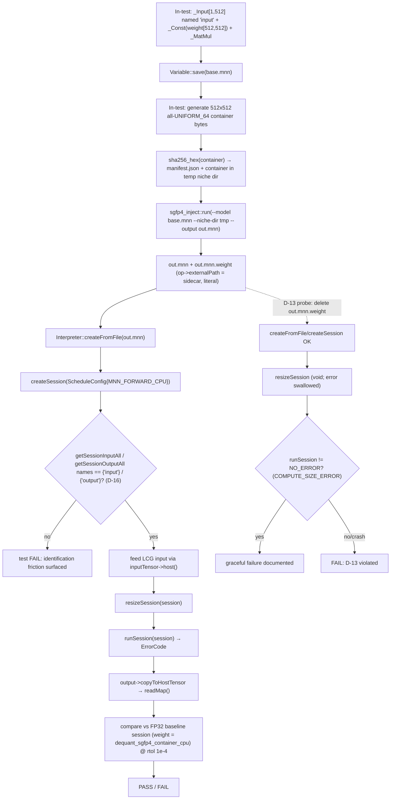

# Phase 6: Classic-API Load & Run Validation - Research

**Researched:** 2026-08-27
**Domain:** Classic Interpreter/Session API end-to-end validation of Phase 5's injected SGFP4 v2 artifacts (C++/CMake, CPU decode Execution)
**Confidence:** HIGH

<user_constraints>
## User Constraints (from 06-CONTEXT.md)

### Locked Decisions

#### Test Model & Artifact Scope
- **D-01:** Inject in-test — the test generates the base model at test time, runs injection, then loads the injected result via the classic API. No committed `.mnn`/sidecar fixtures.
- **D-02:** Base model topology is `Input[512] → MatMul(weight[512,512]) → output` — one real session input/output so input-identification friction is exercised (prior PoC graph had zero inputs).
- **D-03:** Classic-API entry point is `createFromFile` only (no `createFromBuffer` this phase).
- **D-04:** Injected weight source uses the demo-container chain (512×512, byte-verified, all `UNIFORM_64`); structured/quadtree containers are Phase 7.

#### FP32 Baseline & Tolerance
- **D-05:** FP32 baseline = SAME base model (pre-injection) loaded via classic API, run with the identical input.
- **D-06:** The base model's FP32 weight = the **decoded container** (`dequant_sgfp4_container_cpu` of the same bytes) — zero-by-construction weight difference, isolating classic-API plumbing correctness from quantization error.
- **D-07:** Tight pair-relative check (`checkVectorByRelativeError`-style, rtol ~1e-4); bit-exactness NOT required.
- **D-08:** Session input tensor filled deterministically in-code (fixed values / LCG); no golden-output vector, no per-run randomness.

#### Validation Harness Form
- **D-09:** New `run_test.out` suite (e.g. `test/op/SGFP4ClassicAPITest.cpp`, registered `op/sgfp4/classic_api`), using the established filtered-suite workaround for the `FP4ModelTest.cpp` full-build blocker.
- **D-10:** Container fixture is **generated** (small `.sgfp4` or C-array header under `test/op/`, following `SGFP4DequantFixtures.h`) — NOT the 132,368-byte committed `demo.sgfp4`, NOT an env-var-skip path.
- **D-11:** Test exercises the tool's **real input contract**: writes a synthetic niche dir (manifest.json with correct sha256 computed over the generated container + the container file) to a temp dir at runtime, then injects.
- **D-12:** Injection via a **shared core header**: refactor `sgfp4_inject.cpp`'s core into `tools/fp4/sgfp4_inject_core.hpp` (function: model path + niche dirs + output path → exit int); tool `main()` and test both link it. No subprocess, no re-implementation.

#### Failure-Mode Probing Depth
- **D-13:** **Probe missing sidecar**: with the `.weight` sidecar absent, classic-API load/run must fail gracefully (non-zero ErrorCode / nullptr) rather than crash.
- **D-14:** Skip corrupted-payload probing (Phase 7).
- **D-15:** Skip OOB-offset probing via hand-tampered artifacts (Phase 7).
- **D-16:** Test **explicitly asserts named session input/output identification** (`getSessionInputAll`/`getSessionOutputAll`) — if names differ after injection, the test fails and surfaces the friction.

### Agent's Discretion
- Exact fixture generation method (C-array header vs. generated `.sgfp4` written to temp), fixture size, temp-dir mechanism (portable, no `<filesystem>` per Phase 5 precedent).
- Test class/file naming beyond the `SGFP4*Test.cpp` pattern; suite registration string within `op/sgfp4/`.
- Shared core header's exact signature/structure.
- Whether the missing-sidecar probe is the same or a sibling test case.
- Error-diagnostic wording and logging verbosity.

### Deferred (OUT OF SCOPE)
- `createFromBuffer` classic-API coverage (revisit at SGProcessingManager integration).
- Corrupted-payload / OOB-offset failure probing — Phase 7 (SGINJ-08).
- Real quantization-error tolerance calibration — v3.0 Phase 10.
- Conv2D-weight injection under classic API (4-D weights vs `{dimO, dimI}` convention) — v3.0.
- Multi-tensor / LAYOUT_MIXED structured-container classic-API runs — Phase 7.
</user_constraints>

## Summary

Phase 6 proves the thing SGINJ-05/SGINJ-06 demand and the workstream core-value promise states: **the injected artifact loads and runs through the classic `Interpreter`/`Session` API** (`Interpreter::createFromFile` → `createSession` → `resizeSession` → `runSession`), the exact path downstream `SGProcessingManager::MNN_Tensor::Process()` uses. Phase 5 proved artifact validity only at the Express `Module::load` level (in-tool verify + `SGFP4InjectTest`); the classic path has never been exercised end-to-end against an injected artifact.

The **classic path is not merely a re-run of the Express path.** Three things differ and each is a claimed-proof target:

1. **Execution creation goes through `OpCommonUtils::createExecutionWithExternal`**, not Express `Module::load`. Verified: that function's `switch (op->main_type())` only auto-rewrites `OpParameter_Convolution2D`/`OpParameter_Scale`/`OpParameter_LayerNorm` (`OpCommonUtils.cpp:683-690`); `OpParameter_SGFP4DequantParam` falls through to `backend->onCreate(inputs, outputs, op)` with the **original, unmodified op** — whose `externalPath` was serialized literally by the injector. This is success criterion 3 (no session-level `setExternalFile`) and Pitfall 2 of Phase 5, confirmed at source.

2. **Session input/output tensors are identified by name** via `Schedule` (not by VARP graph position). The Phase 5 test built its input with `_Input(...)` **without naming it**, so it never verified what `getSessionInputAll` returns. That is exactly the success-criterion-1 friction ("the only prior PoC graph had zero inputs"). D-16 forces the test to name input/output and assert the names survive.

3. **`Interpreter::resizeSession` returns `void` and silently discards the `Session::resize()` ErrorCode** (`Interpreter.cpp:483-497`). This is the single most important finding for D-13: a failed `CPUSGFP4Dequant::onResize` (missing sidecar → `NOT_SUPPORT`) does NOT surface at `resizeSession`. It leaves the session in `mNeedResize == true`, so the failure is observable **only** at `runSession` (returns `COMPUTE_SIZE_ERROR`, `Session.cpp:238-243`) or via `getSessionInfo(RESIZE_STATUS)` (`Session.cpp:288-295`, status `2`). D-13's probe MUST go through `runSession`, not `resizeSession`.

**Primary recommendation:** One new test file `test/op/SGFP4ClassicAPITest.cpp` (registration `op/sgfp4/classic_api`, plus a sibling `op/sgfp4/classic_api_missing_sidecar` for D-13), gated on `#ifdef MNN_SUPPORT_TRANSFORMER_FUSE` like the Phase 5 tests. It (1) builds the base `Input[512] → MatMul[512,512]` graph **with explicitly named input/output**, (2) saves it to a temp path, (3) generates a valid 512×512 all-`UNIFORM_64` v2 container in-test, (4) writes the synthetic niche dir (manifest.json + container) to a temp dir with sha256 computed via `sgfp4::sha256_hex`, (5) invokes the shared core `sgfp4_inject::run(...)` (D-12 refactor), (6) loads the injected artifact via `createFromFile` → `createSession`, asserts `getSessionInputAll`/`getSessionOutputAll` names (D-16), feeds the LCG input, resizes, runs, reads output, and (7) compares against an FP32 baseline session built from the decoded container (D-05/D-06/D-07). Every building block below is traced to in-repo source.

**Confidence: HIGH** — the classic-API flow, the `createExecutionWithExternal` fall-through, the `resizeSession`-swallows-error behavior, and the decode oracle are all byte-verified in the repository. The only genuinely novel code is (a) the in-test container fixture generation and (b) the D-12 refactor, both flagged explicitly below.

## Architectural Responsibility Map

| Capability | Primary Tier | Secondary Tier | Rationale |
|------------|-------------|----------------|-----------|
| Build base `Input[512]→MatMul[512,512]` graph in-test | Express `_Input`/`_Const`/`_MatMul` + `Variable::save(file)` | — | Exact Phase 5 recipe (`SGFP4InjectTest.cpp:160-180`) |
| Name input/output so names survive save/load (D-16) | `Variable::setName` on input + MatMul output VARP | — | `Variable::save` serializes `mOutputNames`; unnamed `_Input` yields an empty/mangled tensor name |
| Generate 512×512 all-UNIFORM_64 container in-test (D-10) | Tool-local C++ framing (mirror `encode_sgfp4.py:391-460`) | extended `encode_sgfp4.py --emit-cpp-fixture` | 64 uniform-64 records, linear record order; no 132KB committed blob |
| Compute container sha256 (D-11) | `sgfp4::sha256_hex` (`tools/fp4/sha256.hpp`) | — | Vendored, KAT-verified in Phase 5 |
| Inject (D-12) | Shared `sgfp4_inject_core.hpp` `sgfp4_inject::run(argc,argv)` | — | Refactor of `sgfp4_inject.cpp` `injectMain`; no subprocess |
| Classic load/create/run | `Interpreter::createFromFile`/`createSession`/`resizeSession`/`runSession` | — | `Interpreter.hpp:109/327/483/426`; canonical flow `pictureRecognition.cpp` |
| Named tensor identification (D-16) | `getSessionInputAll`/`getSessionOutputAll` | — | `Interpreter.hpp:466/475` → `Session::getInputAll/getOutputAll` |
| Decode under classic path | `CPUSGFP4Dequant` Execution | — | Created via `createExecutionWithExternal` fall-through (`OpCommonUtils.cpp:683-690`) |
| FP32 baseline decode (D-06) | `dequant_sgfp4_container_cpu` | — | `SGFP4DequantUtils.hpp:336` |
| Tolerance check (D-07) | `checkVectorByRelativeError` | — | `test/TestUtils.h:58` |
| Missing-sidecar graceful failure (D-13) | `runSession` return code / `getSessionInfo(RESIZE_STATUS)` | — | `resizeSession` discards resize error (`Interpreter.cpp:483-497`) |

<phase_requirements>
## Phase Requirements

| ID | Description | Research Support |
|----|-------------|------------------|
| SGINJ-05 | Injected artifact loads and runs via classic `Interpreter::createFromFile`/`createFromBuffer` → `createSession` → `runSession`; expect friction around session input/output tensor identification | Flow verified in `demo/exec/pictureRecognition.cpp:32-130`; `Interpreter.hpp:109/327/426`; input naming friction traced to `_Input` (unnamed) at `NeuralNetWorkOp.cpp:54-62` + `Variable::setName` at `Expr.cpp:571-574`. `createFromBuffer` deliberately out of scope (D-03). |
| SGINJ-06 | End-to-end inference with injected weight matches FP32/reference baseline within tolerance on CPU; external sidecar resolves under classic path (path arrives via the op, not `setExternalFile`) | `createExecutionWithExternal` only rewrites Conv2D/Scale/LayerNorm (`OpCommonUtils.cpp:683-690`); `SGFP4Dequant` uses the literal serialized `op->externalPath` (`CPUSGFP4Dequant.cpp:48-77`). Schema field `Op.externalPath` (`schema/default/MNN.fbs:455`) serialized by `Variable::save` (`MNN_generated.h:4708`). Baseline via `dequant_sgfp4_container_cpu`; tolerance via `checkVectorByRelativeError`. |

*Requirement IDs supplied by orchestrator: SGINJ-05, SGINJ-06.*
</phase_requirements>

## Standard Stack

This phase adds **no external packages**. Everything is in-repo or platform API. The only new code is a header-only refactor and a test file.

### Core
| Library | Version | Purpose | Why Standard |
|---------|---------|---------|--------------|
| MNN Interpreter/Session API | in-repo (`include/MNN/Interpreter.hpp`) | Classic load/create/run, named tensor maps | The exact downstream `SGProcessingManager::MNN_Tensor::Process()` surface |
| MNN Express (`Variable`/`Expr`/`Module`) | in-repo | Base-model build + save; in-tool verify inside the shared core | Reused from Phase 5 |
| `MNN/SGFP4DequantUtils.hpp` | in-repo | `dequant_sgfp4_container_cpu` oracle (D-06), framing constants for in-test container generation | Single source of format truth |
| rapidjson | vendored `3rd_party/rapidjson` | manifest.json parsing inside shared core (D-11) | Already used by the tool; global include dir `3rd_party/` (`CMakeLists.txt:446`) |
| `sgfp4::sha256_hex` | vendored `tools/fp4/sha256.hpp` | container sha256 for manifest (D-11) | Phase 5 output, KAT-verified |

### Supporting
| Library | Version | Purpose | When to Use |
|---------|---------|---------|-------------|
| MNN generated FlatBuffers types | generated `schema/current/` | `OpT`/`SGFP4DequantParamT` inside shared core | Carried by the refactor |
| `checkVectorByRelativeError` | `test/TestUtils.h` | D-07 tolerance | Test-only |
| Win32 `FindFirstFileA` / POSIX `dirent.h` | platform | niche-dir discovery inside shared core | Already in `sgfp4_inject.cpp`; preserved by refactor |

### Alternatives Considered
| Instead of | Could Use | Tradeoff |
|------------|-----------|----------|
| In-test C++ container generation | Extend `encode_sgfp4.py --emit-cpp-fixture` with a 512×512 case | Encoder regeneration is the "official" fixture path but commits ~800KB of hex C-array text and adds a Python+numpy dev-time step; in-test generation is self-contained and ~40 lines |
| Reuse existing `SGFP4DequantFixtures.h` | — | Not viable: all uniform fixtures are 64×64 (or 64×192), none is 512×512 (see Pitfall 6) |
| `resizeSession` return code for D-13 | `runSession` return / `getSessionInfo(RESIZE_STATUS)` | `resizeSession` returns `void` and discards the error (`Interpreter.cpp:483-497`) — the latter two are the only observables |
| Session-level `setExternalFile` for the classic path | Literal `op->externalPath` | The op is NOT in `createExecutionWithExternal`'s rewrite switch; the literal path is authoritative (SGINJ-06) |

**Installation:** none. The shared core header and test are compiled into existing targets; no new link dependencies (Express is already in `${MNN_DEPS}`, linked by both `sgfp4_inject.out` and `run_test.out`).

**Version verification:** no registry lookups apply. Op type/enum and `externalPath` schema field re-verified this session against `schema/default/MNN.fbs:455`, `schema/current/MNN_generated.h:4708`, and the `createExecutionWithExternal` switch in `source/core/OpCommonUtils.cpp:683-690`.

## Package Legitimacy Audit

**No external packages are installed by this phase.** All dependencies are vendored in-repo or platform APIs already in use by Phase 5.

| Package | Registry | Age | Downloads | Source Repo | slopcheck | Disposition |
|---------|----------|-----|-----------|-------------|-----------|-------------|
| (none) | — | — | — | — | n/a | n/a |

*The slopcheck / registry-verification protocol is not applicable: no `npm`/`pip`/`cargo` installs. The one dev-time decision (regenerate a fixture via `encode_sgfp4.py`) is a `[CITED]`-class in-repo pattern, not a registry package.*

## Architecture Patterns

### System Architecture Diagram



### Pattern 1: Canonical classic-API flow (the exact downstream path)
**What:** `createFromFile` → `createSession` → get named tensors → resize → run → read output.
**When to use:** The whole phase; mirrors `demo/exec/pictureRecognition.cpp`.
**Example (verified against `pictureRecognition.cpp`):**
```cpp
// demo/exec/pictureRecognition.cpp:32,38-46,116,121-130
std::shared_ptr<Interpreter> net(Interpreter::createFromFile(path), Interpreter::destroy); // nullptr on invalid model
ScheduleConfig config;
config.type = MNN_FORWARD_CPU;                          // D: CPU baseline + injected run
auto session = net->createSession(config);              // Interpreter.hpp:327
auto input   = net->getSessionInput(session, nullptr);  // Interpreter.hpp:446 (nullptr = first input)
net->resizeSession(session);                            // Interpreter.hpp:483 — returns VOID
auto output  = net->getSessionOutput(session, nullptr); // Interpreter.hpp:456
// (canonical demo checks output->elementSize()==0 after resize, pictureRecognition.cpp:56)
ErrorCode code = net->runSession(session);              // Interpreter.hpp:426
std::shared_ptr<Tensor> outUser(new Tensor(output, dimType));
output->copyToHostTensor(outUser.get());                // pictureRecognition.cpp:121-130
const float* data = outUser->host<float>();
```

### Pattern 2: Feed input under the classic CPU path
**What:** After `resizeSession`, the session input tensor's host buffer is writable for a CPU session; write the deterministic LCG values directly, or via a host Tensor + `copyFromHostTensor`.
**When to use:** D-08 input feeding.
**Example:**
```cpp
// Option A (simplest, CPU Session_Input_Inside default):
auto inputTensor = net->getSessionInput(session, nullptr);
net->resizeSession(session);
::memcpy(inputTensor->host<float>(), inputVals.data(), inputVals.size() * sizeof(float));
// Option B (canonical demo pattern, pictureRecognition.cpp:98):
//   build a host Tensor inputUser, fill it, then input->copyFromHostTensor(inputUser.get());
```
**Caution:** `resizeSession` must be called **before** writing (the input host buffer is (re)allocated during resize); the demo calls `resizeTensor`/`resizeSession` before `copyFromHostTensor` (`pictureRecognition.cpp:47-51,98`).

### Pattern 3: Name the base-model input and output explicitly (D-16)
**What:** `Variable::setName` on the `_Input` VARP and on the `_MatMul` output VARP before `Variable::save`, so `getSessionInputAll`/`getSessionOutputAll` return deterministic keys.
**When to use:** Always in this phase — this is the success-criterion-1 friction.
**Example:**
```cpp
// express/NeuralNetWorkOp.cpp:54-62 (unnamed), express/Expr.cpp:571-574 (setName)
auto input = _Input({1, kDimI}, NHWC, halide_type_of<float>());
input->setName("input");                       // <-- required for D-16
auto weight = _Const(w.data(), {kDimO, kDimI}, NHWC, halide_type_of<float>());
weight->setName("weight");
auto out = _MatMul(input, weight);             // express/MathOp.cpp:988
out->setName("output");                        // <-- required for D-16
Variable::save({out}, basePath.c_str());       // include/MNN/expr/Expr.hpp:157
```
**Why:** `_Input` (`NeuralNetWorkOp.cpp:54`) creates a `VARP::INPUT` Expr whose `mOutputNames` are default-empty. `Variable::name()`/`setName` operate on `mFrom->mOutputNames[mFromIndex]` (`Expr.cpp:571-574`). An unnamed input serializes with an empty (or schedule-mangled) tensor name; `Session::getInput` on `""` is unspecified. Explicitly naming both is the only deterministic contract — exactly what D-16 asks the test to assert. (The Phase 5 test never named the input and never checked its name — this phase closes that gap.)

### Pattern 4: Inject via the shared core header (D-12)
**What:** Extract everything in `sgfp4_inject.cpp` except `main()` into a header-only `tools/fp4/sgfp4_inject_core.hpp`, exposing `int sgfp4_inject::run(int argc, const char* argv[])`; the tool's `main()` and the test both call it.
**When to use:** Every injection in this phase; no subprocess, no re-implementation.
**Example (current structure to preserve):**
```cpp
// tools/fp4/sgfp4_inject.cpp current structure:
//   anonymous-namespace helpers: toLower, basenameOf, readFileBytes,
//     listDirEntries (FindFirstFile/dirent), usage, loadNicheDir, makeDequantOp,
//     injectMain(argc, argv)  -- CLI parse at top, exit 0/1
//   int main(int argc, const char* argv[]) { return injectMain(argc, argv); }  // lines 459-461
//
// Refactor:
//   tools/fp4/sgfp4_inject_core.hpp  -- everything above, in namespace sgfp4_inject,
//                                       all free functions `inline`, injectMain → run()
//   tools/fp4/sgfp4_inject.cpp       -- #include "sgfp4_inject_core.hpp";
//                                       int main(int argc, const char* argv[]) { return sgfp4_inject::run(argc, argv); }
//
// Test:
//   #include "fp4/sgfp4_inject_core.hpp"   // global include dir ${...}/tools/ (CMakeLists.txt:444)
//   const char* argv[] = {"sgfp4_inject", "--model", basePath.c_str(), "--niche-dir", nicheDir.c_str(),
//                         "--output", outPath.c_str(), nullptr};
//   int rc = sgfp4_inject::run(5, argv);   // 0 == success; assert rc == 0
```

### Pattern 5: Synthetic niche dir satisfying the tool's real contract (D-11)
**What:** Write `manifest.json` (with `fp4_binary.sha256` = sha256 of the generated container, `fp4_binary.path` basename matching the container filename, `fp4_binary.stats.shape = [512,512]`) + the container file into a temp dir; then point `--niche-dir` at it.
**When to use:** The injection step; exercises manifest parse + sha256 + version gate exactly as the CLI would.
**Example:** mirror `loadNicheDir`'s expected fields (`sgfp4_inject.cpp` `loadNicheDir`, which reads `fp4_binary.sha256`, `fp4_binary.path` (basename-only), `fp4_binary.stats.shape` as exactly 2 positive ints). The manifest JSON shape:
```json
{"fp4_binary": {"path": "phase6_fixture.sgfp4",
                "sha256": "<hex from sgfp4::sha256_hex>",
                "stats": {"shape": [512, 512]}}}
```
Write with `sgfp4::sha256_hex(containerBytes.data(), containerBytes.size())` (`tools/fp4/sha256.hpp`); container filename must match `fp4_binary.path`'s basename and be the unique `*.sgfp4` in the dir.

### Anti-Patterns to Avoid
- **Reading the D-13 failure from `resizeSession`:** it returns `void` and discards the resize error (`Interpreter.cpp:483-497`). Observe it via `runSession`'s `ErrorCode` (or `getSessionInfo(RESIZE_STATUS)`) instead.
- **Reusing `SGFP4DequantFixtures.h` for the 512×512 topology:** all uniform fixtures there are 64×64 (or 64×192) — none matches D-02/D-04's 512×512 (Pitfall 6).
- **Committing `demo.sgfp4` bytes or an env-var skip:** D-10 forbids both; generate the container in-test (or regenerate a fixture header).
- **Forgetting to name input/output:** yields an empty/mangled `getSessionInputAll` key and a flaky D-16 assertion (Pattern 3).
- **Re-implementing injection in the test:** D-12 forbids it; call the shared core header.

## Don't Hand-Roll

| Problem | Don't Build | Use Instead | Why |
|---------|-------------|-------------|-----|
| Container decode (oracle + baseline) | Custom byte parser | `dequant_sgfp4_container_cpu` (`SGFP4DequantUtils.hpp:336`) | Bounds-checked, byte-verified; ASVS V5 posture |
| Injection (graph surgery + sidecar + verify) | Re-implementation in test | `sgfp4_inject_core.hpp` `run()` | D-12; Phase 5's proven single source |
| SHA-256 (D-11) | New crypto | `sgfp4::sha256_hex` (`tools/fp4/sha256.hpp`) | Vendored, KAT-verified Phase 5 |
| Classic load/run/readout | Raw FlatBuffers | `Interpreter`/`Session`/`Tensor` API | The exact downstream path |
| Tolerance check (D-07) | Hand-rolled | `checkVectorByRelativeError` (`test/TestUtils.h:58`) | Established test helper |

**Key insight:** Every difficult sub-problem (decode correctness, injection, sha256, classic scheduling) is already solved in-repo. The only genuinely new logic is (a) the in-test container **framing** (uniform-64 is the trivial degenerate case) and (b) the D-12 **refactor** (mechanical move, no behavior change). Hand-rolling the solved pieces would reintroduce the exact bugs v1.0/Phase 5 already eliminated.

## Common Pitfalls

### Pitfall 1: `Interpreter::resizeSession` swallows the resize error (D-13)
**What goes wrong:** A planner that probes D-13 by checking `resizeSession`'s return will see nothing — it returns `void`.
**Why it happens:** `Interpreter::resizeSession(Session*, int)` ends with a bare `session->resize();` discarding the `ErrorCode` (`Interpreter.cpp:495-497`). The failing `CPUSGFP4Dequant::onResize` (`NOT_SUPPORT` when the sidecar is missing, `CPUSGFP4Dequant.cpp:50-53,66-68`) propagates `Pipeline::resize → Session::resize` (returns the code, `Pipeline.cpp:1007-1034`), but `Session::resize` leaves `mNeedResize == true` (it re-sets `mNeedResize = true` before `allocMemory`, `Session.cpp:250-310`) and `resizeSession` drops the code.
**How to avoid:** Probe at `runSession`: `Session::run` returns `COMPUTE_SIZE_ERROR` when `mNeedResize` (`Session.cpp:238-243`); or `net->getSessionInfo(session, Interpreter::RESIZE_STATUS, &status)` returns `2` (`Session.cpp:288-295`). Assert `runSession != NO_ERROR` (and no crash). Document this precisely for the downstream `SGProcessingManager` team (their `Process()` path has an unchecked-nullptr deref).
**Warning signs:** test hangs/crashes, or a "missing sidecar should fail" probe that passes because it only checked `resizeSession`.

### Pitfall 2: `externalPath` is NOT auto-injected for `SGFP4Dequant` (SGINJ-06)
**What goes wrong:** Assuming `Interpreter::setExternalFile` / `ScheduleConfig`-level external file will feed the op. It will not.
**Why:** `OpCommonUtils::createExecutionWithExternal`'s `switch` only sets `hasExternal` for Conv2D/Scale/LayerNorm (`OpCommonUtils.cpp:683-690`); `SGFP4Dequant` takes the `!hasExternal` branch → `backend->onCreate(inputs, outputs, op)` with the original op, whose `externalPath` is the literal string the injector serialized (`sgfp4_inject.cpp:249-263`; `schema/default/MNN.fbs:455`). `Interpreter::setExternalFile` merely sets `mNet->externalFile` (`Interpreter.cpp:186`) → `ScheduleInfo::externalWeightPath` (`Interpreter.cpp:413`) → the `FileLoader` inside `_createExecutions` (`Pipeline.cpp:545`) — which the SGFP4 op never consults.
**How to avoid:** Confirm the injected artifact's `op->externalPath` is the sidecar path (absolute, so it resolves regardless of CWD); do NOT set a session-level external file. This is success criterion 3 — the test should run with no `setExternalFile` call at all.
**Warning signs:** `CPUSGFP4Dequant::onResize → NOT_SUPPORT` at runtime despite a valid sidecar.

### Pitfall 3: Relative vs absolute sidecar path in the serialized op
**What goes wrong:** The injector writes `op->externalPath = sidecarPath` where `sidecarPath = outputPath + ".weight"`. If the test passes a **relative** `--output`, the serialized path resolves against the process CWD at load time — fragile and order-dependent.
**Why:** `CPUSGFP4Dequant::onResize` opens `mOp->externalPath()->str()` verbatim (`CPUSGFP4Dequant.cpp:66,77`); no resolution against the model file's directory.
**How to avoid:** Always use absolute temp paths for `--output` (and hence the sidecar) in the test — the Phase 5 `tempPath` helper pattern (`SGFP4InjectTest.cpp`) already produces full paths; keep that.

### Pitfall 4: `FileLoader::size()` is not a file stat (already fixed, do not regress)
**What goes wrong:** Using `FileLoader::size()` to bound `external()[1]` returns 0 for offset+size reads; an oversized declared `size` then forces a huge allocation.
**Why:** Documented in `CPUSGFP4Dequant.cpp:20-38` — `size()` only reflects bytes pulled by the whole-file `read()`. The op already uses a direct `std::ifstream` `queryFileSize` probe before `mContainer.resize`.
**How to avoid:** Leave `CPUSGFP4Dequant.cpp` untouched this phase; the D-13 probe exercises its `queryFileSize` failure path (`return NOT_SUPPORT` on missing file, `CPUSGFP4Dequant.cpp:66-68`).

### Pitfall 5: Existing fixtures are 64×64 — not usable for D-02's 512×512
**What goes wrong:** A planner reuses `findFixture("mode0_uniform64")` from `SGFP4DequantFixtures.h` for a `MatMul[512,512]` — the shape does not match, and the injector's exact-shape pairing (D-02) will find zero matches and hard-error.
**Why:** `SGFP4DequantFixtures.h` `kFixtures[]` rows are all `dimO=64, dimI=64` (or `64×192`); none is 512×512. The 512×512 container is the demo lineage (D-04), ~132KB.
**How to avoid:** Generate a 512×512 all-UNIFORM_64 container in-test (Pattern below) or regenerate a fixture header with a 512×512 case. Note the tension with D-10's word "small" — a 512×512 all-uniform64 container is inherently ~132KB; see Open Question 1.

### Pitfall 6: Windows path/`windows.h` hazards in the shared core header
**What goes wrong:** Moving the Win32 `FindFirstFileA` directory-listing helper into a header included by the test TU can collide with `min`/`max` macros or require `_CRT_SECURE_NO_WARNINGS`.
**Why:** `sgfp4_inject.cpp` already guards `NOMINMAX` before `<windows.h>` (`05-02-SUMMARY.md` Deviations). The test TU (`run_test.out`) does not define `_CRT_SECURE_NO_WARNINGS` (only `sgfp4_inject.out` does, `tools/fp4/CMakeLists.txt`), so any `fopen`/`strcpy`-class calls inside the header would warn under MSVC `/W3`.
**How to avoid:** Keep the `NOMINMAX` guard self-contained in the header; prefer the header's existing `std::ifstream`-based file IO (already `_CRT_SECURE`-clean); if a warning appears, the test target can add the same `_CRT_SECURE_NO_WARNINGS` definition. `run_test.out` already has `/bigobj` (`test/CMakeLists.txt`).

## Code Examples

Verified patterns from official/in-repo sources:

### Complete classic-API validation skeleton (compiles against current repo)
```cpp
// Sources: demo/exec/pictureRecognition.cpp (flow), include/MNN/Interpreter.hpp,
//          test/op/SGFP4InjectTest.cpp (base-model + oracle), test/TestUtils.h
#ifdef MNN_SUPPORT_TRANSFORMER_FUSE
#include "MNN_generated.h"
#include "MNN/SGFP4DequantUtils.hpp"
#include "MNN/expr/Expr.hpp"
#include "MNN/expr/ExprCreator.hpp"
#include "MNN/expr/Executor.hpp"
#include "MNN/expr/Module.hpp"
#include "MNNTestSuite.h"
#include "TestUtils.h"
#include "fp4/sgfp4_inject_core.hpp"   // D-12 shared core (global include dir ${...}/tools/)

using namespace MNN::Express;

// 1) Build + save the FP32 baseline and base model with NAMED io (D-16).
auto input  = _Input({1, kDimI}, NHWC, halide_type_of<float>()); input->setName("input");
auto weight = _Const(w.data(), {kDimO, kDimI}, NHWC, halide_type_of<float>()); weight->setName("weight");
auto out    = _MatMul(input, weight); out->setName("output");                 // MathOp.cpp:988
Variable::save({out}, basePath.c_str());                                       // Expr.hpp:157

// 2) Inject via shared core (D-12) — absolute paths (Pitfall 3).
const char* argv[] = {"sgfp4_inject", "--model", basePath.c_str(),
                      "--niche-dir", nicheDir.c_str(), "--output", outPath.c_str(), nullptr};
if (0 != sgfp4_inject::run(5, argv)) { /* inject failed */ }

// 3) Classic load + named tensor identification (D-16, SGINJ-05).
std::shared_ptr<Interpreter> net(Interpreter::createFromFile(outPath.c_str()), Interpreter::destroy);
ScheduleConfig cfg; cfg.type = MNN_FORWARD_CPU;
auto session = net->createSession(cfg);                       // Interpreter.hpp:327
const auto& inAll  = net->getSessionInputAll(session);        // Interpreter.hpp:466
const auto& outAll = net->getSessionOutputAll(session);       // Interpreter.hpp:475
if (inAll.count("input") == 0 || outAll.count("output") == 0) { return false; }  // D-16

// 4) Feed LCG input + run (D-08).
auto inputTensor = net->getSessionInput(session, nullptr);
net->resizeSession(session);                                  // returns VOID (Pitfall 1)
::memcpy(inputTensor->host<float>(), inputVals.data(), inputVals.size() * sizeof(float));
ErrorCode code = net->runSession(session);                    // Interpreter.hpp:426
if (NO_ERROR != code) { return false; }

// 5) Read output.
auto outputTensor = net->getSessionOutput(session, nullptr);
std::shared_ptr<Tensor> outUser(new Tensor(outputTensor, Tensor::CAFFE));
outputTensor->copyToHostTensor(outUser.get());
const float* got = outUser->host<float>();

// 6) Compare vs FP32 baseline (D-05/D-06/D-07): a second classic session on
//    base.mnn whose weight is the decoded container (dequant_sgfp4_container_cpu).
return checkVectorByRelativeError<float>(got, baselinePtr, outCount, 1e-4f);
#endif // MNN_SUPPORT_TRANSFORMER_FUSE
```

### In-test 512×512 all-UNIFORM_64 container generation (D-10; degenerate framing)
```cpp
// Source: tools/fp4/encode_sgfp4.py:391-460 (encode_macroblock + encode_container),
//         include/MNN/SGFP4DequantUtils.hpp (constants)
// The uniform-64 record is the degenerate case: one 64x64 leaf, mode 0.
// sb_header = layout_enum & 0x7 (NO x/y — position is implicit in record order,
// decode is fully sequential/linear). A 512x512 container = 64 such records.
//  - header:   b"SGF4" + version(0x02) + B(=64) + pad0 → 16 bytes
//  - offsets:  64 x u32 LE record offsets, 16-byte aligned region
//  - records:  64 x (sb_header + 1 leaf header + aligned payload of 2048 code bytes)
// The decoder (dequant_sgfp4_container_cpu) fills output[0..4096), [4096..8192), ...
// Verify the generated bytes in-test with sgfp4_is_v2_container + dequant_sgfp4_container_cpu.
```
(Note: this is the one place the phase writes *framing* code. Keep it minimal and validate against `dequant_sgfp4_container_cpu` in the same test — the oracle the baseline itself uses. Alternatively regenerate a fixture header with a 512×512 case — Open Question 1.)

### D-13 missing-sidecar probe
```cpp
// Delete out.mnn.weight AFTER injection; then:
auto net  = Interpreter::createFromFile(outPath.c_str());   // still non-null (model is valid)
auto sess = net->createSession(cfg);                        // still non-null (schedule succeeds)
net->resizeSession(sess);                                   // error swallowed (Pitfall 1)
ErrorCode code = net->runSession(sess);                     // Session::run → COMPUTE_SIZE_ERROR
if (NO_ERROR == code) { return false; }                     // must fail gracefully, no crash
```

## State of the Art

| Old Approach | Current Approach | When Changed | Impact |
|--------------|------------------|--------------|--------|
| Artifact validity proven only via Express `Module::load` | Proven via classic `Interpreter`/`Session` (the downstream `SGProcessingManager` path) | Phase 6 | First end-to-end proof of the workstream's core-value claim |
| Injection invoked as a subprocess/CLI only | Invoked in-process via shared `sgfp4_inject_core.hpp` | Phase 6 (D-12) | Tool and test share one implementation |
| Session external file (`setExternalFile`) assumed sufficient | Literal `op->externalPath` shown authoritative for SGFP4Dequant | v1.0 (confirmed Phase 6) | Success criterion 3 |

**Deprecated/outdated:**
- "Resize failure is observable from `resizeSession`" — false; it returns `void` (`Interpreter.hpp:483`).
- "Existing `SGFP4DequantFixtures.h` covers the demo lineage" — false for 512×512; it is 64×64-only.

## Assumptions Log

| # | Claim | Section | Risk if Wrong |
|---|-------|---------|---------------|
| A1 | `dequant_sgfp4_container_cpu` decodes records in **fully sequential linear order** (record 0 fills the first span, etc.), so a 64-record uniform-64 container is a valid 512×512 container with no per-macroblock position in the header. | Code Examples | MEDIUM — verified against `encode_sgfp4.py:428-460` docstring + STATE.md Phase 1 note; must be re-confirmed by the in-test oracle round-trip in Wave 0. |
| A2 | Explicitly `setName`-ing the `_Input` and `_MatMul` output VARP before `Variable::save` yields exactly those keys in `getSessionInputAll`/`getSessionOutputAll` after classic load. | Pattern 3 | HIGH — this is the core of D-16; if the name is mangled (e.g. a suffix) the assertion must match the actual key. De-risk with a Wave 0 name-dump spike. |
| A3 | `sgfp4_inject_core.hpp` (header-only, `inline` free functions in `namespace sgfp4_inject`) compiles into both `sgfp4_inject.out` and `run_test.out` with no ODR/link issues and no extra link deps. | Pattern 4 | LOW-MEDIUM — mechanical refactor; watch MSVC `/W3` `_CRT_SECURE` warnings (Pitfall 6) and the Win32 `NOMINMAX` guard. |
| A4 | `runSession` returns `COMPUTE_SIZE_ERROR` (non-zero, no crash) for the missing-sidecar case via the `mNeedResize` guard. | Pitfall 1 | MEDIUM — traced to `Session.cpp:238-243`; if the session is constructed with `mNeedResize=false` under some mode, the error could surface differently. Confirm empirically in Wave 0. |
| A5 | The base-model MatMul weight (and therefore the baseline) is rank-2 `{512,512}`, matching the injector's 2-D-only pairing (A4 of Phase 5). | Summary | LOW — D-02/D-04 lock 512×512 2-D; the Phase 5 tool already pairs 2-D weights. |

## Open Questions

1. **Fixture generation method for the 512×512 container (D-10 tension).**
   - What we know: D-02/D-04 lock a 512×512 all-`UNIFORM_64` container; a 512×512 uniform64 container is inherently ~132KB (64 uniform-64 records) — the same size as the committed `demo.sgfp4` that D-10 forbids re-committing. Existing `SGFP4DequantFixtures.h` fixtures are 64×64.
   - Options: (a) **in-test C++ generation** (recommended) — ~40 lines mirroring `encode_macroblock`/`encode_container` for the uniform-64 degenerate case, self-contained, no committed blob, validated in-test by `dequant_sgfp4_container_cpu` + `sgfp4_is_v2_container`; (b) **extend `encode_sgfp4.py --emit-cpp-fixture`** with a 512×512 case and regenerate a new header — "official" fixture path but commits ~800KB of hex text and adds a Python+numpy dev-time regeneration step.
   - Recommendation: (a) in-test generation, with the generated bytes written to the synthetic niche dir (D-11). Flag (b) as the fallback if A1 is disproven.

2. **Exact key strings `getSessionInputAll`/`getSessionOutputAll` return for a named `_Input`/`_MatMul` output.**
   - What we know: `Variable::setName` writes `mOutputNames`; the input/output are named `"input"`/`"output"` in the base model.
   - What's unclear: whether classic `Schedule` preserves those names byte-for-byte or appends an index/suffix for the MatMul output (some MNN paths emit `output` vs `output0`).
   - Recommendation: Wave 0 spike dumps the full `getSessionInputAll`/`getSessionOutputAll` key sets and locks the assertion strings from the dump (D-16's "names may differ" warning makes this an expected-friction surface, not a surprise).

3. **Whether `createSession` itself performs an initial resize on some backends/modes.**
   - What we know: the canonical demo calls `resizeSession` explicitly (`pictureRecognition.cpp:51`); `Session` constructor sets `mNeedResize` via `mMode`.
   - What's unclear: the exact `mNeedResize` initial value for the default mode and whether an un-resized session already fails `runSession`.
   - Recommendation: follow the canonical flow (create → resize → run) exactly; the D-13 probe asserts on `runSession`'s code, which is robust to either initial state (A4).

4. **MSVC `_CRT_SECURE_NO_WARNINGS` for the test TU including the shared core header.**
   - What we know: `run_test.out` has `/bigobj` but not `_CRT_SECURE_NO_WARNINGS`; the header uses `std::ifstream` (already clean) but also `std::remove`/`FindFirstFile`.
   - What's unclear: whether any header call triggers a `/W3` deprecation warning in the test build.
   - Recommendation: if warnings appear, add `_CRT_SECURE_NO_WARNINGS` to the `run_test.out` target (or the specific test file) — a one-line `test/CMakeLists.txt` change.

## Environment Availability

| Dependency | Required By | Available | Version | Fallback |
|------------|------------|-----------|---------|----------|
| CMake | Build tests + tool | ✓ | 3.29.2 | — |
| MSVC (active toolchain per Phase 5) | Build `run_test.out` + `sgfp4_inject.out` | ✓ | Release `.build` | — |
| MNN core + Express (`${MNN_DEPS}`) | Shared core + test | ✓ | in-repo | — |
| `MNN_SUPPORT_TRANSFORMER_FUSE=ON` | SGFP4 tests actually execute (`#ifdef` gate) | ✓ | build flag | must pass `-DMNN_SUPPORT_TRANSFORMER_FUSE=ON` |
| `MNN_BUILD_TEST=ON` | `run_test.out` | ✓ | build flag | — |
| rapidjson | Shared core manifest parse | ✓ | vendored `3rd_party/rapidjson` (global include dir) | — |
| `tools/fp4/sha256.hpp` | sha256 for manifest | ✓ | vendored, Phase 5 output | — |
| Python + numpy | (only if Option (b) fixture regen) | ✓ | 3.13.4 | in-test generation avoids it |

**Missing dependencies with no fallback:** none.
**Missing dependencies with fallback:** Python+numpy — fallback is in-test C++ container generation (Option (a)).

## Validation Architecture

### Test Framework
| Property | Value |
|----------|-------|
| Framework | MNN custom test runner (`run_test.out`), `MNNTestSuite`/`MNNTestCase` (`test/main.cpp`, `test/MNNTestSuite.*`) |
| Config file | `test/CMakeLists.txt` (glob-recurses `test/**/*.cpp`, lines 12-15); new file auto-included |
| Registration | `MNNTestSuiteRegister(ClassName, "op/sgfp4/classic_api")` (mirror `SGFP4InjectTest.cpp` `op/sgfp4/inject`) |
| Gate | whole file `#ifdef MNN_SUPPORT_TRANSFORMER_FUSE` |
| Quick run command | `./run_test.out op/sgfp4/classic_api` (new) / `./run_test.out op/sgfp4/` (all SGFP4) |
| Full suite | `./run_test.out` (blocked by `FP4ModelTest.cpp` — filtered-suite workaround per STATE.md) |

### Phase Requirements → Test Map
| Req ID | Behavior | Test Type | Automated Command | File |
|--------|----------|-----------|-------------------|------|
| SGINJ-05 | Classic load/create/run succeeds; named I/O identified | integration | `./run_test.out op/sgfp4/classic_api` | `test/op/SGFP4ClassicAPITest.cpp` (Wave 1) |
| SGINJ-06 | Injected output == FP32 baseline within 1e-4; no `setExternalFile` | integration | `./run_test.out op/sgfp4/classic_api` | same file |
| D-16 | `getSessionInputAll`/`getSessionOutputAll` keys == base-model names | unit (within same case) | `./run_test.out op/sgfp4/classic_api` | same file |
| D-13 | Missing sidecar → graceful non-zero `runSession` | integration | `./run_test.out op/sgfp4/classic_api_missing_sidecar` | sibling case |

### Sampling Rate (Nyquist — what to verify at which point)
- **Wave 0 (spike, before implementation):** (1) name-dump — build a named base model, save, classic-load, print `getSessionInputAll`/`getSessionOutputAll` keys (resolves Open Q2, A2); (2) container round-trip — generate the 512×512 container in-test, assert `sgfp4_is_v2_container` true and `dequant_sgfp4_container_cpu` output size == 262144 (resolves A1); (3) D-13 trace — delete sidecar, assert `runSession` non-zero (resolves A4).
- **Per task commit:** `./run_test.out op/sgfp4/` (<30s, all SGFP4 suites stay green).
- **Per wave merge:** `./run_test.out op/sgfp4/classic_api` + a standalone build of `sgfp4_inject.out` (confirms the D-12 refactor kept the CLI target intact) + one manual CLI run against a temp niche dir.
- **Phase gate:** filtered SGFP4 suites green; `sgfp4_inject.out` builds and still verifies end-to-end; then `/gsd-verify-work 6`.

### Wave Gaps
- [ ] `tools/fp4/sgfp4_inject_core.hpp` — D-12 refactor (move all non-`main` code; rename `injectMain` → `sgfp4_inject::run`; keep `main()` in `sgfp4_inject.cpp`).
- [ ] `test/op/SGFP4ClassicAPITest.cpp` — `op/sgfp4/classic_api` + `op/sgfp4/classic_api_missing_sidecar`; in-test container generation + synthetic niche dir + shared-core injection + classic load/run + FP32 baseline compare.
- [ ] CMake: verify no `test/CMakeLists.txt` change is strictly required (`#include "fp4/sgfp4_inject_core.hpp"` resolves via the global `tools/` include dir, `CMakeLists.txt:444`); add `_CRT_SECURE_NO_WARNINGS` to `run_test.out` only if warnings appear (Open Q4).

## Security Domain

> `security_enforcement` is enabled (ASVS level 1, `security_block_on: high`). This phase reads one untrusted input indirectly (the injected `.mnn` + sidecar produced by the shared core) and probes one failure mode. No network/auth/session surface.

### Applicable ASVS Categories

| ASVS Category | Applies | Standard Control |
|---------------|---------|-----------------|
| V2/V3/V4 | no | n/a (offline test + tool) |
| V5 Input Validation | yes | Reuse the tool's existing gates: magic/version probe, sha256 integrity, exact-shape match (Phase 5); D-13 probes the decode Execution's missing-file path, not new parsing |
| V6 Cryptography | yes (sha256 only, integrity) | Reuse `sgfp4::sha256_hex`; never hand-roll crypto |

### Known Threat Patterns
| Pattern | STRIDE | Standard Mitigation |
|---------|--------|---------------------|
| Missing sidecar crashes the loader | DoS / Reliability | D-13 documents graceful `NOT_SUPPORT` → `COMPUTE_SIZE_ERROR`; `CPUSGFP4Dequant::onResize` already gates on `queryFileSize` failure (`CPUSGFP4Dequant.cpp:66-68`) |
| Oversized `external()[1]` forces large allocation | DoS | Already bounded by `queryFileSize` before `mContainer.resize` (`CPUSGFP4Dequant.cpp:60-72`); not this phase's change |
| Corrupt container bytes misdecoded | Tampering | `dequant_sgfp4_container_cpu` returns false on malformed input → `INVALID_VALUE` (`CPUSGFP4Dequant.cpp:107-115`); corrupted-payload probing deferred to Phase 7 (D-14) |

## Sources

### Primary (HIGH confidence — verified against in-repo source this session)
- `demo/exec/pictureRecognition.cpp:32,38-51,55-56,98,116,121-130` — canonical classic-API flow
- `include/MNN/Interpreter.hpp:109,327,426,446,456,466,475,483,563` — `createFromFile`/`createSession`/`runSession`/`getSessionInput`/`getSessionOutput`/`getSessionInputAll`/`getSessionOutputAll`/`resizeSession`/`resizeTensor`
- `source/core/Interpreter.cpp:186,413,483-497` — `setExternalFile` → `mNet->externalFile`; `externalWeightPath`; `resizeSession` discards `session->resize()` return
- `source/core/Session.cpp:238-243,250-310,288-295,493-496` — `Session::run` (`mNeedResize` → `COMPUTE_SIZE_ERROR`), `Session::resize` (flag handling), `RESIZE_STATUS`, `getInputAll`/`getOutputAll`
- `source/core/Pipeline.cpp:545-560,962-1034,1007-1034` — `_createExecutions` + `createExecutionWithExternal`; resize loop `onResize` error propagation
- `source/core/OpCommonUtils.cpp:683-690` — `createExecutionWithExternal` switch (Conv2D/Scale/LayerNorm only) → SGFP4Dequant fall-through
- `source/backend/cpu/CPUSGFP4Dequant.cpp:20-38,48-79,107-115` — `queryFileSize`; `onResize` externalPath gate + bounds; `onExecute` → `dequant_sgfp4_container_cpu`
- `schema/default/MNN.fbs:455`, `schema/current/MNN_generated.h:4708` — `Op.externalPath` string field + serialization
- `include/MNN/SGFP4DequantUtils.hpp:336` — `dequant_sgfp4_container_cpu` signature; framing constants used for in-test generation
- `include/MNN/expr/Expr.hpp:150-159` — `load`/`loadMap`/`getInputAndOutput`/`mapToSequence`/`save(file)`
- `express/NeuralNetWorkOp.cpp:54-76` — `_Input` (unnamed) / `_Const`; `express/MathOp.cpp:988` — `_MatMul`; `express/Expr.cpp:571-574` — `Variable::setName`
- `test/TestUtils.h:58` — `checkVectorByRelativeError` (threshold = max|ref| × rtol)
- `test/op/SGFP4InjectTest.cpp:160-180,196,248-261` — base-model build, literal `externalPath`, oracle + tolerance check
- `test/op/SGFP4DequantFixtures.h` — all-uniform fixtures are 64×64 (or 64×192), generated by `tools/fp4/encode_sgfp4.py --emit-cpp-fixture`
- `tools/fp4/sgfp4_inject.cpp:249-263,266-290,459-461` — `makeDequantOp`, CLI parse, `main → injectMain` (D-12 refactor source)
- `tools/fp4/CMakeLists.txt:1-6`, `tools/fp4/sha256.hpp` — tool build + `sgfp4::sha256_hex`
- `test/CMakeLists.txt:12-15,44,50` — glob-recurse, include dir, `/bigobj`
- `CMakeLists.txt:50,439-447,970-971` — `MNN_BUILD_SGFP4_TOOLS` option; global include dirs (`tools/`, `3rd_party/`); `tools/fp4` include
- `tools/fp4/encode_sgfp4.py:391-460` — `encode_macroblock` + `encode_container` (framing reference for in-test generation)
- `.planning/workstreams/sgfp4-pivot/{REQUIREMENTS.md,ROADMAP.md,STATE.md,06-CONTEXT.md,05-RESEARCH.md,05-01-SUMMARY.md,05-02-SUMMARY.md}` — decisions/history

### Secondary (MEDIUM confidence — inferred, needs Wave 0 confirmation)
- Exact `getSessionInputAll`/`getSessionOutputAll` key strings for a named `_Input`/`_MatMul` output (A2/Open Q2).
- `runSession` returning `COMPUTE_SIZE_ERROR` for the missing-sidecar case under the default session mode (A4/Open Q3).

### Tertiary (LOW confidence)
- None — all findings were verified against in-repo source; the only `[ASSUMED]` items are A1-A5.

## Metadata

**Confidence breakdown:**
- Standard stack: HIGH — all components vendored/in-repo, no registry installs.
- Architecture: HIGH — classic-API flow, `createExecutionWithExternal` fall-through, and `resizeSession` error-swallowing traced to exact source lines.
- Pitfalls: HIGH — Pitfalls 1-3 traced to source; Pitfall 5 (fixture size) verified against `SGFP4DequantFixtures.h`.
- Open Questions: MEDIUM — the D-16 key-string exactness (Q2) and A1/A4 are explicitly queued as Wave 0 spikes.

**Research date:** 2026-08-27
**Valid until:** 2026-09-26 (stable in-repo API; re-verify only if the classic Interpreter/Session API, `createExecutionWithExternal`, or `SGFP4DequantFixtures.h` changes)
