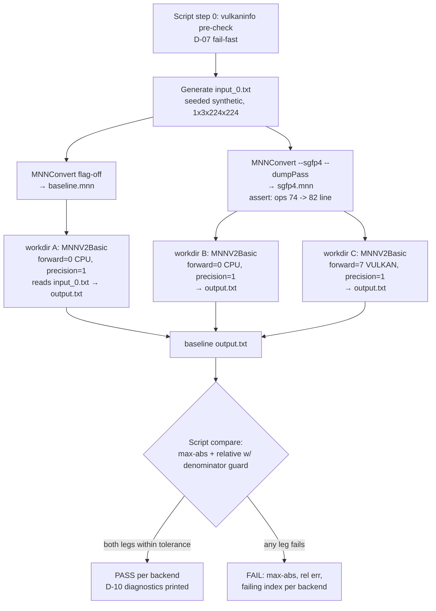
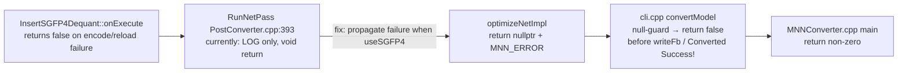

# Phase 12: End-to-End Validation - Research

**Researched:** 2026-09-01
**Domain:** E2E numeric validation of an SGFP4-converted real model on CPU + Vulkan (classic API), plus an SGFP4-scoped converter exit-code fix
**Confidence:** HIGH (all load-bearing claims verified by direct code reads or local probes this session)

<user_constraints>
## User Constraints (from CONTEXT.md)

### Locked Decisions
- **D-01 (numeric gate, not classification):** Formal gate = numeric comparison of final output tensor(s) vs the FP32 baseline — max-abs + relative error, `checkVectorByRelativeError` / `checkVector` style. Top-1/top-5 match is NOT the gate.
- **D-02 (Phase 10-anchored tolerances):** Tolerance numbers anchored to `tools/fp4/real_weight_validation_report.json` — no invented numbers. Exact per-gate values locked at plan time from that data.
- **D-03 (deterministic synthetic input):** Seeded deterministic synthetic tensor (SGFP4TestUtil fixture style) — no image asset or preprocessing dependency.
- **D-04 (FP32-baseline = same path):** Baseline = the SAME ONNX converted WITHOUT `--sgfp4`, run through the identical session/input path. No external-framework ground truth.
- **D-05 (classic API, VULKAN forward type):** Vulkan leg = same artifact through `Interpreter::createFromFile` → `createSession(MNN_FORWARD_VULKAN)` → `runSession`. Express/Module path is not the gate.
- **D-06 (both backends vs the same FP32 baseline):** Vulkan compared against the SAME baseline with the SAME tolerance as CPU.
- **D-07 (Vulkan is a hard requirement):** No SKIP semantics — no Vulkan capability = phase FAIL.
- **D-08 (one committed validation script):** Single committed PowerShell script driving FP32 convert → `--sgfp4` convert → CPU run → Vulkan run → comparison. Corpus path is a script parameter.
- **D-09 (script drives native tools):** Comparison logic lives in the script, shelling out to existing MNN tools/binaries — no new dedicated C++ validator build target.
- **D-10 (final-output diagnostics):** On failure: per-backend max-abs error, relative error, failing index.
- **D-11 (fix RunNetPass escalation here):** `--sgfp4` + `InsertSGFP4Dequant` failure/skip ⇒ mnnconvert exits non-zero with clear `MNN_ERROR` — never "Converted Success!" over a silently-FP32 artifact.
- **D-12 (SGFP4-scoped only):** Escalation touches only the SGFP4 path — zero behavior change for other passes or flag-off conversions.

### Claude's Discretion
- Exact tolerance values derived from the Phase 10 report (structure locked: max-abs + relative).
- Which existing MNN tool/binary the script shells out to (D-09) and the dump/comparison mechanics.
- Script location/naming, parameter spelling, README placement.
- The exact escalation mechanism in the converter, constrained by D-12.
- Whether the script additionally asserts SGFP4 node presence in the artifact.
- Structure of the synthetic input generator (seed handling, value range) as long as deterministic and documented.

### Deferred Ideas (OUT OF SCOPE)
- Per-layer error tracing / intermediate-tensor extraction tooling
- Generalized RunNetPass failure semantics (all passes escalate)
- Performance benchmarking (SGV2-33)
- Additional backends (Metal/CUDA/OpenCL, SGV2-35)
- Corpus expansion beyond AlexNet
- MatMul/LLM-export path rewriting
</user_constraints>

<phase_requirements>
## Phase Requirements

| ID | Description | Research Support |
|----|-------------|------------------|
| SGV2-31 | CPU end-to-end inference correctness via the new flag | MNNV2Basic.out.exe driver (CPU leg) + output.txt dump + script-side max-abs/relative comparison vs FP32 baseline (Pitfall 2–6 findings); Phase 11 proved load/run NO_ERROR, this phase adds the numeric gate |
| SGV2-32 | Vulkan end-to-end inference correctness via the new flag | Same driver with `MNN_FORWARD_VULKAN` (type 7) + `Precision_High` (FP32 shader, Pitfall 1); RTX 4070 Ti SUPER + Vulkan 1.4.321 verified present (D-07 satisfiable); `backupType` semantics give hard-fail-not-fallback |
</phase_requirements>

## Project Constraints (from copilot-instructions.md / CLAUDE.md / AGENTS.md)

- **Style:** Google-variant C++ (4-space, 120-col, PascalCase classes, camelCase functions, `mCamelCase` members); clang-format before commit.
- **Restricted directories:** do NOT read/modify/reference `schema/private/` or `source/internal/`.
- **Shader regen rule:** any GLSL edit under `source/backend/vulkan/buffer/execution/glsl/` requires `python3 source/backend/vulkan/buffer/compiler/makeshader.py` + committing the three regenerated files. **This phase is not expected to touch GLSL** — the decode shaders shipped in Phases 3/4 and are consumed as-is.
- **Task scoping:** start from the directly relevant files (converter exit path, `tools/cpp/` drivers, `tools/fp4/` script precedents); no whole-project analysis needed.
- **Terminology:** "SGFP4 v2" everywhere user-visible; never "Ultra FP4".
- **Build facts:** RTTI/exceptions disabled; errors via `ErrorCode`/`MNN_ERROR`/null returns.
- **GSD note:** gsd-tools init queries resolve repo root — always `--ws sgfp4-pivot` or explicit paths.

## Summary

Phase 12 is an orchestration-and-gates phase, not an algorithms phase. Every runtime component it needs already exists and is proven: the `--sgfp4` converter flag produces a single self-contained `.mnn` with inline SGFP4 containers (no sidecar for the converter path — Phase 8 D-11 buffer contract, verified in Phase 11 PHASE C T6/T6b); the artifact already loads and returns `NO_ERROR` from a classic-API CPU session (Phase 11 D-13 smoke); the Vulkan buffer-mode Execution exists and passes GPU/CPU parity on fixtures (`op/sgfp4/vulkan_buffer_parity`); and the dev box has a working Vulkan 1.4.321 device (NVIDIA RTX 4070 Ti SUPER, driver 591.86 — probed this session). The build is correctly configured (`MNN_VULKAN=ON`, `MNN_VULKAN_IMAGE=OFF` buffer mode, `MNN_BUILD_CONVERTER=ON`, `MNN_BUILD_SGFP4_TOOLS=ON`).

The two genuine pieces of new engineering are: (1) the committed PowerShell E2E script — for which the ideal D-09 driver already exists in `.build/Release/MNNV2Basic.out.exe` (classic API, forward-type + precision + input-dims CLI args, input from `input_0.txt`, unconditional `output.txt` dump, `backupType` hard-fail semantics); and (2) the SGFP4-scoped RunNetPass escalation — for which the exact fix sites are `RunNetPass` (void, log-only, `PostConverter.cpp:144`), the SGFP4 batch call at `:393`, the null-guard gap in `cli.cpp:786-798`, and an exit-code propagation gap in `MNNConverter.cpp` main (which ignores `convertModel`'s bool return).

**Primary recommendation:** Build the E2E script around `MNNV2Basic.out.exe` (per-leg temp CWD, `input_0.txt` synthetic seed, forward=0/7, precision mask 1 = Precision_High), compare the dumped `output.txt` files in PowerShell (max-abs + relative-with-denominator-guard), and implement D-11 as: SGFP4-gated failure propagation from `RunNetPass` → `optimizeNetImpl` returns nullptr → null-guard in `convertModel` → non-zero exit from `MNNConverter.cpp` main.

## Architectural Responsibility Map

| Capability | Primary Tier | Secondary Tier | Rationale |
|------------|-------------|----------------|-----------|
| FP32 baseline generation | Script orchestration (PowerShell) | Converter (`MNNConvert` flag-off) | Baseline is just a conversion + run the script drives (D-04) |
| SGFP4 conversion + node-count sanity | Converter CLI | Script (stdout assertion) | `--dumpPass` already prints `InsertSGFP4Dequant: ops 74 -> 82` |
| Session execution (both backends) | Existing native tool (`MNNV2Basic.out.exe`) | — | D-09 forbids a new validator target; MNNV2Basic already does classic-API run + output dump + forward-type arg |
| Numeric comparison + diagnostics | Script (PowerShell) | — | D-09/D-10: comparison logic lives in the script |
| Exit-code honesty (D-11/D-12) | Converter (`PostConverter.cpp` + `cli.cpp` + `MNNConverter.cpp`) | — | Failure propagation is a converter-internal concern, gated on `useSGFP4` |
| Tolerance values | Plan-time decision | Phase 10 report data | D-02: anchored, not invented |
| Vulkan device availability | Environment (verified present) | Script pre-check | D-07 hard requirement — fail loudly, never skip |

## Standard Stack

### Core (all existing — zero new dependencies)

| Component | Version/Path | Purpose | Why Standard |
|-----------|--------------|---------|--------------|
| `MNNConvert.exe` | `.build/Release/MNNConvert.exe` (built, converter ON) | FP32 + `--sgfp4` conversions | The system under test (Phase 11 output) |
| `MNNV2Basic.out.exe` | `.build/Release/MNNV2Basic.out.exe` (`tools/cpp/MNNV2Basic.cpp`) | D-09 driver: classic-API session run, forward type, precision, input dims, `input_0.txt` load, `output.txt` dump | Only existing tool that combines classic API + backend selection + text I/O dump [VERIFIED: codebase read] |
| PowerShell 5.1+ | `pwsh`/`powershell` | E2E script language | D-08 + `w2_failcleanup_probe.ps1` precedent |
| `run_test.out.exe` | `.build/Release/run_test.out.exe` | No-regression gate (`op/sgfp4` 13 suites) | Established workstream baseline |
| `TestSGFP4Converter.exe` | `.build/Release/TestSGFP4Converter.exe` | Converter mechanics regression | Phase 11 PHASE A/B/C suite |

### Supporting

| Component | Path | Purpose | When to Use |
|-----------|------|---------|-------------|
| `vulkaninfo --summary` | System32 (present) | Script pre-check: Vulkan device exists before any conversion (D-07 fail-fast) | Script step 0 |
| `GetMNNInfo.exe` | `.build/Release/GetMNNInfo.exe` | Optional artifact inspection | Planner discretion (node-presence assert is cheaper via `--dumpPass` stdout) |
| Phase 10 report | `tools/fp4/real_weight_validation_report.json` | Tolerance anchoring data (D-02) | Plan-time tolerance derivation |
| Corpus | `W:\gnus\models\alexnet_Opset16.onnx`, sha256 `4bc388cc…` | The real model | Script parameter (D-08) — never committed |

### Alternatives Considered (D-09 driver choice)

| Instead of | Could Use | Tradeoff |
|------------|-----------|----------|
| `MNNV2Basic.out.exe` | `testModel.out.exe` (`tools/cpp/testModel.cpp`) | testModel compares vs an expect `.txt` natively (`TensorUtils::compareTensors`, fixed tolerance semantics, no dump of its own output) — but its comparison is opaque to D-10 diagnostics and its tolerance model isn't max-abs+relative-with-index. Use MNNV2Basic + script-side compare. |
| `MNNV2Basic.out.exe` | `benchmarkExprModels.out` | Express/Module path — violates D-05. Rejected. |
| `MNNV2Basic.out.exe` | New dedicated validator target | Explicitly forbidden by D-09. Rejected. |

**Installation:** none — everything is already built in `.build/Release/`.

## Package Legitimacy Audit

No external packages are installed or recommended by this phase (script + C++ edits against the existing build only). Table intentionally empty — **none**.

## Architecture Patterns

### System Architecture Diagram



### Converter escalation path (D-11)



### Pattern 1: Per-leg isolated working directories
**What:** Each `MNNV2Basic` invocation runs with its own CWD (temp dir), because `input_0.txt`, `output.txt`, `.order`, and `.tempcache` are all resolved relative to CWD (`pwd` stays `"./"` on Windows — `MNNV2Basic.cpp:196-199` uses `rfind("/")`, which never matches backslash paths [VERIFIED: codebase read]).
**When to use:** Every one of the three run legs (baseline-CPU, sgfp4-CPU, sgfp4-Vulkan).
**Example:** script creates `tmp\p12_e2e\<leg>\`, copies/writes `input_0.txt` there, `Set-Location` or `Start-Process -WorkingDirectory`.

### Pattern 2: Seeded synthetic input file
**What:** `input_0.txt` = 150,528 whitespace-separated floats (`1×3×224×224`), generated deterministically by the script from a fixed seed (D-03). `_loadInputFromFile` (`MNNV2Basic.cpp:97`) reads them elementwise via `stream >> double` — any whitespace separation works [VERIFIED: codebase read].
**When to use:** Once per run; identical bytes fed to all three legs (D-04 apples-to-apples).
**Note:** `SGFP4TestUtil` fixture style is C++ `std::rand`-seeded; for a PowerShell script the equivalent is a documented fixed seed (e.g., `[Random]::new(1234)` or a hash-based LCG) with range documented (suggest `[-1, 1)` uniform — activations-scale, avoids FP16/overflow extremes, exercises both signs).

### Pattern 3: W-2 probe script skeleton (D-08 form)
**What:** `tools/fp4/w2_failcleanup_probe.ps1` is the committed-script precedent: `param(...)` block, `$ErrorActionPreference = "Stop"`, temp-dir setup, `Start-Process -NoNewWindow -PassThru -Wait`, exit-code + artifact assertions, explicit `exit 0/1/2` semantics, PASS/FAIL `Write-Host` lines [VERIFIED: codebase read].
**When to use:** The E2E script copies this skeleton and extends it to multi-leg orchestration.

### Anti-Patterns to Avoid
- **Running the Vulkan leg at default precision:** `MNNV2Basic` defaults `precision = Precision_Low` when `argc <= 6` (`MNNV2Basic.cpp:210`) — on the RTX card `VulkanBackend` then selects FP16 storage + the FP16 SGFP4 shader (`VulkanBackend.cpp:102`: `mUseFP16 = precision != Precision_High && fp16Support` [VERIFIED: codebase read]), adding an FP16 error source D-06's single-tolerance design does not account for. Always pass the precision mask `1` (Precision_High) on **both** legs.
- **Trusting `MNN_FORWARD_VULKAN` alone to prove Vulkan executed:** assert the driver's `backendType` line from stdout, and keep the step-0 `vulkaninfo` pre-check (D-07).
- **Plain per-element relative error as the only gate:** Phase 10 D-07 proved near-zero denominators make it structurally unbounded. Gate = max-abs (primary) + relative with denominator guard `max(|baseline_i|, eps)` or a magnitude-normalized form; document the exact formula in the script.

## Don't Hand-Roll

| Problem | Don't Build | Use Instead | Why |
|---------|-------------|-------------|-----|
| Session execution + output dump | New C++ validator binary | `MNNV2Basic.out.exe` | D-09 explicitly forbids; MNNV2Basic already has forward-type/precision/dims args + text dump |
| FP32 baseline | ORT/PyTorch reference run | Flag-off `MNNConvert` of the same ONNX | D-04 locks this — isolates quantization error within MNN |
| Comparison tolerances | Invented round numbers | Phase 10 report + measured-run derivation | D-02 locks this |
| Converter failure semantics (general) | Converter-wide RunNetPass error refactor | SGFP4-gated propagation only | D-12 locks this |
| Script skeleton | New script conventions | `w2_failcleanup_probe.ps1` pattern | Repo precedent, reviewer familiarity |

**Key insight:** every piece of runtime machinery is shipped and regression-gated; the phase's risk is concentrated in orchestration correctness (precision flags, CWD isolation, exit codes) and tolerance methodology — both of which this research pins down.

## Common Pitfalls

### Pitfall 1: Vulkan FP16-by-default poisons the single-tolerance gate (D-06)
**What goes wrong:** Default `Precision_Low` on a FP16-capable device selects FP16 tensor storage + the FP16 SGFP4 decode shader across the whole AlexNet, roughly doubling error sources; the Vulkan leg then fails a CPU-anchored tolerance for non-SGFP4 reasons.
**Why it happens:** `MNNV2Basic.cpp:210` defaults precision to `Precision_Low`; `VulkanBackend.cpp:102` enables FP16 whenever precision ≠ `Precision_High` and the device supports it.
**How to avoid:** Pass precision mask `1` (`Precision_High`) on both legs (argv[6] of MNNV2Basic: `precision = mask % 4`). This mirrors the Vulkan test suite's tight-pass precedent (`kFixtureRelativeTolerance = 1e-4` under `Precision_High`, `SGFP4VulkanDequantTest.cpp:36`).
**Warning signs:** Vulkan leg fails while CPU passes; error pattern uniform across all outputs.

### Pitfall 2: Text-dump precision truncation
**What goes wrong:** `dumpTensor2File` writes floats via default `std::ofstream <<` formatting — ~6 significant digits. Differences below ~1e-6 relative are invisible in `output.txt`.
**Why it happens:** No `setprecision` in `MNNV2Basic.cpp` dump macros.
**How to avoid:** Accept it: FP4 weight error manifests at 1e-2..1e-1 relative — four orders above the truncation floor. Document the floor in the script; ensure the max-abs tolerance exceeds ~1e-5 (it will, being Phase-10-anchored). Do NOT edit MNNV2Basic just for this (out-of-scope churn; planner may revisit only if measured errors land suspiciously near the floor).
**Warning signs:** Baseline-vs-baseline (two identical CPU runs) comparing as exactly 0 difference is *expected*; baseline-vs-itself through a different leg showing zero error is not suspicious per se, but a gate set below 1e-5 absolute would be meaningless.

### Pitfall 3: CWD-relative file collisions across legs
**What goes wrong:** `input_0.txt`, `output.txt`, `.order`, `.tempcache` all land in the process CWD; three legs in one directory overwrite each other.
**How to avoid:** One temp dir per leg (Pattern 1). Also: MNNV2Basic's per-name all-outputs dump targets `output/<name>.txt` — create an `output\` subdir per leg or ignore those files (the primary `output.txt` at CWD root is what the script reads).
**Warning signs:** Comparison of two identical files; `.tempcache` reuse across different models (per-leg dirs also fix this).

### Pitfall 4: Relative-error denominator blow-up on near-zero logits (carried from Phase 10 D-07)
**What goes wrong:** AlexNet final logits can be near zero; plain `|a-b|/|b|` is unbounded there (Phase 10 measured worst 3.6e6 on the same corpus's weights).
**How to avoid:** Primary gate = max-abs error. Secondary relative metric uses `|a-b| / max(|b|, eps)` with documented `eps`, or normalize by the output tensor's max magnitude. State the formula in the script header and lock values at plan time.
**Warning signs:** A single failing index with tiny baseline value dominating the relative metric.

### Pitfall 5: D-11 fix sites have TWO exit-code holes, not one
**What goes wrong:** Fixing only `RunNetPass` still leaves the success path lying.
**(a)** `RunNetPass` is `void` and log-only (`PostConverter.cpp:144`, `if (!valid) LOG(INFO)`) — pass failure never reaches `optimizeNetImpl`.
**(b)** `convertModel` (`cli.cpp:690`) returns `bool`, but `MNNConverter.cpp` main does `MNN::Cli::convertModel(modelPath); return 0;` — **every `convertModel` failure currently exits 0**, including pre-existing ones like bad-format parse (only the *arg-parse* stage exits 1, per Phase 11 OQ1) [VERIFIED: codebase read].
**(c)** If `optimizeNet` returns nullptr, `cli.cpp:787` dereferences `newNet->extraTensorDescribe` without a null check — a crash, not a clean error.
**How to avoid:** Chain the fix: propagate pass failure (SGFP4-gated) → `optimizeNetImpl` returns nullptr with `MNN_ERROR` → null-guard in `convertModel` returning false → main returns non-zero. Scope note for (b): propagating `convertModel`'s bool in main changes exit codes for *already-failing* flag-off conversions (0→1) — strictly a D-12 gray zone. Minimal-D-12 option: gate the non-zero exit on `useSGFP4` only; honest option: propagate unconditionally (successful flag-off conversions are unchanged). Planner should pick explicitly (see Open Questions).
**Warning signs:** `--sgfp4` on a corrupted model printing "Converted Success!"; exit 0 on "Convert error" messages.

### Pitfall 6: AlexNet has no static input shape — resize is mandatory
**What goes wrong:** Session resize fails or reads garbage without explicit input dims (Phase 11 deviation note: the decode probe needed `resizeTensor({1,3,224,224})` before `resizeSession`).
**How to avoid:** `MNNV2Basic` argv[7] = `1x3x224x224` on every leg; it performs resize + checks `RESIZE_STATUS` and errors out cleanly (`MNNV2Basic.cpp:313-320`) [VERIFIED: codebase read].

### Pitfall 7: No CPU fallback on the Vulkan leg is a feature — keep it
**What goes wrong:** Silent CPU fallback would fake a Vulkan pass (violates D-07).
**How to avoid:** `MNNV2Basic` sets `config.backupType = type` ("If type not found, let it failed") — with explicit `MNN_FORWARD_VULKAN` (7) and no Vulkan runtime, session creation fails loudly [VERIFIED: codebase read]. The script's step-0 `vulkaninfo` check makes the failure mode fast and diagnosable. Also parse the `backendType is %d` line from stdout and assert `7` on the Vulkan leg.

### Pitfall 8: Artifact form — converter output has NO external sidecar
**What goes wrong:** Expecting/handling a `.mnn.weight` sidecar for the converter artifact (the injection tool's form) adds dead complexity; or, conversely, assuming inline buffers and hitting `.__convert_external_data.bin` spilled weights.
**What's actually true:** The Phase 11 artifact carries SGFP4 containers in the op's inline `buffer` (`external == {}`, empty `externalPath` — Phase 8 D-11 contract, asserted in PHASE C T6/T6b); both `CPUSGFP4Dequant::onResize` and `VulkanSGFP4DequantCreator` dispatch buffer-first [VERIFIED: codebase read]. Spilled-weight *input* handling is internal to the pass. The script just treats the output as one self-contained `.mnn`.
**Warning signs:** none needed beyond a one-line comment in the script.

### Pitfall 9: Tolerance derivation is a measure-then-lock step, not a plan-time constant
**What goes wrong:** Picking E2E output tolerances purely by transcribing Phase 10 *weight-level* thresholds (worst leaf `max_relative` 0.384 at size-64 tiles) — output error after 8 layers accumulates/averages differently; a transcribed number is as invented as a round one.
**How to avoid:** Methodology (fits D-02's "anchored, not invented"): (1) derive the *form* and the *sanity bounds* from the Phase 10 report; (2) at plan/execute time, run the two SGFP4 legs once on the locked corpus to measure observed max-abs/relative; (3) lock gate = measured worst × documented margin (e.g., 1.5–2×), recorded in the script header with the Phase 10 citation; (4) same gate for both backends (D-06). Also note two identical-model CPU runs establish the determinism floor (expect exact 0 in text-dump space).

### Pitfall 10: `run_test.out` full build is still broken
**What:** `test/op/FP4ModelTest.cpp` (unrelated, `milestone` workstream) breaks from-scratch full builds — keep using filtered suites (`run_test.out op/sgfp4`). Known workstream fact; no action this phase.

## Code Examples

### E2E driver invocation (per leg)
```powershell
# Source: tools/cpp/MNNV2Basic.cpp argument order (verified this session)
# argv: model runLoops runMask forwardType numberThread precisionMask inputDims
#   forwardType: 0=CPU, 7=VULKAN (include/MNN/MNNForwardType.h)
#   precisionMask: mask%4 -> precision (1 = Precision_High), (mask/4)%4 -> memory
# Leg template (run with -WorkingDirectory <per-leg temp dir>):
MNNV2Basic.out.exe ..\..\sgfp4.mnn 1 0 7 4 1 1x3x224x224
#  - reads  .\input_0.txt   (150528 whitespace-separated floats)
#  - writes .\output.txt    (tab-separated final output, ~6 sig figs)
#  - prints "backendType is 7" on the Vulkan leg -> assert via stdout capture
```

### Conversion + node-presence sanity (D-11 complement, discretion)
```powershell
# Source: tools/fp4/README.md Phase 11 smoke (verified this session)
$conv = & MNNConvert.exe -f ONNX --modelFile $Corpus `
    --MNNModel $work\sgfp4.mnn --sgfp4 --dumpPass 2>&1
if ($LASTEXITCODE -ne 0) { fail "converter exit $LASTEXITCODE" }
if ($conv -notmatch 'InsertSGFP4Dequant: ops (\d+) -> (\d+)' -or
    $Matches[1] -eq $Matches[2]) { fail "pass did not rewrite any op" }
```

### D-11 escalation sketch (exact current code → intent)
```cpp
// Source: tools/converter/source/optimizer/PostConverter.cpp:144-170 (verified)
void RunNetPass(const std::vector<std::string>& passes, std::unique_ptr<MNN::NetT>& originNet) {
    ...
    if (!valid) {
        LOG(INFO) << "Run " << pass << "Error\n";   // <- log-only today (D-11 target)
    }
}
// PostConverter.cpp:393 (the SGFP4 batch):
RunNetPass({"InsertSGFP4Dequant", "ReIndexTensor"}, newNet);
// D-12-safe shape: return/aggregate failure ONLY where config->useSGFP4 is true,
// thread it out of optimizeNetImpl as nullptr, then:
// cli.cpp:786 ff:  auto newNet = optimizeNet(...);
//                  if (newNet == nullptr) { MNN_ERROR("..."); return false; }  // add guard
// MNNConverter.cpp main: propagate convertModel false -> return 1 (scope decision, Pitfall 5b)
```

### Comparison core (script-side, D-10)
```powershell
# Read output.txt (single whitespace-separated float row set), then per index i:
#   absErr_i  = [math]::Abs($sgfp4[$i] - $base[$i])
#   relErr_i  = absErr_i / [math]::Max([math]::Abs($base[$i]), $eps)
# Gate: (max absErr -le $TolAbs) -and (max relErr -le $TolRel)
# Fail output: per-backend max-abs, max-rel, and the failing index for both metrics.
```

## State of the Art

Not applicable — no external ecosystem moving parts. All components are repo-internal and frozen for this phase. (The only external dependency, the Vulkan driver, was probed: API 1.4.321, NVIDIA 591.86 — current and stable.)

## Assumptions Log

| # | Claim | Section | Risk if Wrong |
|---|-------|---------|---------------|
| A1 | `MNNV2Basic.out.exe`'s `_loadInputFromFile` correctly feeds a resized `1×3×224×224` NCHW float input from `input_0.txt` (read code to line 130; float branch inferred from int/uint branches' shape) | Patterns, Code Examples | Input feed mismatch → both legs garbage equally (gate still apples-to-apples); worst case: use the Phase 11 `tmp/p13_decode_probe.cpp` API sequence as an alternative driver — verify in first execution wave |
| A2 | `MNNV2Basic` `output.txt` dump covers the *final* model output tensor (`getSessionOutput(session, NULL)`) with complete element coverage for AlexNet's single output | Pitfall 2, Code Examples | If per-name dumps in `output/` are needed instead, script reads `output/<name>.txt` — discoverable in first run |
| A3 | Text-dump 6-sig-fig truncation is harmless given Phase-10-anchored tolerances ≫ 1e-5 | Pitfall 2 | If measured errors land under 1e-5 absolute, planner must add precision to the dump (small MNNV2Basic edit) — unlikely for FP4 |
| A4 | CPU and Vulkan legs are run-deterministic at fixed thread count / device (no non-deterministic GPU reductions in these ops) | Pitfall 9 | Flaky gate → add a repeat-run consistency check to the script (cheap: run each leg twice in the measure phase) |
| A5 | `RunNetPass` is not declared in a converter header consumed elsewhere (all call sites appear local to `PostConverter.cpp`) | Pitfall 5, Code Examples | Signature change needs a header touch too — trivial, verify at implementation |

All other claims were verified by direct code reads (`[VERIFIED: codebase]`) or local probes (`[VERIFIED: local probe]`) this session.

## Open Questions (RESOLVED)

1. **Exit-code propagation scope (Pitfall 5b):** does main propagate `convertModel`'s bool unconditionally (honest, changes exit code of already-failing flag-off conversions 0→1) or only when `useSGFP4` (strictest D-12 reading)?
   - What we know: main currently ignores the bool; D-12 says "zero behavior change for flag-off conversions".
   - Recommendation: strictest D-12 reading (gate on `useSGFP4`) for the phase gate, with the unconditional propagation noted in the plan as an explicit follow-up/decision for the user at checkpoint. Planner should surface this.
   - **(RESOLVED → 12-01 objective):** strictest D-12 reading locked — `MNNConverter.cpp` main propagates non-zero exit ONLY when `modelPath.useSGFP4` is true and `convertModel` returned false; unconditional propagation recorded as an in-code comment follow-up, not implemented.
2. **Exact tolerance values (D-02):** locked at plan time from Phase 10 report + a measured baseline-vs-sgfp4 run (Pitfall 9 methodology). Research provides the form and derivation procedure, not the numbers — by design.
   - **(RESOLVED → 12-02 objective):** measure-then-lock — Task 1 ships `-MeasureOnly`, Task 2 locks `$TolAbs`/`$TolRel` = 2.0x measured worst across BOTH backends (D-06 same gate), with `tools/fp4/real_weight_validation_report.json` cited as form/sanity anchor only; sub-1e-5 measured absolute halts and surfaces.
3. **Relative-error formula detail:** `max(|b|, eps)` guard vs max-magnitude normalization — planner picks; both satisfy D-01/D-10 (Phase 10 D-07 precedent favors a guarded denominator).
   - **(RESOLVED → 12-02 objective):** guarded denominator `relErr_i = absErr_i / max(|baseline_i|, 1e-3)` (Phase 10 D-07 precedent); max-abs is the primary gate, relative secondary.

## Environment Availability

| Dependency | Required By | Available | Version | Fallback |
|------------|------------|-----------|---------|----------|
| Vulkan device + driver | SGV2-32 leg (D-07) | ✓ | NVIDIA RTX 4070 Ti SUPER, Vulkan 1.4.321, driver 591.86 [VERIFIED: local probe] | — (hard requirement) |
| `MNNConvert.exe` | Both conversions | ✓ | `.build/Release/`, `MNN_BUILD_CONVERTER=ON` [VERIFIED: local probe] | — |
| `MNNV2Basic.out.exe` | All run legs (D-09) | ✓ | `.build/Release/` [VERIFIED: local probe] | `testModel.out.exe` (weaker fit) |
| `run_test.out.exe` | No-regression gate | ✓ | `.build/Release/` [VERIFIED: local probe] | — |
| Build config | Vulkan buffer backend | ✓ | `MNN_VULKAN=ON`, `MNN_VULKAN_IMAGE=OFF` (buffer mode — required form), `MNN_BUILD_SGFP4_TOOLS=ON` [VERIFIED: CMakeCache read] | — |
| Corpus | Whole phase | ✓ | `W:\gnus\models\alexnet_Opset16.onnx`, sha256 `4bc388cc…` (Phase 10 lock) | — |
| PowerShell | E2E script | ✓ | 5.1+ / pwsh present | — |
| Python 3 | NOT required (no GLSL edits expected) | ✓ | available if shader regen ever needed | — |

**Missing dependencies with no fallback:** none.
**Missing dependencies with fallback:** none.

## Validation Architecture

### Test Framework
| Property | Value |
|----------|-------|
| Framework | MNN custom test suite (`run_test.out`, `MNNTestSuiteRegister`) + `TestSGFP4Converter.exe` + the phase's committed E2E script |
| Config file | `test/CMakeLists.txt` (existing; no changes expected) |
| Quick run command | `.build\Release\run_test.out.exe op/sgfp4` (13 suites, filtered — full build broken by unrelated `FP4ModelTest.cpp`) |
| Full suite command | `.build\Release\run_test.out.exe op/sgfp4` + `.build\Release\TestSGFP4Converter.exe` + `tools\fp4\<e2e-script>.ps1 -Corpus W:\gnus\models\alexnet_Opset16.onnx` |

### Phase Requirements → Test Map
| Req ID | Behavior | Test Type | Automated Command | File Exists? |
|--------|----------|-----------|-------------------|-------------|
| SGV2-31 | SGFP4 artifact CPU inference numerically matches FP32 baseline within anchored tolerance | e2e (script) | `tools\fp4\<e2e-script>.ps1 -Corpus <alexnet> ` (CPU leg PASS) | ❌ Wave 0 (this phase creates it) |
| SGV2-32 | Same artifact on Vulkan classic API, same baseline, same tolerance | e2e (script) | same script (Vulkan leg PASS + backendType=7 assert) | ❌ Wave 0 (this phase creates it) |
| D-11 | `--sgfp4` + pass failure ⇒ non-zero exit, no "Converted Success!" | integration (script leg) | script's negative-path leg (corrupted/unsuitable model or forced pass failure → assert exit ≠ 0) | ❌ Wave 0 |
| D-12 | Flag-off conversions byte-identical behavior/exit codes | regression | converter re-run flag-off + `run_test.out op/sgfp4` 13/13 + `TestSGFP4Converter.exe` | ✅ (existing suites) |
| No-regression | All prior SGFP4 behavior intact | unit/suite | `run_test.out op/sgfp4`; `TestSGFP4Converter.exe` | ✅ |

### Sampling Rate
- **Per task commit:** `run_test.out op/sgfp4` (13/13) — the established quick gate.
- **Per wave merge:** quick gate + `TestSGFP4Converter.exe` + one full E2E script run (once the script exists).
- **Phase gate:** Full E2E script PASS on both backends + D-11 negative leg + all regression suites green before `/gsd-verify-work`.

### Wave 0 Gaps
- [ ] `tools/fp4/<e2e-script>.ps1` — the phase's central artifact (covers SGV2-31, SGV2-32, D-11 positive/negative legs)
- [ ] README section in `tools/fp4/README.md` documenting usage + hard Vulkan requirement
- No framework installs or fixtures needed — everything else exists.

## Security Domain

Local, offline validation tooling; no network, no secrets, no user input beyond a file path. Applicable ASVS categories: none materially (V5 Input Validation — the script validates `-Corpus` path existence and converter exit codes before proceeding; that is the entire surface).

| Pattern | STRIDE | Standard Mitigation |
|---------|--------|---------------------|
| Malformed/corrupt corpus path fed to tools | Tampering (local) | Script `Test-Path` pre-check + exit-nonzero-on-any-tool-failure (D-11 chain enforces converter honesty) |
| Temp-dir leftovers with model data | Information disclosure (local dev box) | Script cleans its temp dirs (`Remove-Item -Recurse -Force`, W-2 probe precedent) |

Note: the SGFP4 op's own input hardening (DoS bounds, magic/version gates, host pre-validation) shipped in Phases 1/3/8 and is regression-gated — not re-litigated here.

## Sources

### Primary (HIGH confidence)
- Direct code reads this session: `tools/cpp/MNNV2Basic.cpp`, `tools/cpp/testModel.cpp`, `tools/converter/source/optimizer/PostConverter.cpp`, `tools/converter/source/common/cli.cpp`, `tools/converter/source/MNNConverter.cpp`, `tools/converter/include/config.hpp`, `tools/converter/source/optimizer/postconvert/InsertSGFP4Dequant.cpp`, `source/backend/cpu/CPUSGFP4Dequant.cpp`, `source/backend/vulkan/buffer/execution/VulkanSGFP4Dequant.cpp`, `source/backend/vulkan/buffer/backend/VulkanBackend.cpp`, `test/op/SGFP4ClassicAPITest.cpp`, `test/op/SGFP4VulkanDequantTest.cpp`, `test/op/SGFP4TestUtil.hpp`, `tools/fp4/w2_failcleanup_probe.ps1`, `tools/fp4/README.md`, `tools/fp4/real_weight_validation_report.json`, `include/MNN/MNNForwardType.h`, `source/core/TensorUtils.cpp`
- Local probes this session: `vulkaninfo --summary`, `.build/CMakeCache.txt` flags, `.build/Release` binary inventory
- Workstream artifacts: `12-CONTEXT.md`, `11-VERIFICATION.md`, `11-05-SUMMARY.md`, `STATE.md`, `tools/fp4/real_weight_validation_report.json`

### Secondary (MEDIUM confidence)
- None needed — no external claims.

### Tertiary (LOW confidence)
- None.

## Metadata

**Confidence breakdown:**
- Standard stack (existing tools as D-09 drivers): HIGH — every capability read in source this session
- Architecture (script flow, escalation chain): HIGH — fix sites read line-level; A1/A2 marked for first-run verification
- Pitfalls: HIGH — FP16-default, CWD, exit-code holes, and resize requirements all verified in source; tolerance methodology is MEDIUM-by-design (data locked at plan time per D-02)

**Research date:** 2026-09-01
**Valid until:** 2026-10-01 (repo-internal; only the Vulkan driver could drift)
