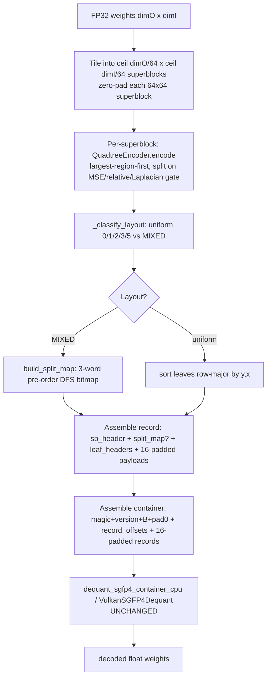

# Phase 9: Real-Weight C++ Encoder Port - Research

**Researched:** 2026-08-28
**Domain:** SGFP4 v2 adaptive-quadtree quantization encoder — Python→C++ port, byte-compatible with unchanged CPU/Vulkan decoders
**Confidence:** HIGH

<user_constraints>
## User Constraints (from CONTEXT.md)

### Locked Decisions
- **D-01 (v2-core port):** Phase 9 IS a C++ encoder port — NOT direct export-dir consumption. Scope is the **v2 adaptive quadtree encode core only**: the `--adaptive` path's code modes (FP4_AFFINE / T158_AFFINE) and the layouts that path emits (LAYOUT_MIXED plus its uniform fallbacks). v1 fixed-payload, and layouts the adaptive path never emits (FULL_4X4, etc.) are NOT ported. Justification: self-contained single-command `mnnconvert --sgfp4` UX for the Phase 11 converter path with no Python dependency.
- **D-02 (Python-identical policy):** The adaptive quadtree decision policy must mirror `fp4_exporter.py --adaptive` exactly — same superblock scanning order, same split decisions, same `DEFAULT_V2_THRESHOLDS` MSE/relative-error values per leaf size (64→4: max_mse 0.01/0.005/0.002/0.001/0.0005, max_relative 0.05/0.03/0.02/0.01/0.005). Thresholds are not tunable knobs in this phase — Phase 10 revises them against real weight statistics if validation demands.
- **D-03 (header-pair lib under tools/fp4):** The encoder ships as `sgfp4_encode.hpp`/`sgfp4_encode.cpp` under `tools/fp4/` (building alongside `sgfp4_inject_core.hpp` under the existing `MNN_BUILD_SGFP4_TOOLS` CMake wiring), exercised via test infra in Phase 9. Phase 11's PostConverter pass links/includes it later — no converter-tree placement now.
- **D-04 (decode-parity, not byte-exact):** Acceptance bar is **decode-parity**: C++-encode → decode must match Python-encode → decode within the existing cross-language tolerance (the rtol 1e-4 decode-vs-decode pattern from `SGFP4InjectTest`). Byte-exact container output is explicitly NOT required — near-tie threshold decisions may flip between encoders, bounded by decode tolerance. This avoids forcing bit-exact FP16/accumulation-order reproduction of NumPy.
- **D-05 (real-shape generated goldens):** Fixture strategy is a generator mirroring `tools/fp4/author_structured_fixture.py`: run `fp4_exporter.py --adaptive` on deterministic pseudo-random FP32 weights of non-64-aligned shapes (e.g. 100×36, 250×128, plus tiny <64 tensors), emitting `{input weights, container bytes, decoded reference}` C arrays into a committed, regenerable fixture header.
- **D-06 (zero-pad to 64):** Non-64-multiple shapes are handled by **internal zero-padding to 64-multiples**: the encoder pads the weight plane with zeros, encodes the padded plane, and records the true `{dimO, dimI}` in the container/spec — no native partial-superblock traversal.
- **D-07 (row-major crop):** Crop semantics are **row-major**: the injected/rewritten op keeps `dims = {dimO, dimI}` (Phase 5 contract); the pad region is encoded but only the true-dims region is consumed — the first `dimO*dimI` elements row-major from the decoded padded plane. The researcher/planner must verify the existing decoders' `elementCount` handling actually supports this (decode-plane-larger-than-elementCount consistency).
- **D-08 (verify in Phase 9):** Padded non-aligned decode is verified **in Phase 9** against both real decoders — the CPU oracle (`dequant_sgfp4_container_cpu`) and the Vulkan Execution — as a correctness prerequisite, before Phase 10/11 build on it.
- **D-09 (tools/fp4, converter links later):** Build placement is `tools/fp4/` under the existing `MNN_BUILD_SGFP4_TOOLS` CMake structure (single lib home both `sgfp4_inject` and — in Phase 11 — the converter target depend on). No shared-lib target under `source/` and no header-only-only compromise; `.hpp` + `.cpp` pair compiles once into the tools lib.
- **D-10 (one-shot encode API):** Public API is a single encode function: raw FP32 weights + `{dimO, dimI}` in → container bytes (`std::vector<uint8_t>`) out. Layout/thresholds/mode are fixed at v2-adaptive defaults — no config knobs. If Phase 10's parameter-revision work requires them, the API grows a config struct THEN, not speculatively now.

### the agent's Discretion
- Exact function/file naming within the `sgfp4_*` conventions (`sgfp4_encode.hpp` suggested but not locked).
- Internal structure of the encoder (quadtree builder class vs. free functions; MSE accumulation details short of the D-04 parity bar).
- Which specific non-64-aligned shapes the golden generator covers beyond the D-05 examples (small/tiny/one-dim-aligned variety).
- Test suite naming/placement within the `op/sgfp4/` family conventions and the `tools/fp4/` test wiring.
- Whether tiny tensors (< 64 in a dim, single partial superblock) get dedicated hand-built edge cases in addition to the generated goldens (D-05 covers them statistically; explicit edge cases are at planner's judgment).
- Whether `encode_sgfp4.py`'s role comments need updating to note the C++ encoder as the new converter-path encoder while the Python script stays test-oracle — documentation-level detail.

### Deferred Ideas (OUT OF SCOPE)
- **Configurable encoder API** (config struct with threshold table, layout/code-mode overrides): deferred to Phase 10 — only if real-weight validation demands parameter revision (D-10).
- **Native partial-superblock quadtree traversal (no padding):** rejected for this phase (D-06); revisit only if pad-region overhead proves costly on real models (Phase 10's territory).
- **Same-shape disambiguation via tensor-name keying** and other injection-tool limitations: stay with Phase 11 / injection-tool work per the v2.0 milestone audit placement.
- **v1 fixed-payload and non-adaptive layouts port:** rejected outright (D-01) — v2-only milestone.
</user_constraints>

<phase_requirements>
## Phase Requirements

| ID | Description | Research Support |
|----|-------------|------------------|
| SGV2-24 | python→C++ encoder port (v2 adaptive quadtree encode core, FP4_AFFINE/T158_AFFINE, LAYOUT_MIXED + uniform fallbacks) | §"Adaptive Encode Algorithm" (exact `_try_block` policy), §"Framing Constants", §"Code Examples" |
| SGV2-25 | non-64-multiple tiling/padding policy | §"Finding F1" (decoder element-count contract gap), §"Open Questions Q1", §"Architecture Patterns" |
</phase_requirements>

## Summary

Phase 9 ports the gnus-poc `fp4_exporter.py --adaptive` SGFP4 v2 encoder to C++ as a `tools/fp4/sgfp4_encode.hpp/.cpp` pair. The encoder consumes a raw FP32 `{dimO, dimI}` weight matrix and emits a self-framed v2 container (`SGF4 | 0x02 | B | pad0 | record_offsets[B] | pad1 | records`) whose bytes must decode — unchanged — through the existing CPU oracle `dequant_sgfp4_container_cpu` and the Vulkan `VulkanSGFP4Dequant` Execution. The acceptance bar is decode-parity (rtol 1e-4) against Python-encode→decode goldens, not byte-exactness.

The port is **well-bounded**: the container framing, leaf packing, and split-map walk all have exact C++ mirrors already in `include/MNN/SGFP4DequantUtils.hpp` (verified byte-compatible with the exporter in earlier phases). The hard parts are (1) reproducing the adaptive **split-decision policy** including the scipy Gaussian-filter Laplacian weighting, and (2) resolving a genuine contract gap: the current decoders require decoded-element-count == output-tensor elementSize exactly, which conflicts with D-06 zero-padding for non-64-multiple shapes (Finding F1 below).

**Primary recommendation:** Port the encoder as a small static lib under `tools/fp4/`, mirror `fp4_exporter.py`'s `QuadtreeEncoder` + `LaplacianWeightedError` + `_export_v2_adaptive` exactly (reusing `SGFP4DequantUtils.hpp` constants), and — before implementation — resolve Finding F1 by extending the decoders with a minimal padded-plane crop path (D-07/D-08 require it; the current decoder cannot consume padded non-aligned containers).

## Architectural Responsibility Map

| Capability | Primary Tier | Secondary Tier | Rationale |
|------------|-------------|----------------|-----------|
| Weight-plane tiling → 64×64 superblocks | Encoder (tools/fp4) | — | Encode-side policy only; mirrors exporter's `ceil(dim/64)` grid |
| Quadtree split decision (MSE/relative/Laplacian gates) | Encoder (tools/fp4) | — | Encode-side policy; not serialized into leaf flags |
| Per-leaf affine fit + mode selection (FP4/T158) | Encoder (tools/fp4) | — | `_fit_affine`/`_fit_ternary` + Eq.5 + outlier veto |
| Container byte assembly (framing/alignment/pack) | Encoder (tools/fp4) | `SGFP4DequantUtils.hpp` (constants reused) | Encoder emits; decoder reads by exact `{offset,size}` + 16-align |
| Leaf payload decode (nibble/symbol unpack) | Decoder (CPU oracle + Vulkan shader) | — | Unchanged; encoder output must be consumable as-is (D-08) |
| Padded-plane crop to true dims | Decoder (CPU/Vulkan) | Encoder records padded dims | **Gap** — see Finding F1; ownership to be resolved at plan time |
| Output tensor shape | Shape inference (`ShapeSGFP4Dequant`) | — | `dims = {dimO, dimI}` from op param; never padded today |

## Standard Stack

### Core
| Library | Version | Purpose | Why Standard |
|---------|---------|---------|--------------|
| C++ (std) | C++11 | Encoder implementation | Repo default standard; no RTTI/exceptions |
| `3rd_party/half/half.hpp` | vendored | FP16 (IEEE binary16) bit conversion for scale/bias packing | Already a dependency of `SGFP4DequantUtils.hpp`; the decode side uses it, encoder must use the same for FP16 parity |
| `include/MNN/SGFP4DequantUtils.hpp` | in-tree | Framing constants, `sgfp4_align16`, `sgfp4_read_u32_le` (read side), `dequant_sgfp4_container_cpu` oracle | Single source of truth; encoder MUST reuse, not redefine (D-02, avoid divergence) |
| Python (`fp4_exporter.py` + `quadtree.py` + `laplacian.py` + `sgfp4_format.py`) | gnus-poc | Canonical encoder being ported + the decode-parity golden oracle | Locked canonical source (STATE.md 2026-08-26) |

### Supporting
| Library | Version | Purpose | When to Use |
|---------|---------|---------|-------------|
| `numpy` + `scipy` (dev machine) | 2.2.5 / 1.17.0 | Golden-fixture generator (`author_*_fixture.py` clones) + oracle parity checks | Authoring time only; never at build/CI/test time (D-03 of Phase 7 precedent) |
| `sgfp4_test::` helpers (`test/op/SGFP4TestUtil.hpp`) | in-tree | tempPath/container builder/sidecar helpers | New test suites born on these (Phase 8 D-10 extraction) |

### Alternatives Considered
| Instead of | Could Use | Tradeoff |
|------------|-----------|----------|
| `sgfp4_encode.hpp` static lib under tools/fp4 | header-only inline (like `sgfp4_inject_core.hpp`) | D-09 explicitly rejects header-only-only; lib compiles once, Phase 11 links it |
| Hand-rolled IEEE-half conversion | `3rd_party/half/half.hpp` | Hand-rolling risks rounding-mode divergence; vendored half already used by the decoder |
| Byte-exact parity | decode-parity rtol 1e-4 | Byte-exact requires bit-exact NumPy float64/scipy Gaussian reproduction — impractical (D-04) |

**Installation:** None — the encoder adds no external runtime dependency. Dev-only Python deps (numpy/scipy) are already present (see Environment Availability).

**Version verification:** Not applicable — no new packages installed. `3rd_party/half/half.hpp` is vendored in-tree; `include/MNN/SGFP4DequantUtils.hpp` is the in-tree framing source (both verified present via filesystem).

## Package Legitimacy Audit

**No external packages are installed by this phase.** The encoder is pure C++11/STL, reusing the vendored `3rd_party/half/half.hpp` (in-tree) and `include/MNN/SGFP4DequantUtils.hpp` (in-tree). The only Python tooling (`numpy`, `scipy`, gnus-poc `fp4_exporter.py`) is dev-machine oracle/golden-generation only, already installed, and never shipped or linked into MNN.

- Packages removed due to slopcheck [SLOP]: none
- Packages flagged suspicious [SUS]: none

## Architecture Patterns

### System Architecture Diagram



### Recommended Project Structure
```
tools/fp4/
├── sgfp4_encode.hpp          # public one-shot API: encode(weights, dimO, dimI) -> vector<uint8_t>
├── sgfp4_encode.cpp          # quadtree + laplacian + fit + container assembly (the port)
├── CMakeLists.txt            # add sgfp4_encode STATIC lib; link into sgfp4_inject.out (+ test)
├── author_real_shape_fixture.py   # D-05 clone: fp4_exporter --adaptive on real shapes -> C-array header
└── (existing: sgfp4_inject*, encode_sgfp4.py, author_structured_fixture.py, ...)
test/op/
├── SGFP4EncodeTest.cpp       # C++-encode -> CPU decode parity vs Python goldens (rtol 1e-4)
├── SGFP4RealShapeFixtures.h  # generated by author_real_shape_fixture.py
└── (existing: SGFP4TestUtil.hpp, SGFP4DequantFixtures.h, SGFP4InjectTest.cpp, ...)
```

### Pattern 1: Header-pair static lib (D-03/D-09)
**What:** `.hpp` declares the one-shot API; `.cpp` holds the encoder; a `STATIC` lib target compiles it once.
**When to use:** Any `tools/fp4` code shared between the injection tool and (later) the Phase 11 converter + tests.
**Example:**
```cpp
// sgfp4_encode.hpp
#include <cstdint>
#include <vector>
namespace sgfp4_encode {
// Encode FP32 row-major [dimO][dimI] weights to an SGFP4 v2 container.
// Mirrors fp4_exporter.py --adaptive (DEFAULT_V2_THRESHOLDS, ternary_delta=0.10).
// Returns empty vector on malformed input (non-finite, non-positive dims).
std::vector<uint8_t> encode(const float* weights, int dimO, int dimI);
}
```

### Pattern 2: Reuse framing constants, never redefine
**What:** The encoder includes `MNN/SGFP4DequantUtils.hpp` and uses `MNN::kSGFP4Magic`, `MNN::kSGFP4Version`, `MNN::kSGFP4Alignment`, `MNN::sgfp4_align16`, `MNN::kSGFP4Layout*`, `MNN::kSGFP4LeafHeader*`, `MNN::kSGFP4SplitMap*`, `MNN::kSGFP4NibblesPerWord`, `MNN::kSGFP4SymbolsPerWord`.
**When to use:** Everywhere the encoder emits framing. Adds its own `write_u32_le` + `float_to_half_bits` helpers (the write-side inverses the header does not provide).

### Pattern 3: Deterministic regenerable golden fixtures (D-05)
**What:** Clone `author_structured_fixture.py` → `author_real_shape_fixture.py`; call `FP4Exporter.export_weights(w, name, adaptive=True)` on seeded non-64-aligned shapes; emit `{weights, container bytes, decoded reference}` C arrays with a sha256 provenance block and no timestamp/RNG (byte-identical regeneration).
**When to use:** Committed fixture header `test/op/SGFP4RealShapeFixtures.h`.

### Anti-Patterns to Avoid
- **Redefining constants locally:** a second copy of magic/layout/masks in the encoder will drift from `SGFP4DequantUtils.hpp` (the W-1 offset-convention bug class). Reuse the header's constants.
- **`std::round` for code quantization:** Python `np.round` rounds half-to-even; `std::round` rounds half-away-from-zero. Use `std::rint`/`std::nearbyint` (FE_TONEAREST) to match NumPy at exact-tie values.
- **Float32 MSE accumulation:** the Python affine fit runs in float64 (bias/scale are Python floats). A float32 C++ port diverges on candidate ranking → more split flips. Use `double` in the fit/search, cast at pack time.
- **`file(GLOB ...)` double-compile:** the current `tools/fp4/CMakeLists.txt` globs `*.cpp` into `sgfp4_inject.out`; adding `sgfp4_encode.cpp` without narrowing the glob double-compiles it. Use an explicit `add_library(sgfp4_encode STATIC ...)` and list sources explicitly.
- **Encoding the padded plane without recording padded dims:** the decoder cannot crop without knowing the padded column stride (see Finding F1).

## Don't Hand-Roll

| Problem | Don't Build | Use Instead | Why |
|---------|-------------|-------------|-----|
| IEEE-754 float↔half conversion | Custom bit-manipulation | `3rd_party/half/half.hpp` (`half_float::half`) | Rounding-mode correctness; the decoder already decodes via this exact type |
| Framing constants / magic / layout enums | Local `constexpr` copies | `MNN/SGFP4DequantUtils.hpp` constants | Single source of truth; drift causes cross-language decode failures |
| Little-endian u32 read | — (exists as `sgfp4_read_u32_le`) | reuse it | — |
| **Laplacian Gaussian filter** | (no in-tree C++ lib exists) | Hand-roll a small separable Gaussian with reflect mode, mirroring `scipy.ndimage.gaussian_filter(sigma, mode='reflect', truncate=4.0)` | **Necessary hand-roll** — no vendor available; see Pitfall 1 for parity risk |

**Key insight:** The only genuinely "hand-rolled" piece is the 2D Gaussian filter for Laplacian weighting (scipy is a Python-only dependency). Everything else has an in-tree reuse target or a trivial named helper.

## Runtime State Inventory

**Omitted** — this is a greenfield feature phase (new encoder + tests), not a rename/refactor/migration. No stored data, live service config, OS-registered state, secrets, or installed-package artifacts carry an old name to migrate.

## Common Pitfalls

### Pitfall 1: scipy Gaussian-filter parity (the #1 port risk)
**What goes wrong:** The adaptive split policy's error metric (`LaplacianWeightedError.compute`) uses `scipy.ndimage.gaussian_filter(..., sigma, mode='reflect')` with default `truncate=4.0` (kernel radius `int(4*sigma+0.5)`). A naive C++ Gaussian (different kernel radius, clamp/edge handling, or normalization) shifts the weighted error enough to flip split decisions on near-tie regions.
**Why it happens:** scipy's kernel truncation, `reflect` boundary convention (mirror without repeating the edge), and sum-to-1 normalization are all non-obvious.
**How to avoid:** Implement a separable 2D Gaussian with kernel radius `int(4*sigma + 0.5)`, `reflect` boundary, and explicit sum-to-1 normalization; validate C++ vs scipy on random 64×64/32×32/16×16 patches BEFORE wiring into split decisions. Accept that D-04's decode-parity bar tolerates the residual flips.
**Warning signs:** Decode-parity tests pass on uniform shapes but fail on the structured/MIXED goldens; or near-tie inputs decode outside rtol 1e-4.

### Pitfall 2: `np.round` (half-to-even) vs `std::round` (half-away-from-zero)
**What goes wrong:** `codes = np.clip(np.round((values-bias)/scale), -8, 7)` rounds exact `.5` ties to even; `std::round`/`std::lround` rounds away from zero. Tie values decode to different codes → different reconstructed weights.
**Why it happens:** NumPy uses banker's rounding; the C++ `<cmath>` round family defaults differ.
**How to avoid:** Use `std::rint` or `std::nearbyint` (both round-to-nearest-even under default FE_TONEAREST) for the code quantization in `_fit_affine`/`_encode_*_affine*`. Add a unit test with a constructed tie value.
**Warning signs:** Occasional 1-ULP code mismatches on weights exactly at `bias + (k+0.5)*scale`.

### Pitfall 3: float32 vs float64 accumulation in the affine fit
**What goes wrong:** Python `_fit_affine` computes `bias = float(np.mean(values))` (float64) and `scale * codes + bias` in float64; a float32 C++ port ranks the 16 scale candidates differently.
**Why it happens:** `bias` and `scale` are Python floats (double); the error term is a float64 reduction.
**How to avoid:** Use `double` for `_fit_affine`/`_fit_ternary`/`_combined_gate_error` internals; convert to `float`/FP16 bits only at leaf-header pack time (as the exporter does). Document the choice (D-04 tolerates residual flips).
**Warning signs:** Split-map bytes differ from Python on the same weights; decode still within rtol but layout distribution diverges.

### Pitfall 4: bias low-4-bits clearing (leaf-header flags)
**What goes wrong:** The exporter packs the leaf header as `(scale_bits<<16 | bias_bits) & 0xFFFFFFF0 | (mode & 0x1)`. Forgetting to zero `bias_bits` low 4 bits corrupts the bias the decoder recovers (`bias = half(h & 0xFFF0)`).
**Why it happens:** The low 4 bits of the second half-word are repurposed as flags; the bias must be truncated to 12 mantissa bits before storage.
**How to avoid:** Pack via `(bias_bits & ~0xFu) | mode`, mirroring `HEADER_CLEAR_FLAGS_MASK = 0xFFFFFFF0`. Verify with `unpack_leaf_header` round-trip.
**Warning signs:** Decoded bias off by tiny amounts for values whose half-bit-pattern has non-zero low nibble.

### Pitfall 5: D-07 crop semantics are not "flat prefix"
**What goes wrong:** "First `dimO*dimI` elements row-major" reads as a flat prefix of the padded plane, but the true 2D region is `rows[0..dimO) × cols[0..dimI)`, which is NOT contiguous when pad columns exist (each row is separated by `paddedCols - dimI` pad values).
**Why it happens:** The exporter places weights at the top-left with zero-pad right/bottom; row-major flat traversal interleaves pad columns into the data.
**How to avoid:** Crop by stride: `out[r*dimI + c] = padded[r*paddedCols + c]`, `paddedCols = ceil(dimI/64)*64`. Requires the padded column count to be known to the consumer (Finding F1).
**Warning signs:** Padded-shape decode parity holds only when dimI % 64 == 0.

## Code Examples

### Canonical adaptive encode (port target)
```python
# Source: W:\gnus\...\gnus-poc\quantize\quadtree.py (QuadtreeEncoder._try_block) — VERIFIED
# Accept a region iff gate_error <= max_mse (with 1.1x slack for size > min),
# else split TL/TR/BL/BR. Laplacian-weighted error drives mode + gate.
gate_error = self._combined_gate_error(region, selected_error, max_mse, max_relative)
accept = gate_error <= max_mse            # effective_threshold is max_mse
if not accept and size > self._min_block_size:
    accept = gate_error <= max_mse * _kHysteresisSlack   # 1.1
if size <= self._min_block_size:
    accept = True                          # 4x4 floor is always a leaf
```
> Note: `_kHysteresisImprovement` (0.8) is **dead code** — `parent_accepted` is always `False` in every recursive call (the only recursion passes `parent_accepted=accept` when `accept` is `False`). Only the 1.1× slack matters.

### Combined absolute+relative gate
```python
# Source: quadtree.py _combined_gate_error — VERIFIED
signal_power = float(np.mean(region.astype(np.float64) ** 2))
if signal_power <= 1e-12: return selected_error
relative_equivalent = max_mse * ((selected_error / signal_power) / max_relative)
return max(selected_error, relative_equivalent)
```

### Laplacian-weighted error (the scipy dependency)
```python
# Source: laplacian.py LaplacianWeightedError.compute — VERIFIED
levels = {4:0, 8:0, 16:1, 32:2, 64:3}[block_size]
for level in range(levels):
    sigma = 2.0 * (2.0 ** level)                      # 2, 4, 8
    smooth_base = gaussian_filter(smooth, sigma=sigma, mode='reflect')
    band = smooth - smooth_base
    total_error += (1.0 / 2**level) * mean(band**2)   # weights 1, 0.5, 0.25
    if level < levels - 1: smooth = smooth_base[::2, ::2]
```

### Framing constant reuse (C++)
```cpp
// sgfp4_encode.cpp (pattern, not final)
#include "MNN/SGFP4DequantUtils.hpp"
#include "half.hpp"
namespace {
inline void write_u32_le(std::vector<uint8_t>& out, size_t off, uint32_t v) {
    out[off] = v & 0xFF; out[off+1] = (v>>8)&0xFF; out[off+2]=(v>>16)&0xFF; out[off+3]=(v>>24)&0xFF;
}
inline uint16_t float_to_half_bits(float v) {  // mirrors fp4_exporter._float_to_half
    half_float::half h(std::max(-65504.0f, std::min(65504.0f, v)));
    uint16_t bits; std::memcpy(&bits, &h, sizeof(bits)); return bits;
}
inline uint32_t pack_leaf_header(uint16_t sBits, uint16_t bBits, int mode) {
    return (static_cast<uint32_t>(sBits) << MNN::kSGFP4LeafHeaderScaleShift)
         | (static_cast<uint32_t>(bBits) & ~0xFu)   // HEADER_CLEAR_FLAGS_MASK
         | static_cast<uint32_t>(mode & MNN::kSGFP4LeafHeaderModeBit);
}
}
```

## State of the Art

| Old Approach | Current Approach | When Changed | Impact |
|--------------|------------------|--------------|--------|
| Python-only encode (`fp4_exporter.py --adaptive`), consumed as export-dir sidecar | Native C++ encoder under `tools/fp4/`, bytes stage into `SGFP4DequantParam.buffer` (Phase 8 D-11) | v3.0 Phase 9 (D-01) | Removes Python from the `mnnconvert --sgfp4` path |
| `encode_sgfp4.py` (MNN's own, geometric-interp thresholds, plain MSE) | `fp4_exporter.py` (gnus-poc, per-level MSE+relative, Laplacian-weighted) as canonical | 2026-08-26 (STATE.md) | MNN script is test-oracle-only; port must mirror gnus-poc policy, NOT `encode_sgfp4.py` |
| Byte-exact container parity | Decode-parity rtol 1e-4 | D-04 | Near-tie split flips acceptable, bounded by decode tolerance |

**Deprecated/outdated:**
- `encode_sgfp4.py`'s `LEVEL_THRESHOLDS` (geometric interpolation) and `veto_factor=3.0`: NOT the port target. The canonical policy is `DEFAULT_V2_THRESHOLDS` (D-02) + `ternary_delta=0.10` + outlier veto `5.0×scale`.
- "64-multiple dims only" limitation in `tools/fp4/README.md`: this phase lifts it (SGV2-25), pending Finding F1 resolution.

## Assumptions Log

| # | Claim | Section | Risk if Wrong |
|---|-------|---------|---------------|
| A1 | `scipy.ndimage.gaussian_filter` default `truncate=4.0` (radius `int(4σ+0.5)`), `mode='reflect'` mirrors without edge repetition | Pitfall 1 / Code Examples | MEDIUM — kernel radius/boundary mismatch flips split decisions; validate C++ vs scipy early |
| A2 | `np.round` = round-half-to-even; `std::round` = round-half-away-from-zero; `std::rint`/`nearbyint` = round-half-to-even under default FE_TONEAREST | Pitfall 2 | LOW — verified semantics of both libraries, but confirm on the exact MSVC/GCC toolchain |
| A3 | Python `_fit_affine` error accumulates in float64 (bias/scale are Python floats); C++ `double` matches | Pitfall 3 | LOW — direct code read; residual divergence is bounded by D-04 |
| A4 | `half_float::half` and Python `struct.pack('<e', v)`/`np.float16` produce identical IEEE-754 binary16 bit patterns (both round-to-nearest-even) | Pitfall 4 / Code Examples | LOW-MEDIUM — same IEEE format; confirm via a dedicated parity selftest (tie/denormal values) |
| A5 | FULL_4X4 (layout enum 5) is reachable by the adaptive path when all 256 leaves are 4×4, contradicting D-01's "never emits FULL_4X4" | Architecture / Open Questions Q4 | MEDIUM — if the C++ classifier omits FULL_4X4, its output diverges from Python on all-split superblocks (decode-equivalent, byte-divergent) |

## Open Questions

1. **Finding F1 — decoder element-count contract vs D-06 zero-padding (BLOCKING).**
   - What we know: `dequant_sgfp4_container_cpu` requires `outCursor == outElementCount` exactly, rejecting mid-way when `outCursor >= outElementCount` or a leaf's `elementCount > outElementCount - outCursor`. Both `CPUSGFP4Dequant` (`onResize` buffer-mode + `onExecute`) and `VulkanSGFP4Dequant` (creator pre-validation + shader `idx >= outElementCount` guard) pass `outElementCount = outputs[0]->elementSize() = dimO*dimI` (from `ShapeSGFP4Dequant` reading `param->dims`). Zero-padding 100×36 → 128×64 decodes to 8192 elements vs 3600 expected → **decode FAILS**.
   - What's unclear: how D-06 (pad to 64) and D-07 (keep `dims={dimO,dimI}`, crop row-major) can both hold without a decoder change, given the phase boundary lists "any changes to the decoders" as excluded.
   - Recommendation: treat padded-decode support as an explicit, scoped plan item (D-08's own wording implies Phase 9 owns it). Minimal design: the encoder records `paddedDimI = ceil(dimI/64)*64` (or `paddedDims`), and the decoder gains a padded-crop path — decode full padded plane to scratch, then `out[r*dimI+c] = padded[r*paddedCols+c]`. Flag the boundary contradiction to the user during planning; do NOT silently implement a decoder change or silently descope SGV2-25.

2. **Where does the padded column stride live?**
   - What we know: the container's `B` (record count) does not encode the 2D grid (tilesY×tilesX), so a consumer cannot derive the row stride from the container alone. The op param carries only true `dims = {dimO, dimI}` today.
   - What's unclear: whether to extend `SGFP4DequantParam` (schema + flatc regen, Phase 8 precedent exists) or derive it another way.
   - Recommendation: extend the param with optional padded dims (default = `dims`, preserving aligned-shape behavior). Schema regen follows the Phase 8 flow (`schema/generate.ps1`).

3. **CMake wiring for tests (research question #7).**
   - What we know: `tools/fp4/CMakeLists.txt` globs `*.cpp *.hpp` into `sgfp4_inject.out` (compiles once); `test/CMakeLists.txt` globs `test/**/*.cpp` into `run_test.out` and links only `${MNN_DEPS}`. `MNN_BUILD_SGFP4_TOOLS` (default OFF) and `MNN_BUILD_TEST` are independent options; the current `.build` cache enables both ON.
   - What's unclear: how `run_test.out` links `sgfp4_encode.cpp` (a `tools/fp4` file) without violating D-09's "compiles once into the tools lib."
   - Recommendation: add `add_library(sgfp4_encode STATIC sgfp4_encode.cpp)` in a CMakeLists reachable from both `test/CMakeLists.txt` and `tools/fp4/CMakeLists.txt` (e.g., define it under `MNN_BUILD_TEST OR MNN_BUILD_SGFP4_TOOLS`), narrow the tools glob to exclude `sgfp4_encode.cpp`, and link `sgfp4_encode` into both `run_test.out` and `sgfp4_inject.out`.

4. **FULL_4X4 reachability vs D-01.**
   - What we know: `_classify_layout` returns `Layout.FULL_4X4` (enum 5) when all leaves are 4×4 (STATE.md Phase 2: "full ramp amp 60 = all-split → FULL_4X4 collapse"). D-01 asserts FULL_4X4 is "never emitted."
   - What's unclear: whether to mirror `_classify_layout` exactly (emit enum 5 on all-split) or map to LAYOUT_MIXED per D-01's literal wording.
   - Recommendation: mirror `_classify_layout` exactly (trivial cost; decoder already supports enum 5). Both are decode-equivalent under D-04, but exact mirroring removes a byte-divergence class for free.

5. **Fixture shape coverage beyond D-05.**
   - What we know: D-05 names 100×36, 250×128, tiny <64. Discretion allows one-dim-aligned, tiny, and hand-built edge cases.
   - What's unclear: the exact final list.
   - Recommendation: cover {100×36, 250×128, 37×91 (both non-aligned), 64×36 (one-dim-aligned), 5×5 (single partial superblock), 1×1}. Add hand-built zero/constant/tie-value cases for the rounding pitfalls.

## Environment Availability

| Dependency | Required By | Available | Version | Fallback |
|------------|------------|-----------|---------|----------|
| CMake + MSVC build (`.build/`) | Encoder lib + tests | ✓ | Release, VS generator | — |
| Python 3 | golden generator + oracle | ✓ | 3.13.4 | — |
| numpy | `fp4_exporter.py` / fixtures | ✓ | 2.2.5 | — |
| scipy | `laplacian.py` Gaussian filter | ✓ | 1.17.0 | — |
| gnus-poc repo | canonical encoder source | ✓ | W:\gnus\...\gnus-poc | — |
| `MNN_BUILD_SGFP4_TOOLS` | tools/fp4 build | ✓ | ON (cache) | enable if fresh configure |
| `MNN_BUILD_TEST` | `run_test.out` | ✓ | ON (cache) | — |
| `MNN_VULKAN` | Vulkan decode-parity (D-08) | ✓ | ON (cache) | CPU-only if GPU absent (flag) |
| `MNN_BUILD_CONVERTER` | Phase 11 only | ✓ | ON (cache) | not needed this phase |

**Missing dependencies with no fallback:** none.
**Missing dependencies with fallback:** Vulkan device availability for D-08's Vulkan parity leg — CPU-oracle parity is the primary gate; Vulkan parity requires a GPU-capable runtime (already exercised in Phases 3-4).

## Validation Architecture

### Test Framework
| Property | Value |
|----------|-------|
| Framework | MNN custom `MNNTestSuite` (`run_test.out`), suite-registered via `MNN_TEST` under `op/sgfp4/*`; Python oracle `fp4_exporter.py` + `dequant_sgfp4_container_cpu` |
| Config file | none — suites registered in `test/op/*.cpp`, built via `test/CMakeLists.txt` glob |
| Quick run command | `.build/run_test.out op/sgfp4/encode` (or the suite string the plan registers) |
| Full suite command | `.build/run_test.out op/sgfp4` (full `run_test.out` still blocked by unrelated dead `test/op/FP4ModelTest.cpp` — pre-existing, out of scope) |

### Phase Requirements → Test Map
| Req ID | Behavior | Test Type | Automated Command | File Exists? |
|--------|----------|-----------|-------------------|-------------|
| SGV2-24 | C++ encode → CPU decode == Python encode → CPU decode (rtol 1e-4) on real-shape goldens | unit (decode-vs-decode) | `.build/run_test.out op/sgfp4/encode` | ❌ Wave 0 — `SGFP4EncodeTest.cpp` |
| SGV2-24 | C++ encode → Vulkan decode == Python encode → Vulkan decode (D-08) | integration | `.build/run_test.out op/sgfp4/vulkan_encode_parity` | ❌ Wave 0 |
| SGV2-24 | LAYOUT_MIXED + uniform fallbacks emitted (layout distribution matches Python) | unit | above suite | ❌ Wave 0 |
| SGV2-25 | Padded non-aligned shapes (100×36, 250×128) decode on CPU + Vulkan, cropped region correct | unit/integration | above suites | ❌ Wave 0 — depends on Finding F1 |
| SGV2-25 | Tiny <64 tensors (single partial superblock) decode parity | unit | above suite | ❌ Wave 0 |
| — | Threshold-flip robustness: near-tie inputs stay within rtol even if split flips | unit (constructed) | above suite | ❌ Wave 0 |

### Sampling Rate
- **Per task commit:** `.build/run_test.out op/sgfp4/encode` (the new suite)
- **Per wave merge:** `.build/run_test.out op/sgfp4` (full SGFP4 family)
- **Phase gate:** SGFP4 suite green + golden regenerability check (`python tools/fp4/author_real_shape_fixture.py` byte-identical) before `/gsd-verify-work`

### Wave 0 Gaps
- [ ] `tools/fp4/sgfp4_encode.hpp` / `sgfp4_encode.cpp` — the encoder
- [ ] `tools/fp4/author_real_shape_fixture.py` + `test/op/SGFP4RealShapeFixtures.h` — golden generator + fixture
- [ ] `test/op/SGFP4EncodeTest.cpp` — CPU decode-parity + layout-distribution + edge cases
- [ ] Vulkan encode-parity leg (or extend the existing `SGFP4VulkanDequantTest.cpp` pattern)
- [ ] CMake lib target `sgfp4_encode` wired into both `run_test.out` and `tools/fp4` (Open Question Q3)
- [ ] Padded-crop decoder path (Finding F1) — decoder + shape/schema touch, gated by planner decision

## Security Domain

> `security_enforcement: true` (ASVS level 1). This phase is an internal encoder + unit tests; no network, auth, or user-input boundary. Relevant ASVS categories are input-validation and (indirectly) memory safety of the decoder consumption path.

### Applicable ASVS Categories

| ASVS Category | Applies | Standard Control |
|---------------|---------|-----------------|
| V2 Authentication | no | — |
| V3 Session Management | no | — |
| V4 Access Control | no | — |
| V5 Input Validation | yes | Validate encoder inputs: finite FP32, positive dims, no NaN/Inf (mirror `QuadtreeEncoder.encode`'s `np.isfinite` guard); decoder-side bounds checks already exhaustive in `dequant_sgfp4_container_cpu` |
| V6 Cryptography | no | — (sha256 provenance in the fixture generator is integrity-only, not a security control) |

### Known Threat Patterns for {C++ inference encoder}
| Pattern | STRIDE | Standard Mitigation |
|---------|--------|---------------------|
| Non-finite/NaN weights corrupting affine fit (scale → 0 or Inf) | DoS / Tampering | Reject NaN/Inf at encode entry (exporter raises on non-finite); guard `maxabs==0` degenerate case (exporter returns scale 1.0) |
| Attacker-crafted container with oversized B/record offsets | DoS | Already mitigated in the unchanged decoder (bounds checks, overflow guard); encoder output must not regress these — fuzz via existing `op/sgfp4/malformed_inputs` probe pattern |
| Integer overflow in `dimO*dimI` / `ceil(dim/64)` | DoS | Bound input dims at encode entry; use size_t for products (matches decoder's overflow guards) |

## Sources

### Primary (HIGH confidence — direct code reads this session)
- `W:\gnus\...\gnus-poc\quantize\fp4_exporter.py` — `DEFAULT_V2_THRESHOLDS`, `_export_v2_adaptive` framing/assembly, `_fit_affine`/`_fit_ternary`/`_encode_*_affine_variable`, `_classify_layout`, `_build_split_map`, `_zero_pad`
- `W:\gnus\...\gnus-poc\quantize\quadtree.py` — `QuadtreeEncoder._try_block` split policy, hysteresis constants, outlier veto, `_combined_gate_error`
- `W:\gnus\...\gnus-poc\quantize\laplacian.py` — `LaplacianWeightedError.compute`, `pyramid_levels_for_size`
- `W:\gnus\...\gnus-poc\quantize\sgfp4_format.py` — framing constants/enums
- `include/MNN/SGFP4DequantUtils.hpp` — MNN framing constants + `dequant_sgfp4_container_cpu` exact-match contract (Finding F1 evidence)
- `source/backend/cpu/CPUSGFP4Dequant.cpp`, `source/backend/vulkan/buffer/execution/VulkanSGFP4Dequant.cpp`, `.../glsl/sgfp4_dequant.comp`, `source/shape/ShapeSGFP4Dequant.cpp` — elementCount handling
- `tools/fp4/CMakeLists.txt`, `tools/fp4/sgfp4_inject_core.hpp`, `tools/fp4/README.md`, `tools/fp4/encode_sgfp4.py`, `tools/fp4/author_structured_fixture.py`
- `test/CMakeLists.txt`, `test/op/SGFP4TestUtil.hpp`, `test/op/SGFP4InjectTest.cpp` (rtol 1e-4), `test/op/SGFP4DequantFixtures.h`
- `.planning/workstreams/sgfp4-pivot/phases/08-schema-sidecar-wiring/08-CONTEXT.md` (D-11 buffer contract), `09-CONTEXT.md`, `REQUIREMENTS.md`, `STATE.md`, `.planning/config.json`

### Secondary (MEDIUM confidence — verified from primary + cross-referenced)
- STATE.md decision history (2026-08-26): canonical encoder = gnus-poc `fp4_exporter.py`; `encode_sgfp4.py` = test-oracle-only; "all-split → FULL_4X4 collapse" (Phase 2 note)

### Tertiary (LOW confidence — training knowledge, flagged in Assumptions Log)
- scipy `gaussian_filter` default `truncate=4.0` / radius formula / `reflect` convention (A1)
- NumPy vs C++ rounding-mode semantics (A2)
- `half_float::half` vs Python `struct '<e'` bit-exactness (A4)

## Metadata

**Confidence breakdown:**
- Standard stack: HIGH — all deps are in-tree/vendored; verified by filesystem reads
- Architecture: HIGH — decode-side contract read directly from the four relevant source files
- Pitfalls: HIGH — pitfalls 2/4/5 are direct code reads; pitfall 1/3 are code-read + training knowledge (scipy/numpy semantics) with honest LOW-MEDIUM flags

**Research date:** 2026-08-28
**Valid until:** 2026-09-27 (stable domain — codebase + canonical encoder are fixed for this phase)
