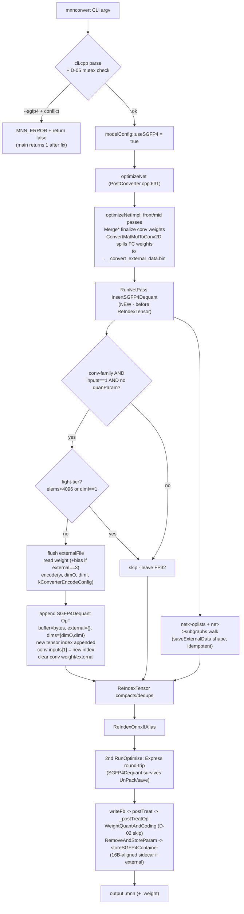

# Phase 11: Graph-Rewrite PostConverter Pass + CLI Flag - Research

**Researched:** 2026-09-01
**Domain:** MNN converter PostConverter pass mechanics, CLI flag wiring, CMake target graph, SGFP4 buffer-staging contract
**Confidence:** HIGH (every claim verified against local source this session; no external libraries involved)

## Summary

Phase 11 plugs a registered `PostConverter` pass (`InsertSGFP4Dequant`) into the tail of `optimizeNetImpl`, gated on a new `--sgfp4` CLI flag → `modelConfig::useSGFP4`, guarded against double-processing by the `inputIndexes.size() > 1` topology fingerprint (which the codebase already uses as its "conv weights arrive as a tensor input" convention in `RemoveAndStoreParam`). The dominant technical facts the planner must internalize: (1) **CMake ordering** — `tools/converter` is configured *before* `tools/fp4` is included in the root `CMakeLists.txt`, so the `sgfp4_encode` target does not exist when `MNNConvertDeps` is defined; the encoder library definition must be hoisted above `add_subdirectory(tools/converter)`. (2) **Weights are NOT always in `param->weight` at pass time** — MatMul-derived convs (AlexNet classifier layers, via `ConvertMatmulToConv2D`) spill weight+bias to `.__convert_external_data.bin` during the Merge passes, and the pass must read them back via `FileLoader` (with a `config->externalFile->flush()` first — the ofstream is still open and buffered). (3) **The final pass batch runs twice on the root net** (once per `ctx.RunOptimize` call in `optimizeNet`) and once per subgraph round-trip — the pass must be idempotent, which its own `inputIndexes.size() == 1` rewrite condition provides. (4) **W-1 is already fixed** (commit `1df51b7e`, Phase 8's D-10 pull-forward) — the planner should verify-and-close, not re-implement. (5) **`main()` returns 0 on parse failure** — D-05's "non-zero exit" requires a one-line fix in `MNNConverter.cpp` (or an accepted deviation).

**Primary recommendation:** Place the pass invocation as `RunNetPass({"InsertSGFP4Dequant", "ReIndexTensor"}, newNet)` at `PostConverter.cpp:393` (pass BEFORE `ReIndexTensor`), hoist `add_library(sgfp4_encode ...)` above `add_subdirectory(tools/converter)` in the root `CMakeLists.txt`, make the pass handle BOTH in-param and external-spilled weights, and add the `return 1` fix to `MNNConverter.cpp` so the D-05 mutex actually exits non-zero.

<user_constraints>
## User Constraints (from CONTEXT.md)

### Locked Decisions
- **D-01:** Registered `PostConverter` pass (e.g. `"InsertSGFP4Dequant"` via `PostConverterRegister`), appended to the final `RunNetPass` batch in `PostConverter.cpp`, after Merge* passes, in the company of `ReIndexTensor`.
- **D-02:** `WeightQuantAndCoding` skips any conv op whose `inputIndexes.size() > 1` (pure topology check; existing `quanParameter != nullptr` early-return stays).
- **D-03:** Pass walks `netT->oplists` AND every `subgraph->nodes` iteratively (mirroring `RemoveUnusefulOp`/`saveExternalData`).
- **D-04:** Boolean `--sgfp4` flag in `cli.cpp` mapping to new `modelConfig::useSGFP4` — exact `--hqq`/`--fp16` precedent shape. No value arguments, no threshold path.
- **D-05:** `--sgfp4` + (`--weightQuantBits` | `--hqq` | `--fp16`) = hard parse-time error (clear `MNN_ERROR`, non-zero exit).
- **D-06:** Pass rewrites exactly `Convolution`, `ConvolutionDepthwise`, `Deconvolution`, `DeconvolutionDepthwise`; flattens weights `{oc, ic*kx*ky}` to 2-D `[out, in]`.
- **D-07:** Light-tier floor: leave weights FP32 when `elements < 4096` OR `dimI == 1`.
- **D-08:** Named, greppable converter-side config constant equal to `sgfp4_encode::kDefaultEncodeConfig` (NOT the Phase 10 validated delta); comment documents `tools/fp4/real_weight_validation_report.json`. No CLI threshold override.
- **D-09 (W-1):** Retrofit `SGFP4ClassicAPITest.cpp:167-171` to region-relative offsets. **[Research finding: ALREADY DONE — see KEY Q4]**
- **D-10 (W-2):** Hoist `failCleanup` lambda in `sgfp4_inject_core.hpp` above the two arg-validation returns.
- **D-11 (W-3):** Env-var override for the hard-coded gnus-poc root in `author_structured_fixture.py:25` + siblings.
- **D-12:** Extend `TestSGFP4Converter.cpp` — synthetic NetT → pass ON → assert node insertion, consumer rewiring (`inputs[1]`), FP32 weights cleared, `buffer` populated / `external == {}` / no `externalPath`, light-tier skip, subgraph coverage. No new CMake surface.
- **D-13:** Real `mnnconvert --sgfp4` smoke run on `W:\gnus\models\alexnet_Opset16.onnx`; output asserted to contain `SGFP4Dequant` nodes and decode via classic API. Documented scripted/manual step, not an always-on gate.
- **D-14:** Flag OFF → zero behavior change; pass is dead code; all 13 `op/sgfp4` suites + existing converter tests green with no test-file edits.

### Claude's Discretion
- Exact pass registration string (suggested `"InsertSGFP4Dequant"`) and file name in `postconvert/`.
- Exact pass ordering within the final batch (before/after `ReIndexTensor`) — planner verifies tensor-index bookkeeping and locks it. **[Resolved: BEFORE — see KEY Q2]**
- Named constant's exact name/placement (converter-side alias vs. direct `kDefaultEncodeConfig` use with comment).
- Whether D-05's mutex error enumerates flags individually or collectively.
- Structure of D-12 synthetic nets beyond the listed assertions.
- How D-13's smoke run is scripted/documented and its tolerance wording.
- Whether the D-11 env-var name aligns with a gnus-poc-side convention discovered at plan time.

### Deferred Ideas (OUT OF SCOPE)
- MatMul/`OpParameter_MatMul` weight rewriting (LLM-export path)
- `--sgfp4Thresholds` CLI file override
- Per-layer SGFP4 opt-out (SGV2-37)
- Flag-ON converter corpus sweep beyond AlexNet (Phase 12 E2E)
- gnus-poc upstream adoption of the validated threshold delta
</user_constraints>

<phase_requirements>
## Phase Requirements

| ID | Description | Research Support |
|----|-------------|------------------|
| SGV2-28 | Graph-rewrite PostConverter pass inserting `OpType_SGFP4Dequant` nodes | KEY Q2 (pass mechanics + ReIndexTensor interplay), KEY Q3 (weight location incl. external-spilled case), Patterns §pass skeleton, idempotency analysis |
| SGV2-29 | CLI flag trigger (`--sgfp4`) | KEY Q7 (no hard-mutex precedent exists; `return false` path + `main()` exit-code-0 landmine), cli.cpp:150-290 option-table + :460-690 parse-block precedents, config.hpp field slot |
| SGV2-30 | WeightQuantAndCoding skip-guard (double-processing prevention) | KEY Q2 fingerprint analysis; `RemoveParams.cpp:70-72` is the existing `inputs>1` convention precedent; WeightQuantAndCoding.cpp:58-62 insertion point |
</phase_requirements>

## Architectural Responsibility Map

| Capability | Primary Tier | Secondary Tier | Rationale |
|------------|-------------|----------------|-----------|
| Graph rewrite (node insert + consumer splice) | Converter PostConverter pass (`tools/converter/source/optimizer/postconvert/`) | — | Net-level topology access; per-op hooks (`WeightQuantAndCoding`) see no topology — this split forces D-01's placement [VERIFIED: codebase] |
| Flag parsing + mutex | `cli.cpp` (`initializeMNNConvertArgs`) | `MNNConverter.cpp` main (exit code) | All flag→config threading lives here; exit code requires main's cooperation [VERIFIED: codebase] |
| Config field | `tools/converter/include/config.hpp` (`modelConfig`) | — | `Global<modelConfig>::Get()` is how passes read config [VERIFIED: SplitBlockQuantConvolution.cpp:26] |
| Encoding | `sgfp4_encode` static lib (consumed as-shipped) | — | Phase 9/10 output; overload `encode(w, dimO, dimI, config)` is the call site [VERIFIED: sgfp4_encode.hpp:66] |
| Container staging / externalization | OpT `buffer` + `RemoveParams.cpp` machinery (consumed as-shipped) | — | Phase 8 D-11 contract; `storeSGFP4Container` + `_postTreatOp` ordering already guarantee correctness [VERIFIED: RemoveParams.cpp:39-72, writeFb.cpp:23-37] |
| Build wiring | Root `CMakeLists.txt` + `tools/converter/CMakeLists.txt` | `tools/fp4/CMakeLists.txt` | Encoder target must exist before `MNNConvertDeps` links it — ordering constraint verified [VERIFIED: CMakeLists.txt:913-916 vs :960-962] |
| Tests | `TestSGFP4Converter.cpp` (pass mechanics) | scripted CLI smoke (D-13) | D-12/D-13 split; `run_test.out op/sgfp4` is the D-14 no-regression gate [VERIFIED: tools/converter/CMakeLists.txt:63-100] |

## Answers to the 8 KEY QUESTIONS

### KEY Q1 — CMake wiring: how `MNNConvertDeps`/`MNNConvert` gain `sgfp4_encode`

**Verified facts:**
- The pass file lands in `tools/converter/source/optimizer/postconvert/` and is auto-picked-up by `file(GLOB_RECURSE OPTIMIZER_SRC ...)` in `tools/converter/source/optimizer/CMakeLists.txt:1-7` → compiled into object lib `MNNConverterOpt` → injected into `MNN_CONVERTER_BACKENDS_OBJECTS` → linked into `MNNConvertDeps` (`tools/converter/CMakeLists.txt:52-58`). **No CMake edit needed for the pass file itself.**
- `sgfp4_encode` is a STATIC lib defined in `tools/fp4/CMakeLists.txt:7-8`, included from root `CMakeLists.txt:960-962` **only** `IF(MNN_BUILD_SGFP4_TOOLS)` (option defaults OFF, `CMakeLists.txt:50`).
- **THE ORDERING CONSTRAINT:** `add_subdirectory(tools/converter)` runs at root `CMakeLists.txt:913-916` (inside `if (NOT MNN_SKIPBUILD_GEOMETRY)`), i.e. **BEFORE** the `tools/fp4` include at `:960-962`. A naive `if(TARGET sgfp4_encode)` guard inside `tools/converter/CMakeLists.txt` would evaluate FALSE at configure time — the target doesn't exist yet. (The `test/CMakeLists.txt:47-48` `if(TARGET sgfp4_encode)` precedent works only because `test/` is included at `:966-968`, after `tools/fp4`.)

**Resolution (recommended):**
1. Hoist the encoder library definition above `add_subdirectory(tools/converter)` in the root `CMakeLists.txt`. Cleanest split: extract `add_library(sgfp4_encode STATIC ...)` + `target_include_directories(sgfp4_encode ...)` into the region just before `:913`, leaving the tools executables where they are (they need `MNN_DEPS`, which is finalized later). Gate choice is a planner decision:
   - **Option A (recommended):** build `sgfp4_encode` whenever `MNN_BUILD_CONVERTER=ON` (converter integration is the milestone's core value; the lib is one .cpp with header-only deps — `include/`, `3rd_party/half`). `--sgfp4` then always works in a converter build.
   - **Option B:** keep it under `MNN_BUILD_SGFP4_TOOLS` (pass compiled only when both options ON; smaller default footprint, but `--sgfp4` silently absent in default converter builds — poor UX and harder to test).
2. In `tools/converter/CMakeLists.txt`, link the encoder into `MNNConvertDeps` in **both** branches (STATIC `:55-58` and SHARED `:52-54`): `target_link_libraries(MNNConvertDeps ... sgfp4_encode)`. After hoisting, the target exists at that point.
3. `TestSGFP4Converter` (static branch `:63-78`, shared branch `:96-100`) links `MNNConvertDeps` with `/WHOLEARCHIVE` (MSVC) — the pass's static registrar fires automatically; `sgfp4_encode` symbols are pulled by reference from pass code (no whole-archive needed for it).
4. **Linux SHARED caveat:** a STATIC `sgfp4_encode` linked into a SHARED `MNNConvertDeps` needs PIC on Linux. Add `set_target_properties(sgfp4_encode PROPERTIES POSITION_INDEPENDENT_CODE ON)` when hoisting (no-op/harmless under MSVC). [ASSUMED — standard CMake behavior; this workspace builds MSVC]
5. **GLOB pitfall:** adding a new .cpp under a globbed dir does not trigger CMake re-configure by itself; since this change also edits `tools/converter/CMakeLists.txt` (link line), the re-configure happens anyway. Still worth a manual `cmake` re-run note in the plan. [ASSUMED — standard CMake glob behavior]

### KEY Q2 — Pass mechanics: new tensor index, oplist append, ReIndexTensor interplay, ordering

**New-index allocation precedent (exact bookkeeping):**
- `SplitBlockQuantConvolution.cpp:95-97`: `subOp->outputIndexes[0] = (int)net->tensorName.size(); net->tensorName.emplace_back(originOutputName + "_" + std::to_string(i));`
- `TransformInnerProduct.cpp:137-139`: `net->tensorName.push_back(permuteBefore->name); tempId = net->tensorName.size() - 1;`
- The pass does the same: `newIndex = (int)net->tensorName.size(); net->tensorName.emplace_back(<name>);` then `newOp->outputIndexes = {newIndex}` and `conv->inputIndexes.push_back(newIndex)` (making it `inputs[1]`).

**ReIndexTensor interplay (verified from `ReIndexTensor.cpp`):**
- It walks **`net->oplists` only** — it never touches `subgraphs` (subgraph nodes carry their own index namespace in `subgraph->tensors`, reindexed independently during each subgraph's own `optimizeNetImpl` round-trip via `CompleteSubGraph`, `PostConverter.cpp:608-615`).
- It builds `tensorValid` from every op's input/output indexes, compacts to `usefulTensorName`, and `DCHECK`s every referenced index resolves. A pass that appends `tensorName` + references the new index keeps this invariant.
- It also dedups op names and tensor names (empty/dup → generated defaults).

**ORDER LOCK: run `InsertSGFP4Dequant` BEFORE `ReIndexTensor`.**
- Current tail of `optimizeNetImpl` (`PostConverter.cpp:393-394`): `RunNetPass({"ReIndexTensor"}, newNet); RunNetPass({"ReIndexOnnxIfAlias"}, newNet);`
- Change to: `RunNetPass({"InsertSGFP4Dequant", "ReIndexTensor"}, newNet);` (or a separate `RunNetPass` call before it).
- Why before: (a) `ReIndexTensor` then compacts/dedups the pass's additions — the new tensor is used, so it survives; its name gets dedup-checked for free. (b) Running after would also work mechanically, but forfeits the dedup safety net and mixes responsibilities. (c) `ReIndexOnnxIfAlias` only touches ONNX `If` alias strings — orthogonal, stays last.
- **Caveat to design around:** this tail executes on EVERY `ctx.RunOptimize` invocation — and `optimizeNet` (`PostConverter.cpp:631-716`) calls `RunOptimize` on the root net **twice** (line 649 first pass; line 685 second full pass), plus once per subgraph via `CompleteSubGraph`. Therefore:
  1. **The pass MUST be idempotent.** Its rewrite condition — only conv-family ops with `inputIndexes.size() == 1` — provides this: after the first run the rewritten conv has 2 inputs and is skipped on re-runs. This is the same fingerprint as D-02 (by design).
  2. **The inserted SGFP4Dequant op round-trips through the Express world once** (second `RunOptimize` does `Program::create` → VARP → `Variable::save` back to NetT). A 0-input expr with a real `OpT` survives as `mOp->UnPack()` (`Expr.cpp:1163-1166`) — the injection tool's artifacts prove `OpType_SGFP4Dequant` survives `Variable::save`. Residual risk: a Merge/constant-fold pass could theoretically evaluate the 0-input expr; no such fold is known for unknown op types, but this is the single biggest untested mechanics — **D-13's smoke must assert the final `.mnn` still contains the expected `SGFP4Dequant` node count** (AlexNet: 5 feature convs + 3 classifier FC→convs = 8 candidates, minus any light-tier skips). [VERIFIED mechanics; ASSUMED fold-safety — flag for D-13 assertion]
- **Subgraph coverage (D-03):** the pass should still walk `net->oplists` + `net->subgraphs` in the `saveExternalData` shape (see KEY Q8) — belt-and-braces on top of the per-subnet invocations, harmless under the idempotency guard. Note ONNX If/While subgraphs are re-attached to `net->subgraphs` only AFTER the final `RunOptimize` (`PostConverter.cpp:698-701`), so their exposure actually happens inside `CompleteSubGraph`'s subnet runs — where the pass sees their nodes as `oplists` with `subgraph->tensors` as the `tensorName` equivalent. The pass's subgraph branch grows `subgraph->tensors` the same way.

### KEY Q3 — Where conv weight data lives at pass time

**Verified chain:**
- `cli.cpp:769` → `optimizeNet` → `optimizeNetImpl` (Merge passes finalize conv weights into `Convolution2DT::weight` — e.g. `MergeBNToConvolution`, `MergeScaleToConvulation` fold into `param->weight`).
- **The exception — MatMul-derived convs:** `ConvertMatMulToConv2D.cpp:270-279` — when `config->externalFile && info->size >= config->externalTreshold` (64KB, `config.hpp:72`), the FC weight AND bias are written to `.__convert_external_data.bin`, `dense->external = {offset, weightSize, biasSize}`, and `dense->weight`/`dense->bias` are **cleared**. `TransformInnerProduct.cpp:115-120` produces plain convs with `param->weight` populated (caffe/onnx InnerProduct path — no spill there).
- On AlexNet this means: classifier convs (≥4096×…

×4B) and the largest feature convs arrive at the pass with **empty `param->weight` and `param->external.size() == 3`**, data in the temp bin.
- `_postTreatOp` (`writeFb.cpp:23-37`) reloads these via `loadExternalParam` **later** (postTreat, after optimizeNet) — i.e. after our pass. `loadExternalParam` (`RemoveParams.cpp:180-215`) shows the exact read semantics: `fl->offset(external[0]); loadExternalData<float>(fl, param->weight, external[1]);` and bias at `external[2]`.

**Resolution — the pass must handle both cases:**
1. `param->weight` non-empty → encode directly.
2. `param->external.size() == 3` → `FileLoader fl(".__convert_external_data.bin")`, `fl.offset(external[0])`, read `external[1]` bytes as weight (and `external[2]` bytes as **bias — restore it into `param->bias`**, since the dequant node carries only the container and the conv must keep its bias per the injection-tool pattern), then clear `param->external`.
3. **FLUSH CAVEAT [CRITICAL]:** the temp bin's `std::ofstream` is opened in `optimizeNet` (`PostConverter.cpp:639-647`) and lives until `RunOptimize` returns — the pass runs while it is still open, and MSVC buffers writes. The pass can and should flush it first: `config->externalFile` is a plain field of `modelConfig` (`config.hpp:73`)`, so `Global<modelConfig>::Get()->externalFile->flush()` before reading (guard nullptr — it is nulled if open failed, `PostConverter.cpp:645-647`). MSVC `fopen`-family files are shareable (`_SH_DENYNO` default), so a concurrent `FileLoader` read is permitted. [VERIFIED field/reachability; ASSUMED MSVC share mode — standard CRT behavior]
4. Also skip convs with `param->quanParameter != nullptr` (int8 weights — not FP32 encode targets; mirrors WeightQuantAndCoding's early return at `WeightQuantAndCoding.cpp:60-62`).
5. After encoding: clear `param->weight` (swap-empty idiom like `storeWeight`, `RemoveParams.cpp:26-29`), keep `param->bias` (restored if spilled), clear `param->external`. `RemoveAndStoreParam`'s Convolution2D case already `break`s early for `inputIndexes.size() > 1` (`RemoveParams.cpp:70-73`) — the rewritten conv is never re-externalized; its bias stays inline (small). **That early-break is also the codebase's own precedent for the `inputs>1` fingerprint D-02 adopts.**

### KEY Q4 — W-1: current vs. target offset semantics — **ALREADY FIXED**

- Current `SGFP4ClassicAPITest.cpp:167-171` calls the **shared region-relative builder** `sgfp4_test::buildContainerUniform64` (see the file's comment block at ~:84-95: "Plan 08-02 (D-10 pull-forward of the W-1 fix)… the former LOCAL buildContainerUniform64 here wrote ABSOLUTE offset-table entries… replaced by the shared REGION-RELATIVE builder").
- Git history: commit `1df51b7e` "[Test:Refact] dedup SGFP4 test helpers into SGFP4TestUtil.hpp (D-10)" retrofitted the file and created `SGFP4TestUtil.hpp` (whose header comment at :11-15 explicitly retires the W-1 divergence and declines to carry the absolute variant forward).
- Target semantics live at `SGFP4TestUtil.hpp:134-186`: offset-table entries are relative to the record-region start (encoder convention, `encode_sgfp4.py` cursor-from-0), with arithmetic anchored on `MNN::kSGFP4RecordOffsetTableStart` / `sgfp4_align16`.
- **Action for the planner:** D-09/W-1 is a *verify-and-close* item (confirm suites green, annotate the milestone-audit item as retired by `1df51b7e`), NOT an implementation task. Do not re-touch the file. [VERIFIED: code + git]

### KEY Q5 — W-2: exact hoist mechanics in `sgfp4_inject_core.hpp`

Verified current structure of `sgfp4_inject::run`:
- `:278-286`: declarations (`modelPath`, `outputPath`, `nicheDirs`) + arg parse loop; unknown arg → `usage(); return 1;` (`:288-289`); missing required args → `usage(); return 1;` (`:292-294`).
- `:296`: `const std::string sidecarPath = outputPath + ".weight";`
- `:304-310`: the `failCleanup` lambda (captures `&outputPath, &sidecarPath`; `std::remove` both) — defined AFTER the arg-validation returns, so those two paths exit without cleanup (the W-2 gap; matches audit finding text).
- All later failure sites call `failCleanup()` before `return 1` (12 occurrences).

**Hoist mechanics:** move the lambda definition above the arg parse loop, restructured to be safe when `outputPath` is still empty:
```cpp
const auto failCleanup = [&outputPath]() {
    if (!outputPath.empty()) {
        std::remove(outputPath.c_str());
        std::remove((outputPath + ".weight").c_str());
    }
};
```
(Compute the sidecar path inside the lambda; `sidecarPath` can still be derived at `:296` for the success path.) This covers both `:288-289` and `:292-294` without ever `std::remove`-ing a literal `.weight` in the CWD. **Verification surface:** no existing test asserts arg-stage cleanup — a cheap manual check (create stale `out.mnn`+`out.weight`, run with a bad arg pointing `--output` at them, assert both gone) or a small extension to `SGFP4InjectTest.cpp`; keep it proportionate (audit item is WARNING-level). [VERIFIED: code]

### KEY Q6 — W-3: every tools/fp4 *.py with the hard-coded gnus-poc root

Exhaustive grep of `tools/fp4` for `gnus-poc|W:/gnus` (11 files with hits; .py subset):
| File | Line(s) | Current state |
|------|---------|---------------|
| `author_structured_fixture.py` | :25 | `GNUST_POC_ROOT = Path("W:/…/gnus-poc")` — hard-coded, **needs env-var** |
| `author_real_shape_fixture.py` | :28 | same pattern — **needs env-var** |
| `validate_real_weights.py` | :49 + :757 | `DEFAULT_GNUS_POC_ROOT` literal BUT already has a `--gnus-poc-root` argparse override — optionally add env-var as the default's fallback for uniformity |
| `encode_sgfp4.py`, `quantize_fp4.py`, `test_quantize_fp4.py` | — | no gnus-poc root references (clean) |
| `real_weight_validation_report.{json,md}` | — | recorded paths in report content only — not code, no change |

**Fix shape:** `GNUST_POC_ROOT = Path(os.environ.get("SGFP4_GNUS_POC_ROOT", "W:/gnus/GeniusCognitiveSystem/GNUS-NEO-SWARM/gnus-poc"))` in the two author scripts (env name per D-11; no gnus-poc-side convention was discoverable from this repo — discretion item stands). [VERIFIED: grep]

### KEY Q7 — CLI mutex precedent: none exists (D-05 is novel); cleanest error pattern

- **No hard-error-on-flag-combination precedent exists in `cli.cpp`.** The nearest behaviors: the `--hqq`-without-asymmetric case *downgrades* with a `std::cout` warning and disables HQQ (`cli.cpp:516-521`) — a soft precedent D-05 explicitly rejects; parse failures print via `std::cout`/`DLOG(INFO)` and `return false` (e.g. framework error `:380`, missing modelFile `:407`). `MNN_ERROR` is used in the same file (`:463`, `:698`).
- **Cleanest pattern:** after ALL flags are parsed (i.e. at the end of `initializeMNNConvertArgs`, just before `return true` at `:690`), so every conflicting flag is resolved:
```cpp
if (modelPath.useSGFP4 && (modelPath.weightQuantBits != 0 || modelPath.useHQQ || modelPath.saveHalfFloat)) {
    MNN_ERROR("--sgfp4 cannot be combined with --weightQuantBits, --hqq, or --fp16 "
              "(conflicting weight transforms on the same tensors)\n");
    return false;
}
```
  (`weightQuantBits` defaults to 0 = unset, `config.hpp:40`.) Collective enumeration is simplest; individual enumeration is discretionary.
- **THE EXIT-CODE LANDMINE [CRITICAL]:** `MNNConverter.cpp:15-18` — `if (!res) { return 0; }`. A `return false` from `initializeMNNConvertArgs` yields **exit code 0** today. D-05's "non-zero exit" is unreachable without changing `main` to `return 1`. Recommended: change `MNNConverter.cpp` to `return 1` on parse failure (one line; semantically correct; `pymnn/src/MNNTools.cc:34` calls the function directly and checks `res` itself, so it is unaffected). Alternative if the planner wants zero shared-main churn: accept the deviation and document that the mutex's observable is the error text + no conversion occurring. Surface this as an explicit plan decision. [VERIFIED: code]

### KEY Q8 — Subgraph walking: exact iteration pattern

Two verified precedents for the D-03 walk:
1. **`saveExternalData` (`RemoveParams.cpp:167-177`)** — the canonical minimal shape:
```cpp
for (auto& op : netT->oplists) { RemoveAndStoreParam(op, &extraFile, offset); }
for (auto& subgraph : netT->subgraphs) {
    for (auto& op : subgraph->nodes) { RemoveAndStoreParam(op, &extraFile, offset); }
}
```
2. **`postTreat` (`writeFb.cpp:159-168`)** — same shape, plus `context.subgraph = subgraph->name;` when per-subgraph context is needed.
3. `GenerateSubGraph.cpp:581-589` (TF control-flow clustering) is a different, earlier-stage mechanism — not the pattern to copy; the CONTEXT reference is for "net + subgraph iteration precedent" generally.

**Per-subgraph index namespace:** inside a subgraph, `subgraph->tensors` is the `tensorName` equivalent — the pass's subgraph branch appends the new name there and uses `subgraph->tensors.size()` (pre-push) as the new index (`SubGraphProtoT::tensors` is `std::vector<std::string>`, same as `NetT::tensorName`). Cross-namespace leakage must not occur (a subgraph node may reference an outer tensor index — do NOT renumber anything; only append). [VERIFIED: schema types + ReIndexTensor/CompleteSubGraph behavior]

## Standard Stack

### Core
| Library / Component | Version | Purpose | Why Standard |
|---------------------|---------|---------|--------------|
| `PostConverter` + `PostConverterRegister<T>` | in-tree (`PostTreatUtils.hpp:20-41`) | Pass base class + static registration | The only mechanism `RunNetPass` (`PostConverter.cpp:144-167`) can invoke; free `--dumpPass` size-diff logging |
| `sgfp4_encode::encode(w, dimO, dimI, config)` | in-tree Phase 9/10 (`sgfp4_encode.hpp:66`) | Container production | MSVC-proven; config-carrying overload is the greppable swap-point D-08 threads |
| `Global<modelConfig>` | in-tree (`optimizer/Global.hpp`) | Config access inside passes | How `SplitBlockQuantConvolution.cpp:26` and `RunNetPass` read config |
| cxxopts | vendored (`cli.cpp:23`) | Flag parsing | Existing option-table + `result.count("flag")` pattern (`cli.cpp:514-516` hqq precedent) |

### Supporting
| Component | Purpose | When to Use |
|-----------|---------|-------------|
| `FileLoader` (`core/FileLoader.hpp`) | Reading external-spilled weights at pass time | Only for `param->external.size() == 3` convs (KEY Q3) |
| `sgfp4_test::*` helpers (`test/op/SGFP4TestUtil.hpp`) | Container builder for D-12 synthetic tests | Already linked into `TestSGFP4Converter` via include-path (`tools/converter/CMakeLists.txt:65,97`) |
| `MNN::sgfp4_align16`, `kSGFP4Magic` (`MNN/SGFP4DequantUtils.hpp`) | Container constants | `makeSgfp4Op`-style OpT construction (`TestSGFP4Converter.cpp:57-74` is the reference builder) |

### Alternatives Considered
| Instead of | Could Use | Tradeoff |
|------------|-----------|----------|
| Registered PostConverter pass | Sweep inside `postTreat()` (writeFb.cpp) | Rejected by D-01 — non-discoverable, outside pass tooling, no `--dumpPass` |
| Topology skip-guard (`inputs>1`) | Schema marker field / config coupling | Rejected by D-02 — pure topology, zero schema change; `RemoveParams.cpp:70-72` proves the convention |
| Buffer staging (Phase 8 D-11) | Direct `externalPath`/`external` writes (SplitBlockQuantConvolution style) | Rejected in Phase 8 — buffer-first keeps one artifact shape; externalization rides `saveExternalData` untouched |

**Installation:** none — this phase adds no external packages. **Package Legitimacy Audit: N/A (no external packages installed).**

## Architecture Patterns

### System Architecture Diagram


### Recommended Project Structure
```
tools/converter/source/optimizer/postconvert/InsertSGFP4Dequant.cpp   # NEW - the pass (auto-globbed)
tools/converter/source/optimizer/PostConverter.cpp                    # EDIT - final batch entry (:393)
tools/converter/source/common/WeightQuantAndCoding.cpp                # EDIT - D-02 skip-guard
tools/converter/source/common/cli.cpp                                 # EDIT - --sgfp4 + D-05 mutex
tools/converter/include/config.hpp                                    # EDIT - useSGFP4 field
tools/converter/include/PostConverter.hpp                             # EDIT - RunNetPass declaration (for the test)
tools/converter/source/MNNConverter.cpp                              # EDIT (optional) - return 1 on parse failure
tools/converter/source/TestSGFP4Converter.cpp                         # EDIT - D-12 pass-mechanics tests
CMakeLists.txt                                                        # EDIT - hoist sgfp4_encode lib above add_subdirectory(tools/converter)
tools/converter/CMakeLists.txt                                        # EDIT - link sgfp4_encode into MNNConvertDeps
tools/fp4/sgfp4_inject_core.hpp                                       # EDIT - W-2 hoist
tools/fp4/author_structured_fixture.py                                # EDIT - W-3 env-var
tools/fp4/author_real_shape_fixture.py                                # EDIT - W-3 env-var
```

### Pattern 1: Minimal PostConverter pass skeleton
**What:** the exact shape every postconvert pass follows.
**When to use:** the new pass file.
```cpp
// Source: tools/converter/source/optimizer/postconvert/ReIndexTensor.cpp (structure);
//         SplitBlockQuantConvolution.cpp:26 (config access)
#include "../PostTreatUtils.hpp"
#include "../Global.hpp"
#include "config.hpp"
class InsertSGFP4Dequant : public PostConverter {
public:
    virtual bool onExecute(std::unique_ptr<MNN::NetT>& net) const override {
        auto config = Global<modelConfig>::Get();
        if (nullptr == config || !config->useSGFP4) {
            return true; // D-14: dead code when flag absent
        }
        // ... walk oplists + subgraphs (saveExternalData shape) ...
        return true;
    }
};
static PostConverterRegister<InsertSGFP4Dequant> __l("InsertSGFP4Dequant");
```

### Pattern 2: CLI flag (exact `--hqq` precedent shape)
```cpp
// Source: tools/converter/source/common/cli.cpp:243-247 (table), :514-521 (parse)
// option table, near "hqq":
( "sgfp4", "save conv-family weights as SGFP4 v2 (quadtree-adaptive FP4) via inserted SGFP4Dequant nodes" )
// parse block, near hqq handling:
if (result.count("sgfp4")) { modelPath.useSGFP4 = true; }
// mutex at end of initializeMNNConvertArgs (before `return true`):
if (modelPath.useSGFP4 && (modelPath.weightQuantBits != 0 || modelPath.useHQQ || modelPath.saveHalfFloat)) {
    MNN_ERROR("--sgfp4 cannot be combined with --weightQuantBits, --hqq, or --fp16\n");
    return false;
}
```
Note: help text must say "SGFP4 v2", never "Ultra FP4" (locked terminology, STATE.md).

### Pattern 3: Buffer-staged OpT construction (Phase 8 D-11 contract)
```cpp
// Source: tools/converter/source/TestSGFP4Converter.cpp:57-74 (makeSgfp4Op) - the reference builder
op->type      = MNN::OpType_SGFP4Dequant;
op->main.type = MNN::OpParameter_SGFP4DequantParam;
auto* param   = new MNN::SGFP4DequantParamT;
param->magic  = MNN::kSGFP4Magic;
param->dims   = {dimO, dimI};
param->buffer.resize(container.size());
std::memcpy(param->buffer.data(), container.data(), container.size()); // vector<int8_t> per flatc [byte]
op->main.value = param;
// external stays {} and externalPath stays empty - externalization rides
// RemoveAndStoreParam/storeSGFP4Container untouched (RemoveParams.cpp:133-136).
```

### Pattern 4: D-02 skip-guard insertion
```cpp
// Source: tools/converter/source/common/WeightQuantAndCoding.cpp:60-63
auto param = op->main.AsConvolution2D();
auto& common = param->common;
if (param->quanParameter.get() != nullptr) {
    return;
}
// NEW (D-02): SGFP4-rewritten convs carry their weight as a second input tensor.
if (op->inputIndexes.size() > 1) {
    return;
}
```

### Anti-Patterns to Avoid
- **Reading spilled weights without flushing:** `config->externalFile` may hold unflushed bytes when the pass reads `.__convert_external_data.bin` — always `flush()` first (KEY Q3).
- **Walking only `oplists` in the pass:** D-03 mandates the subgraph branch; and vice-versa, do not rely solely on the per-subnet invocations — walk both, rely on idempotency.
- **Clearing conv `param->bias`:** bias stays in the conv (runtime needs it); only `weight` is cleared. For spilled convs, bias must be *restored* from the temp bin.
- **Hand-rolled threshold table in the pass:** use `kDefaultEncodeConfig` (or a named alias) — D-08; the validated delta stays a documented comment/JSON only.

## Don't Hand-Roll

| Problem | Don't Build | Use Instead | Why |
|---------|-------------|-------------|-----|
| New-output-index bookkeeping | Custom index allocator | `tensorName.size()` + `emplace_back` precedent (`SplitBlockQuantConvolution.cpp:95-97`) | Matches every existing pass; ReIndexTensor cleans up after |
| Sidecar externalization | Writing `externalPath`/`external` in the pass | Phase 8 buffer staging + `storeSGFP4Container` (`RemoveParams.cpp:39-72`) | 16-byte alignment + true-size semantics already solved and tested |
| Weight reload at pass time | Ad-hoc ifstream parsing | `FileLoader` + `loadExternalParam` offset semantics (`RemoveParams.cpp:180-215`) | Exact `{offset, wsize, biasize}` layout compatibility |
| Container encoding | Re-implementing any encoder piece | `sgfp4_encode::encode` overload with config | Phase 9/10 shipped + validated; MSVC-proven |

**Key insight:** every mechanical sub-problem in this phase (index growth, consumer splice naming, sidecar alignment, weight reload, config threading) already has an in-tree, tested precedent — the pass is an assembly of proven parts, and the plan's risk budget belongs on the two integration unknowns (Express round-trip survival; CMake target ordering).

## Runtime State Inventory

N/A — feature phase, not a rename/refactor/migration. (No stored data, service config, OS-registered state, secrets, or build artifacts reference strings this phase renames.)

## Common Pitfalls

### Pitfall 1: CMake target-ordering (root CMakeLists)
**What goes wrong:** `if(TARGET sgfp4_encode)` in `tools/converter/CMakeLists.txt` silently false; or linking a not-yet-defined target errors.
**Why:** `tools/converter` subdirectory is configured at `CMakeLists.txt:913-916`, before the `tools/fp4` include at `:960-962`.
**How to avoid:** hoist the encoder lib definition above `add_subdirectory(tools/converter)` (KEY Q1).
**Warning signs:** configure-time "target not found" or a converter build missing `--sgfp4`.

### Pitfall 2: MSVC aggregate-init of `EncodeConfig` (Phase 10 learning)
**What goes wrong:** C2440 without explicit `Gate{}` per element; C2086 if a `static` definition collides with the cpp definition.
**How to avoid:** never re-define `kDefaultEncodeConfig` — reference the extern (headerdecl `sgfp4_encode.hpp:57`) or alias it as a reference/const-ref in the pass .cpp only (never in a header). Explicit `EncodeConfig::Gate{...}` braces if a literal config is ever written.
**Warning signs:** MSVC C2440/C2086 in the pass TU.

### Pitfall 3: Non-idempotent pass under double `RunOptimize`
**What goes wrong:** second invocation re-rewrites or double-appends nodes.
**Why:** `optimizeNet` runs `RunOptimize` twice on the root net (`PostConverter.cpp:649,685`) + once per subgraph.
**How to avoid:** rewrite condition strictly `inputIndexes.size() == 1` (the pass's own copy of the D-02 fingerprint).
**Warning signs:** D-12 test run through full `optimizeNet` (not just `RunNetPass`) produces doubled nodes; `--dumpPass` shows ops growing twice.

### Pitfall 4: Express round-trip folding/transforming the inserted op
**What goes wrong:** second `RunOptimize`'s Merge framework evaluates or replaces the 0-input `SGFP4Dequant` expr.
**Why:** the final batch runs before the last Express round-trip (structural, D-01-locked placement).
**How to avoid:** cannot be eliminated at design time — **assert in D-13 that the emitted `.mnn` contains the expected `SGFP4Dequant` count** and decodes; if folding occurs, fallback options are post-round-trip invocation from `cli.cpp` (between `optimizeNet` and `writeFb`) — flag as deviation from D-01 placement if needed.
**Warning signs:** smoke output lacks SGFP4 nodes; `--dumpPass` MergePass op counts drop unexpectedly.

### Pitfall 5: Unflushed temp-bin reads
**What goes wrong:** spilled weights read as zeros/stale bytes.
**Why:** `.__convert_external_data.bin` ofstream is open+buffered during the pass (KEY Q3).
**How to avoid:** `Global<modelConfig>::Get()->externalFile->flush()` (null-check) before any FileLoader read.
**Warning signs:** D-13 classifier-layer containers decode to garbage; only feature convs correct.

### Pitfall 6: exit code 0 on CLI error
**What goes wrong:** D-05 mutex "passes" a scripted `ERRORLEVEL` check.
**Why:** `MNNConverter.cpp:16-18` returns 0 when `initializeMNNConvertArgs` returns false.
**How to avoid:** `return 1` in main (recommended) or drop the non-zero-exit clause from D-05's acceptance wording.
**Warning signs:** smoke script's exit-code assertion never fires.

### Pitfall 7: GLOB staleness
**What goes wrong:** new pass file not compiled after adding it.
**Why:** `file(GLOB_RECURSE ...)` doesn't re-glob on new files alone.
**How to avoid:** any CMakeLists edit in the same change re-triggers configure (this phase edits `tools/converter/CMakeLists.txt` anyway); note manual re-configure in the plan.
**Warning signs:** `PostConverter::get("InsertSGFP4Dequant")` logs "Can't find pass" (`PostConverter.cpp:148-150`).

### Pitfall 8: Depthwise/deconv dims arithmetic drift
**What goes wrong:** hand-derived `dimI` disagrees with weight layout for depthwise/deconv.
**How to avoid:** mirror `WeightQuantAndCoding.cpp:126-131` exactly: `oc = common->outputCount; kernelSize = weightSize / oc;` → `dimO = oc; dimI = kernelSize`. The encoder zero-pads non-64-multiples internally (`sgfp4_encode.cpp:787-798`).
**Warning signs:** D-12 synthetic depthwise case fails decode-size assertions.

### Pitfall 9: Windows register.py regen (Phase 1 learning) — NOT applicable
No `register.py` regen this phase (converter-side only; no schema/CPU-registration changes). Noted to preempt plan noise.

## Code Examples

### D-12 extension target: driving the pass from the existing test
```cpp
// Source: tools/converter/source/TestSGFP4Converter.cpp (existing scaffolding) +
// PostConverter.cpp:634 (Global<modelConfig>::Reset precedent)
#include "PostConverter.hpp"  // needs RunNetPass declaration added (KEY: only optimizeNet is declared today)
modelConfig config;
config.useSGFP4 = true;
MNN::Express::Global<modelConfig>::Reset(&config);
MNN::Express::RunNetPass({"InsertSGFP4Dequant"}, net);
// then assert: SGFP4Dequant node count, conv inputs[1] == dequant output index,
// conv param->weight empty, param->buffer non-empty, external=={} && externalPath empty,
// light-tier conv untouched, subgraph nodes covered.
```
The static registrar fires because `TestSGFP4Converter` links `MNNConvertDeps` with `/WHOLEARCHIVE` (`tools/converter/CMakeLists.txt:63-78`). Flag-OFF variant: `config.useSGFP4 = false` → pass returns true with zero mutation (D-14 unit-level check).

### D-05 smoke assertion shape (D-13)
```
MNNConvert -f ONNX --modelFile W:\gnus\models\alexnet_Opset16.onnx --MNNModel out.mnn --sgfp4 [--dumpPass]
# assert: exit 0; [DumpPass] shows InsertSGFP4Dequant ops N -> N+K; emitted .mnn contains
# K SGFP4Dequant ops (K = 8 candidates minus light-tier skips); classic-API decode of one
# node matches the CPU oracle (TestSGFP4Converter PHASE B pattern).
MNNConvert ... --sgfp4 --fp16  # assert: MNN_ERROR text, (post-fix) exit 1, no output written
```

## State of the Art

| Old Approach | Current Approach | When Changed | Impact |
|--------------|------------------|--------------|--------|
| Post-hoc injection tool (`sgfp4_inject`, v2.0) | In-converter pass (this phase) | v3.0 Phase 11 | Artifact producers stay structurally comparable (same node naming/splice conventions) |
| `kDefaultEncodeConfig` knob-less call | Config-carrying overload as the greppable swap-point | Phase 10 (f4e3223d) | D-08 threads a named constant, not the validated delta |

**Deprecated/outdated:** the v2.0 milestone audit's W-1 line item (already fixed by `1df51b7e`); `sgfp4_inject` remains supported but is superseded for new conversions once `--sgfp4` lands.

## Assumptions Log

| # | Claim | Section | Risk if Wrong |
|---|-------|---------|---------------|
| A1 | MSVC-open ofstream permits concurrent FileLoader reads (`_SH_DENYNO` default) + flush makes bytes visible | KEY Q3 / Pitfall 5 | Spilled-weight reads fail on some toolchain — fall back to reading via the open stream's offsets is not possible; would need pass relocation. D-13 catches. |
| A2 | Merge framework does not fold a 0-input non-Const `SGFP4Dequant` expr during the 2nd `RunOptimize` | KEY Q2 / Pitfall 4 | Nodes vanish from artifact; fallback = invoke pass post-round-trip from `cli.cpp` (D-01 deviation). D-13 catches. |
| A3 | Linux SHARED builds need `POSITION_INDEPENDENT_CODE ON` on `sgfp4_encode` | KEY Q1 | Linux shared-converter link failure (MSVC unaffected — this workspace's target). |
| A4 | Env-var name `SGFP4_GNUS_POC_ROOT` (no gnus-poc-side convention discoverable from this repo) | KEY Q6 | Cosmetic; discretion item anyway. |
| A5 | Standard CMake glob non-re-trigger behavior | Pitfall 7 | Stale build confusion; mitigated by same-change CMakeLists edit. |

## Open Questions

1. **D-05 exit code:** change `MNNConverter.cpp` main to `return 1` on parse failure (recommended, 1 line), or accept exit-0 + error text as the mutex's observable? Needs an explicit plan decision; `pymnn/src/MNNTools.cc` verified unaffected either way.
2. **Encoder gating (KEY Q1 Option A vs B):** always build `sgfp4_encode` with the converter (recommended: `--sgfp4` always available, matches milestone core value) vs. gate on `MNN_BUILD_SGFP4_TOOLS` (smaller footprint, silent flag absence). Planner locks.
3. **W-2 verification depth:** manual stale-file check vs. a small `SGFP4InjectTest.cpp` extension — audit item is WARNING-level; recommend the cheap manual/scripted check documented in the plan.
4. **A2 (Express round-trip):** if D-13 shows node loss, the D-01 placement needs a documented deviation (post-`optimizeNet` invocation from `cli.cpp` before `writeFb`). Pre-authorize this fallback in the plan to avoid mid-phase re-planning.

## Environment Availability

| Dependency | Required By | Available | Version | Fallback |
|------------|------------|-----------|---------|----------|
| MSVC + CMake toolchain (existing build dir) | converter/pass build | ✓ | project-standard | — |
| `W:\gnus\models\alexnet_Opset16.onnx` (approved corpus, sha256 `4bc388cc…`) | D-13 smoke | ✓ (Test-Path verified) | — | Phase 10 D-04 synthetic fallback (moot per STATE) |
| `tools/fp4/sgfp4_encode.{hpp,cpp}` | pass encoding | ✓ | Phase 10 (f4e3223d) | — |
| Python 3 (gnus-poc import) | W-3 script regeneration only (not CI) | ✓ (authoring-time only, per script headers) | — | none needed |
| `MNNConvert.exe` built with converter | D-13 | build-time product | — | — |

**Missing dependencies with no fallback:** none.
**Missing dependencies with fallback:** none.

## Validation Architecture

### Test Framework
| Property | Value |
|----------|-------|
| Framework | Standalone assert-macro executable (`TestSGFP4Converter.cpp` `CHECK` macro) + MNN test suite (`run_test.out`) |
| Config file | `tools/converter/CMakeLists.txt` (test target wiring, already present) |
| Quick run command | `TestSGFP4Converter.exe` (build target) |
| Full suite command | `run_test.out op/sgfp4` (13 suites) + `TestSGFP4Converter.exe` |

### Phase Requirements → Test Map
| Req ID | Behavior | Test Type | Automated Command | File Exists? |
|--------|----------|-----------|-------------------|-------------|
| SGV2-28 | Pass inserts SGFP4Dequant nodes, rewires `inputs[1]`, clears FP32 weights, stages `buffer`/`external=={}` | unit (synthetic NetT → `RunNetPass`) | `TestSGFP4Converter.exe` | ✅ extend `tools/converter/source/TestSGFP4Converter.cpp` |
| SGV2-28 | Light-tier floor (`<4096` elems or `dimI==1`) skipped | unit (synthetic tiny conv) | `TestSGFP4Converter.exe` | ✅ same |
| SGV2-28 | Subgraph coverage (`subgraph->nodes` + `tensors` growth) | unit (synthetic NetT w/ subgraph) | `TestSGFP4Converter.exe` | ✅ same |
| SGV2-28 | Idempotency (double `RunNetPass` / full `optimizeNet` round-trip → no doubling) | unit | `TestSGFP4Converter.exe` | ✅ same |
| SGV2-28 | External-spilled weight path (`external==3` reload incl. bias restore) | unit (synthetic spilled conv + temp bin) | `TestSGFP4Converter.exe` | ✅ same |
| SGV2-29 | `--sgfp4` parses → `useSGFP4=true`; mutex rejects conflicting combos | CLI smoke (scripted) | `MNNConvert ... --sgfp4 [--fp16]` + output/exit assertions | ❌ new small script/doc step |
| SGV2-29+28 | Real corpus end-to-end (nodes present + decode) | CLI smoke (D-13, documented manual/scripted — corpus is a test-time dependency) | see D-13 shape above | ❌ new doc/script |
| SGV2-30 | `WeightQuantAndCoding` skips `inputs>1` convs | unit (synthetic rewritten conv → hook no-op) | `TestSGFP4Converter.exe` | ✅ extend |
| SGV2-30/D-14 | Flag OFF → zero mutation; 13 `op/sgfp4` suites green, zero test-file edits | regression | `run_test.out op/sgfp4` + `git status test/` clean | ✅ suites exist |
| W-2 | Arg-stage failCleanup removes stale artifacts | manual/scripted probe | stale-file + bad-arg run | ❌ tiny script step |
| W-3 | Env-var root override works | manual (authoring-time scripts) | `SGFP4_GNUS_POC_ROOT=… python author_…` | ❌ manual |
| W-1 | (Already fixed `1df51b7e`) suites still green | regression | `run_test.out op/sgfp4/classic_api` | ✅ exists |

### Sampling Rate
- **Per task commit:** rebuild + run `TestSGFP4Converter.exe`; for pass/CLI tasks also `run_test.out op/sgfp4` quick subset touched by the change.
- **Per wave merge:** `run_test.out op/sgfp4` (13/13) + full `TestSGFP4Converter.exe` + `git status test/` clean (D-14).
- **Phase gate:** full suite green + D-13 smoke executed and documented (nodes-present + decode + mutex behavior) before `/gsd-verify-work`.

### Wave 0 Gaps
- [ ] `TestSGFP4Converter.cpp` pass-mechanics section (synthetic conv/subgraph/light-tier/spilled/idempotency cases) — covers SGV2-28/30 unit legs
- [ ] `RunNetPass` declaration in `tools/converter/include/PostConverter.hpp` (currently only `optimizeNet` is declared; the test needs the symbol)
- [ ] D-13 smoke script/doc (mutex + corpus run + assertions) — manual gate, corpus present

## Security Domain

`security_enforcement: true`, ASVS L1 (`config.json`). This phase processes trusted converter inputs (model files the user supplies for conversion) and adds no network, auth, or crypto surface.

### Applicable ASVS Categories
| ASVS Category | Applies | Standard Control |
|---------------|---------|------------------|
| V2 Authentication | no | — |
| V3 Session Management | no | — |
| V4 Access Control | no | — |
| V5 Input Validation | yes (weakly) | Encoder's existing NaN/Inf + dims guards (`sgfp4_encode.cpp:768-780`); pass should propagate `encode`'s empty-vector failure as a pass failure (MNN_ERROR + `return false`), never encode garbage |
| V6 Cryptography | no | — |

### Known Threat Patterns for converter C++ pass
| Pattern | STRIDE | Standard Mitigation |
|---------|--------|---------------------|
| Malformed model → OOB reads in pass | Tampering | Bounds from `param->external` sizes guarded by file-existence + `FileLoader` failure checks; `encode` input-count derived from `dimO*dimI` matches weight vector size (assert before call) |
| Huge dims → integer overflow | DoS | `encode` rejects dims > 65536 (`sgfp4_encode.hpp` contract); `dimO*dimI` computed in `size_t` |
| Temp-bin path collision (`.__convert_external_data.bin` in CWD) | Tampering | Pre-existing converter behavior, unchanged this phase (deleted at `writeFb.cpp:170`) |

## Sources

### Primary (HIGH confidence — all verified by direct file reads this session)
- `tools/converter/source/optimizer/PostTreatUtils.hpp` — PostConverter base + register macro
- `tools/converter/source/optimizer/PostConverter.cpp` — `RunNetPass` :144-167; `optimizeNetImpl` tail :393-394; `optimizeNet` double-`RunOptimize` :631-716; temp-bin ofstream :639-647
- `tools/converter/source/common/writeFb.cpp` — `_postTreatOp` :23-37; `postTreat` walk :159-168; temp-bin delete :170
- `tools/converter/source/common/WeightQuantAndCoding.cpp` — op-type gate :52-58; quanParameter return :60-62; dims arithmetic :126-131
- `tools/converter/source/common/RemoveParams.cpp` — inputs>1 early-break :70-73; `storeSGFP4Container` :39-72; `loadExternalParam` :180-215; `saveExternalData` walk :167-177
- `tools/converter/source/common/cli.cpp` — option table :150-345; parse blocks :460-690; hqq soft-precedent :514-521
- `tools/converter/include/config.hpp` — fields :38-78 (`useSGFP4` slot, `externalFile` :73, `externalTreshold` :72)
- `tools/converter/source/MNNConverter.cpp` — main returns 0 on parse failure :15-18
- `CMakeLists.txt` (root) — `MNN_BUILD_SGFP4_TOOLS` :50; converter subdirectory :913-916; tools/fp4 include :960-962
- `tools/converter/CMakeLists.txt` — MNNConvertDeps/TestSGFP4Converter wiring :52-100
- `tools/converter/source/optimizer/CMakeLists.txt` — GLOB_RECURSE object lib :1-7
- `tools/fp4/CMakeLists.txt` — sgfp4_encode lib :7-8
- `tools/fp4/sgfp4_encode.hpp/.cpp` — API + config overload; `kDefaultEncodeConfig` :763-770; validated-delta comment :750-762
- `tools/fp4/sgfp4_inject_core.hpp` — rewiring/naming conventions; W-2 sites :281-296, :304-310
- `tools/converter/source/optimizer/postconvert/ReIndexTensor.cpp` — oplists-only walk, name dedup
- `tools/converter/source/optimizer/postconvert/ReIndexOnnxIfAlias.cpp` — If-only, stays last
- `tools/converter/source/optimizer/postconvert/SplitBlockQuantConvolution.cpp` — index-growth + external-write precedents :44-52, :95-100
- `tools/converter/source/optimizer/postconvert/TransformInnerProduct.cpp` — tensorName push precedent :137-139
- `tools/converter/source/optimizer/merge/ConvertMatmulToConv2D.cpp` — weight spill :270-279
- `express/Expr.cpp` — `Variable::save` UnPack survival :1163-1166
- `test/op/SGFP4ClassicAPITest.cpp` + `SGFP4TestUtil.hpp` + git `1df51b7e` — W-1 already fixed
- `tools/converter/source/TestSGFP4Converter.cpp` — D-12 scaffolding + `makeSgfp4Op` reference builder
- `.planning/milestones/v2.0-MILESTONE-AUDIT.md` :51-56, :140-160 — W-1/W-2/W-3 audit text
- `.planning/config.json` — nyquist_validation:true, security_enforcement:true (ASVS L1)
- Corpus presence: `W:\gnus\models\alexnet_Opset16.onnx` (Test-Path ✓)

### Secondary / Tertiary
- None used — no external web/npm/PyPI claims in this research; all findings are codebase- or planning-artifact-sourced.

## Metadata

**Confidence breakdown:**
- Pass mechanics + ordering: HIGH — every referenced line read directly; the double-`RunOptimize` structure and ReIndexTensor scope verified from source
- CMake wiring: HIGH on the ordering constraint (line-verified); MEDIUM on the hoist recommendation (standard practice, not yet exercised in this tree)
- Weight location / spill path: HIGH — `ConvertMatMulToConv2D.cpp:270-279` + `loadExternalParam` verified; MEDIUM on MSVC flush/share details (A1)
- CLI mutex: HIGH that no precedent exists; the exit-code fix is a verified one-liner
- W-1/W-2/W-3: HIGH — current code + git read directly

**Research date:** 2026-09-01
**Valid until:** 2026-09-30 (stable codebase; re-verify line numbers if converter files change before planning)
